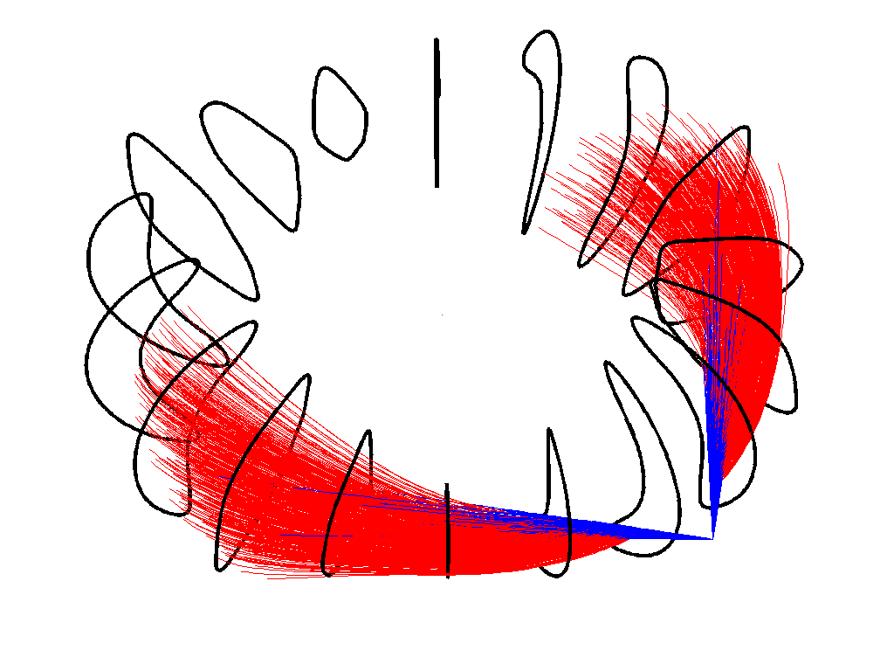
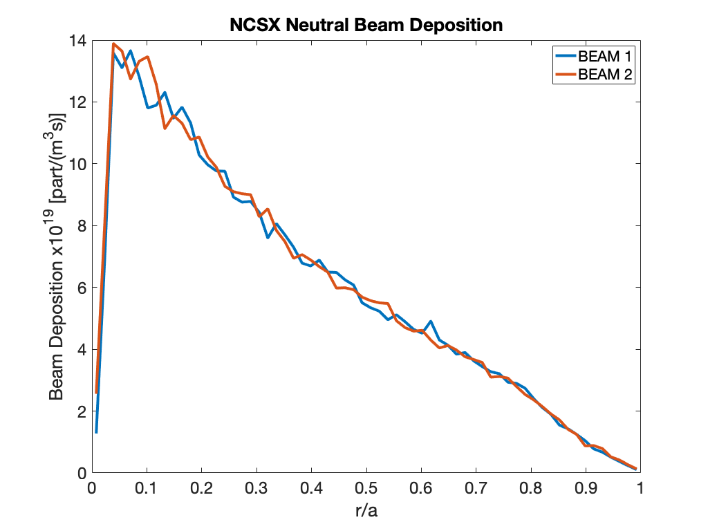

Tutorial: NCSX Neutral Beam Deposition Example
=============================================

This tutorial will walk the user through running the BEAMS3D code for
neutral beam deposition run. Before beginning the user should run the
[VMEC free boundary tutorial](VMEC Free Boundary Run.md) tutorial to 
generate an input and wout file.  Additionally, we will make use of
coils file from that example.

------------------------------------------------------------------------

**Edit the input namelist text file.**
The following namelist should be added to the VMEC input file. And for
clarity the input and wout file should be renamed `input.ncsx_c09r00_free_birth`
and `wout_ncsx_c09r00_free_birth.nc`.

```fortran
&BEAMS3D_INPUT
  NR = 128
  NZ = 128
  NPHI = 120
  RMIN =  7.50000000000000E-01
  RMAX =  2.40000000000000E+00
  ZMIN = -1.00000000000000E+00
  ZMAX =  1.00000000000000E+00
  PHIMIN =  0.00000000000000E+00
  PHIMAX =  2.09439510239320E+00
  MU =  0.00000000000000E+00
  NPOINC =  3
  NPARTICLES_START = 65536
  INT_TYPE = 'LSODE'
  FOLLOW_TOL =  1.00000000000000E-08
  VC_ADAPT_TOL =  1.00E-03
  ! Plasma Profiles
  TE_AUX_S = 0.0000000000E+00      1.0204081633E-02      2.0408163265E-02      3.0612244898E-02      4.0816326531E-02 
          5.1020408163E-02      6.1224489796E-02      7.1428571429E-02      8.1632653061E-02      9.1836734694E-02 
          1.0204081633E-01      1.1224489796E-01      1.2244897959E-01      1.3265306122E-01      1.4285714286E-01 
          1.5306122449E-01      1.6326530612E-01      1.7346938776E-01      1.8367346939E-01      1.9387755102E-01 
          2.0408163265E-01      2.1428571429E-01      2.2448979592E-01      2.3469387755E-01      2.4489795918E-01 
          2.5510204082E-01      2.6530612245E-01      2.7551020408E-01      2.8571428571E-01      2.9591836735E-01 
          3.0612244898E-01      3.1632653061E-01      3.2653061224E-01      3.3673469388E-01      3.4693877551E-01 
          3.5714285714E-01      3.6734693878E-01      3.7755102041E-01      3.8775510204E-01      3.9795918367E-01 
          4.0816326531E-01      4.1836734694E-01      4.2857142857E-01      4.3877551020E-01      4.4897959184E-01 
          4.5918367347E-01      4.6938775510E-01      4.7959183673E-01      4.8979591837E-01      5.0000000000E-01 
          5.1020408163E-01      5.2040816327E-01      5.3061224490E-01      5.4081632653E-01      5.5102040816E-01 
          5.6122448980E-01      5.7142857143E-01      5.8163265306E-01      5.9183673469E-01      6.0204081633E-01 
          6.1224489796E-01      6.2244897959E-01      6.3265306122E-01      6.4285714286E-01      6.5306122449E-01 
          6.6326530612E-01      6.7346938776E-01      6.8367346939E-01      6.9387755102E-01      7.0408163265E-01 
          7.1428571429E-01      7.2448979592E-01      7.3469387755E-01      7.4489795918E-01      7.5510204082E-01 
          7.6530612245E-01      7.7551020408E-01      7.8571428571E-01      7.9591836735E-01      8.0612244898E-01 
          8.1632653061E-01      8.2653061224E-01      8.3673469388E-01      8.4693877551E-01      8.5714285714E-01 
          8.6734693878E-01      8.7755102041E-01      8.8775510204E-01      8.9795918367E-01      9.0816326531E-01 
          9.1836734694E-01      9.2857142857E-01      9.3877551020E-01      9.4897959184E-01      9.5918367347E-01 
                                  9.6938775510E-01      9.7959183673E-01      9.8979591837E-01      1.0000000000E+00
  TE_AUX_F = 2.9000000000E+03      2.8996980425E+03      2.8987921699E+03      2.8972823823E+03      2.8951686797E+03
          2.8924510621E+03      2.8891295294E+03      2.8852040816E+03      2.8806747189E+03      2.8755414411E+03
          2.8698042482E+03      2.8634631404E+03      2.8565181175E+03      2.8489691795E+03      2.8408163265E+03
          2.8320595585E+03      2.8226988755E+03      2.8127342774E+03      2.8021657643E+03      2.7909933361E+03
          2.7792169929E+03      2.7668367347E+03      2.7538525614E+03      2.7402644731E+03      2.7260724698E+03
          2.7112765514E+03      2.6958767180E+03      2.6798729696E+03      2.6632653061E+03      2.6460537276E+03
          2.6282382341E+03      2.6098188255E+03      2.5907955019E+03      2.5711682632E+03      2.5509371095E+03
          2.5301020408E+03      2.5086630571E+03      2.4866201583E+03      2.4639733444E+03      2.4407226156E+03
          2.4168679717E+03      2.3924094127E+03      2.3673469388E+03      2.3416805498E+03      2.3154102457E+03
          2.2885360267E+03      2.2610578925E+03      2.2329758434E+03      2.2042898792E+03      2.1750000000E+03
          2.1451062057E+03      2.1146084965E+03      2.0835068721E+03      2.0518013328E+03      2.0194918784E+03
          1.9865785090E+03      1.9530612245E+03      1.9189400250E+03      1.8842149105E+03      1.8488858809E+03
          1.8129529363E+03      1.7764160766E+03      1.7392753020E+03      1.7015306122E+03      1.6631820075E+03
          1.6242294877E+03      1.5846730529E+03      1.5445127030E+03      1.5037484382E+03      1.4623802582E+03
          1.4204081633E+03      1.3778321533E+03      1.3346522282E+03      1.2908683882E+03      1.2464806331E+03
          1.2014889629E+03      1.1558933778E+03      1.1096938776E+03      1.0628904623E+03      1.0154831320E+03
          9.6747188671E+02      9.1885672636E+02      8.6963765098E+02      8.1981466056E+02      7.6938775510E+02
          7.1835693461E+02      6.6672219908E+02      6.1448354852E+02      5.6164098292E+02      5.0819450229E+02
          4.5414410662E+02      3.9948979592E+02      3.4423157018E+02      2.8836942940E+02      2.3190337359E+02
                                  1.7483340275E+02      1.1715951687E+02      5.8881715952E+01      0.0000000000E+00
   TI_AUX_S = 0.0000000000E+00      1.0204081633E-02      2.0408163265E-02      3.0612244898E-02      4.0816326531E-02 
          5.1020408163E-02      6.1224489796E-02      7.1428571429E-02      8.1632653061E-02      9.1836734694E-02 
          1.0204081633E-01      1.1224489796E-01      1.2244897959E-01      1.3265306122E-01      1.4285714286E-01 
          1.5306122449E-01      1.6326530612E-01      1.7346938776E-01      1.8367346939E-01      1.9387755102E-01 
          2.0408163265E-01      2.1428571429E-01      2.2448979592E-01      2.3469387755E-01      2.4489795918E-01 
          2.5510204082E-01      2.6530612245E-01      2.7551020408E-01      2.8571428571E-01      2.9591836735E-01 
          3.0612244898E-01      3.1632653061E-01      3.2653061224E-01      3.3673469388E-01      3.4693877551E-01 
          3.5714285714E-01      3.6734693878E-01      3.7755102041E-01      3.8775510204E-01      3.9795918367E-01 
          4.0816326531E-01      4.1836734694E-01      4.2857142857E-01      4.3877551020E-01      4.4897959184E-01 
          4.5918367347E-01      4.6938775510E-01      4.7959183673E-01      4.8979591837E-01      5.0000000000E-01 
          5.1020408163E-01      5.2040816327E-01      5.3061224490E-01      5.4081632653E-01      5.5102040816E-01 
          5.6122448980E-01      5.7142857143E-01      5.8163265306E-01      5.9183673469E-01      6.0204081633E-01 
          6.1224489796E-01      6.2244897959E-01      6.3265306122E-01      6.4285714286E-01      6.5306122449E-01 
          6.6326530612E-01      6.7346938776E-01      6.8367346939E-01      6.9387755102E-01      7.0408163265E-01 
          7.1428571429E-01      7.2448979592E-01      7.3469387755E-01      7.4489795918E-01      7.5510204082E-01 
          7.6530612245E-01      7.7551020408E-01      7.8571428571E-01      7.9591836735E-01      8.0612244898E-01 
          8.1632653061E-01      8.2653061224E-01      8.3673469388E-01      8.4693877551E-01      8.5714285714E-01 
          8.6734693878E-01      8.7755102041E-01      8.8775510204E-01      8.9795918367E-01      9.0816326531E-01 
          9.1836734694E-01      9.2857142857E-01      9.3877551020E-01      9.4897959184E-01      9.5918367347E-01 
                                  9.6938775510E-01      9.7959183673E-01      9.8979591837E-01      1.0000000000E+00
  TI_AUX_F = 2.0000000000E+03      1.9997917534E+03      1.9991670137E+03      1.9981257809E+03      1.9966680550E+03
          1.9947938359E+03      1.9925031237E+03      1.9897959184E+03      1.9866722199E+03      1.9831320283E+03
          1.9791753436E+03      1.9748021658E+03      1.9700124948E+03      1.9648063307E+03      1.9591836735E+03
          1.9531445231E+03      1.9466888796E+03      1.9398167430E+03      1.9325281133E+03      1.9248229904E+03
          1.9167013744E+03      1.9081632653E+03      1.8992086631E+03      1.8898375677E+03      1.8800499792E+03
          1.8698458975E+03      1.8592253228E+03      1.8481882549E+03      1.8367346939E+03      1.8248646397E+03
          1.8125780925E+03      1.7998750521E+03      1.7867555185E+03      1.7732194919E+03      1.7592669721E+03
          1.7448979592E+03      1.7301124531E+03      1.7149104540E+03      1.6992919617E+03      1.6832569763E+03
          1.6668054977E+03      1.6499375260E+03      1.6326530612E+03      1.6149521033E+03      1.5968346522E+03
          1.5783007080E+03      1.5593502707E+03      1.5399833403E+03      1.5201999167E+03      1.5000000000E+03
          1.4793835902E+03      1.4583506872E+03      1.4369012911E+03      1.4150354019E+03      1.3927530196E+03
          1.3700541441E+03      1.3469387755E+03      1.3234069138E+03      1.2994585589E+03      1.2750937110E+03
          1.2503123698E+03      1.2251145356E+03      1.1995002082E+03      1.1734693878E+03      1.1470220741E+03
          1.1201582674E+03      1.0928779675E+03      1.0651811745E+03      1.0370678884E+03      1.0085381091E+03
          9.7959183673E+02      9.5022907122E+02      9.2044981258E+02      8.9025406081E+02      8.5964181591E+02
          8.2861307788E+02      7.9716784673E+02      7.6530612245E+02      7.3302790504E+02      7.0033319450E+02
          6.6722199084E+02      6.3369429404E+02      5.9975010412E+02      5.6538942107E+02      5.3061224490E+02
          4.9541857559E+02      4.5980841316E+02      4.2378175760E+02      3.8733860891E+02      3.5047896710E+02
          3.1320283215E+02      2.7551020408E+02      2.3740108288E+02      1.9887546855E+02      1.5993336110E+02
                                  1.2057476052E+02      8.0799666805E+01      4.0608079967E+01      0.0000000000E+00
   NE_AUX_S = 0.0000000000E+00      1.0204081633E-02      2.0408163265E-02      3.0612244898E-02      4.0816326531E-02 
          5.1020408163E-02      6.1224489796E-02      7.1428571429E-02      8.1632653061E-02      9.1836734694E-02 
          1.0204081633E-01      1.1224489796E-01      1.2244897959E-01      1.3265306122E-01      1.4285714286E-01 
          1.5306122449E-01      1.6326530612E-01      1.7346938776E-01      1.8367346939E-01      1.9387755102E-01 
          2.0408163265E-01      2.1428571429E-01      2.2448979592E-01      2.3469387755E-01      2.4489795918E-01 
          2.5510204082E-01      2.6530612245E-01      2.7551020408E-01      2.8571428571E-01      2.9591836735E-01 
          3.0612244898E-01      3.1632653061E-01      3.2653061224E-01      3.3673469388E-01      3.4693877551E-01 
          3.5714285714E-01      3.6734693878E-01      3.7755102041E-01      3.8775510204E-01      3.9795918367E-01 
          4.0816326531E-01      4.1836734694E-01      4.2857142857E-01      4.3877551020E-01      4.4897959184E-01 
          4.5918367347E-01      4.6938775510E-01      4.7959183673E-01      4.8979591837E-01      5.0000000000E-01 
          5.1020408163E-01      5.2040816327E-01      5.3061224490E-01      5.4081632653E-01      5.5102040816E-01 
          5.6122448980E-01      5.7142857143E-01      5.8163265306E-01      5.9183673469E-01      6.0204081633E-01 
          6.1224489796E-01      6.2244897959E-01      6.3265306122E-01      6.4285714286E-01      6.5306122449E-01 
          6.6326530612E-01      6.7346938776E-01      6.8367346939E-01      6.9387755102E-01      7.0408163265E-01 
          7.1428571429E-01      7.2448979592E-01      7.3469387755E-01      7.4489795918E-01      7.5510204082E-01 
          7.6530612245E-01      7.7551020408E-01      7.8571428571E-01      7.9591836735E-01      8.0612244898E-01 
          8.1632653061E-01      8.2653061224E-01      8.3673469388E-01      8.4693877551E-01      8.5714285714E-01 
          8.6734693878E-01      8.7755102041E-01      8.8775510204E-01      8.9795918367E-01      9.0816326531E-01 
          9.1836734694E-01      9.2857142857E-01      9.3877551020E-01      9.4897959184E-01      9.5918367347E-01 
                                  9.6938775510E-01      9.7959183673E-01      9.8979591837E-01      1.0000000000E+00
  NE_AUX_F = 8.0000000000E+19      7.9991670137E+19      7.9966680550E+19      7.9925031237E+19      7.9866722199E+19 
          7.9791753436E+19      7.9700124948E+19      7.9591836735E+19      7.9466888796E+19      7.9325281133E+19 
          7.9167013744E+19      7.8992086631E+19      7.8800499792E+19      7.8592253228E+19      7.8367346939E+19 
          7.8125780925E+19      7.7867555185E+19      7.7592669721E+19      7.7301124531E+19      7.6992919617E+19 
          7.6668054977E+19      7.6326530612E+19      7.5968346522E+19      7.5593502707E+19      7.5201999167E+19 
          7.4793835902E+19      7.4369012911E+19      7.3927530196E+19      7.3469387755E+19      7.2994585589E+19 
          7.2503123698E+19      7.1995002082E+19      7.1470220741E+19      7.0928779675E+19      7.0370678884E+19 
          6.9795918367E+19      6.9204498126E+19      6.8596418159E+19      6.7971678467E+19      6.7330279050E+19 
          6.6672219908E+19      6.5997501041E+19      6.5306122449E+19      6.4598084132E+19      6.3873386089E+19 
          6.3132028322E+19      6.2374010829E+19      6.1599333611E+19      6.0807996668E+19      6.0000000000E+19 
          5.9175343607E+19      5.8334027489E+19      5.7476051645E+19      5.6601416077E+19      5.5710120783E+19 
          5.4802165764E+19      5.3877551020E+19      5.2936276551E+19      5.1978342357E+19      5.1003748438E+19 
          5.0012494794E+19      4.9004581424E+19      4.7980008330E+19      4.6938775510E+19      4.5880882965E+19 
          4.4806330696E+19      4.3715118701E+19      4.2607246980E+19      4.1482715535E+19      4.0341524365E+19 
          3.9183673469E+19      3.8009162849E+19      3.6817992503E+19      3.5610162432E+19      3.4385672636E+19 
          3.3144523115E+19      3.1886713869E+19      3.0612244898E+19      2.9321116202E+19      2.8013327780E+19 
          2.6688879633E+19      2.5347771762E+19      2.3990004165E+19      2.2615576843E+19      2.1224489796E+19 
          1.9816743024E+19      1.8392336526E+19      1.6951270304E+19      1.5493544357E+19      1.4019158684E+19 
          1.2528113286E+19      1.1020408163E+19      9.4960433153E+18      7.9550187422E+18      6.3973344440E+18 
                                  4.8229904207E+18      3.2319866722E+18      1.6243231987E+18      0.0000000000E+00
  ADIST_BEAMS(  1) =  2.00000000000000E+00
  ADIST_BEAMS(  2) =  2.00000000000000E+00
  ASIZE_BEAMS(  1) =  1.50000000000000E-01
  ASIZE_BEAMS(  2) =  1.50000000000000E-01
  DIV_BEAMS(  1) =  1.00000000000000E-01
  DIV_BEAMS(  2) =  1.00000000000000E-01
  E_BEAMS(  1) =  6.40800000000000E-15 ! In [J] multiply by electron charge to get [eV]
  E_BEAMS(  2) =  6.40800000000000E-15
  MASS_BEAMS(  1) =  1.67300000000000E-27
  MASS_BEAMS(  2) =  1.67300000000000E-27
  CHARGE_BEAMS(  1) =  1.60200000000000E-19
  CHARGE_BEAMS(  2) =  1.60200000000000E-19
  R_BEAMS(1,1) =  2.00000000000000E+00
  R_BEAMS(1,2) =  1.40000000000000E+00
  R_BEAMS(2,1) =  2.00000000000000E+00
  R_BEAMS(2,2) =  1.40000000000000E+00
  PHI_BEAMS(1,1) =  0.00000000000000E+00
  PHI_BEAMS(1,2) =  1.04719755120000E+00
  PHI_BEAMS(2,1) =  0.00000000000000E+00
  PHI_BEAMS(2,2) = -1.04719755120000E+00
  Z_BEAMS(1,1) =  0.00000000000000E+00
  Z_BEAMS(1,2) =  0.00000000000000E+00
  Z_BEAMS(2,1) =  0.00000000000000E+00
  Z_BEAMS(2,2) =  0.00000000000000E+00
  P_BEAMS(1)   =  1.0E+06
  P_BEAMS(2)   =  1.0E+06
  T_END_IN(1:2) = 2*100.0E-3
/
&END
```

**Execute the code.**
    To execute the code, we first
    invoke the MPI execution command with the number of processors we
    wish to use. The BEAMS3D executable is passed next with the VMEC run
    extension next. The coils option is passed next with the coil name
    (this will be used for calculation of the vacuum field). The full
    path may be specified here. This will be a deposition only run
    so we supply the `-depo` flag to indicate this.  We also supply
    a vessel via the vessel flag.

```
>mpirun -np 32 ~/bin/xbeams3d -vmec ncsx_c09r00_free_birth -coil /u/sul/pub/coils/coils.c09r00 -vessel /u/sul/Sims/NCSX/NCSX_wall_nbiport_acc.dat -depo
BEAMS3D Version  4.07
-----  HDF5 (Parallel) Parameters  -----
   HDF5_version:   1.12 release: 02
-----  MPI Parameters  -----
   MPI_version:   3.01
   Intel(R) MPI Library 2021.9 for Linux* OS

   Nproc_total:       640
   Nproc_shared:       40
-----  GIT Repository  -----
   Repository: git@github.com:PrincetonUniversity/STELLOPT.git
   Branch:     develop
   Version:    v3.00-110-g6f274
   Built-on:   30.01.2024 13:28:38
   Hash:       512375ce3582efa57910c336c83409577d760d6b
----- Input Parameters -----
   FILE: input.ncsx_c09r00_free_birth
   R   = [  0.75000,  2.40000];  NR:    128
   PHI = [ 0.00000, 2.09440];  NPHI:  120
   Z   = [-1.00000, 1.00000];  NZ:    128
   # of Particles to Start:    65920
   # of Beams:        2
   VESSEL: /u/sul/Sims/NCSX/NCSX_wall_nbiport_acc.dat
   COIL: /u/sul/pub/coils/coils.c09r00
   COLLISION OPERATOR ON!
   DEPOSITION ONLY!
----- Plasma Parameters -----
   Te   = [  0.00000,  2.90000] keV;  NTE:     99;  S_MAX_TE:  1.00000
   Ti   = [  0.00000,  2.00000] keV;  NTI:     99;  S_MAX_TI:  1.00000
   Ne   = [  0.00000,  0.80000] E20 m^-3;  NNE:     99;  S_MAX_NE:  1.00000
   Ni(1)= [  0.00000,  0.80000] E20 m^-3;  M:   1 amu;  Z:  1;  S_MAX_NI:  1.00000
   Zeff = [  1.00000,  1.00000];  NZEFF:    6;  S_MAX_ZEFF:  1.00000
   PLASMA_MASS =    1.00728 amu
   PLASMA_ZMEAN =    1.00000 [Z]
----- COILS Information -----
   FILE: /u/sul/pub/coils/coils.c09r00
   Coil Periodicity:   3
   Current Systems:  10
   Current Type:      SCALED
   Num Coils  =    6  EXTCUR =  652.272 [kA]
   Num Coils  =    6  EXTCUR =  651.869 [kA]
   Num Coils  =    6  EXTCUR =  537.744 [kA]
   Num Coils  =    8  EXTCUR =    0.000 [A]
   Num Coils  =    8  EXTCUR =    0.000 [A]
   Num Coils  =    8  EXTCUR =   28.095 [kA]
   Num Coils  =   12  EXTCUR =  -54.805 [kA]
   Num Coils  =    4  EXTCUR =   30.123 [kA]
   Num Coils  =    2  EXTCUR =   94.241 [kA]
   Num Coils  =   18  EXTCUR =   45.514 [kA]
     Vacuum Field Calculation [100]%
----- VMEC Information -----
   FILE: ncsx_c09r00_free_birth
   R       = [  1.02249,  1.77878]
   Z       = [-0.64066, 0.64066]
   BETA    =    0.04;  I  =   -0.18 [MA]
   AMINOR  =    0.32 [m]
   PHIEDGE =    0.50 [Wb]
   VOLUME  =    2.96 [m^3]
   NYQUIST DETECTED IN WOUT FILE!
----- Virtual Casing Information -----
   INTEGRAL TYPE: Surface Current (DCUHRE) 
   MIN_GRID_DISTANCE =  6.0439E-02
   NORMAL_AREA =  2.4584E+01
   NR =    1;   NU =  128;  NV =  128;  NFP =   3
   NUVP =  49152
   ABS_TOL =  0.0000E+00;   REL_TOL =  1.0000E-03
   MIN_CLS =      0   (16777216)
     Plasma Field Calculation [100]%
----- Loading wall data -----
----- Constructing Splines -----
   R   = [  0.75000,  2.40000];  NR:    128
   PHI = [ 0.00000, 2.09440];  NPHI:  120
   Z   = [-1.00000, 1.00000];  NZ:    128
   HERMITE FORM: 1
----- INITIALIZING BEAMS -----
      nbeams:    2
      nparticles_start:  65920
            E_BEAM( 1):   40 [keV] P_BEAM( 1):   1.000 [MW]
            E_BEAM( 2):   40 [keV] P_BEAM( 2):   1.000 [MW]
 -----  Vessel Information  -----
   Wall Name :  NCSX NBI WALL
   Date      : :  09-04-11
   Faces     :   35874
   Blocks    :     720
   Mean faces per block:    839.00
   Highest faces per block:    2932
   R_WALL   = [  0.92003,  2.35994]
   Z_WALL   = [ -0.89111,  0.89111]
----- FOLLOWING NEUTRAL TRAJECTORIES -----
----- BEAM Density Calc. -----
----- BEAM DIAGNOSTICS -----
 BEAMLINE  E [keV]  Q [e]   M [Mp]   Markers [#]    NDIST [#]    Orbit [%]    Lost [%]   Shine. [%]  Port [%]    T_MIN [s]       T_MAX [s]
    1       40        1        1       65920          2.1E+12       76.6        0.0       23.4        0.0       279.9E-09       100.0E-03
    2       40        1        1       65920          2.1E+12       76.6        0.0       23.4        0.0       276.7E-09       100.0E-03
----- BEAMS3D DONE -----
> 
```


**Examine the output.**
    The BEAMS3D code only generates one HDF5 file as output.  This file
    contains all information about the backgroud grids, particles,
    particle orbits and 
    In this example two files will be
    created: beams3d\_ncsx\_c09r00.h5. The first is an HDF5 file containing
    the saved particle trajectory information for the run with the
    magnetic field grid information. Here is a sample plot:





