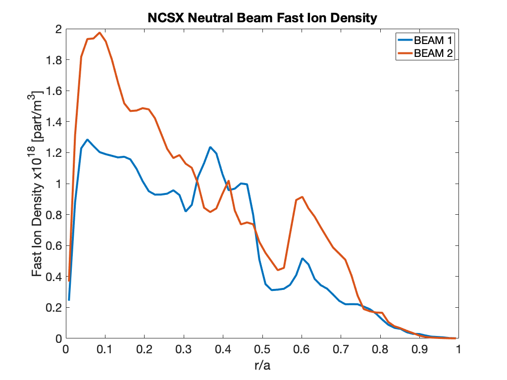
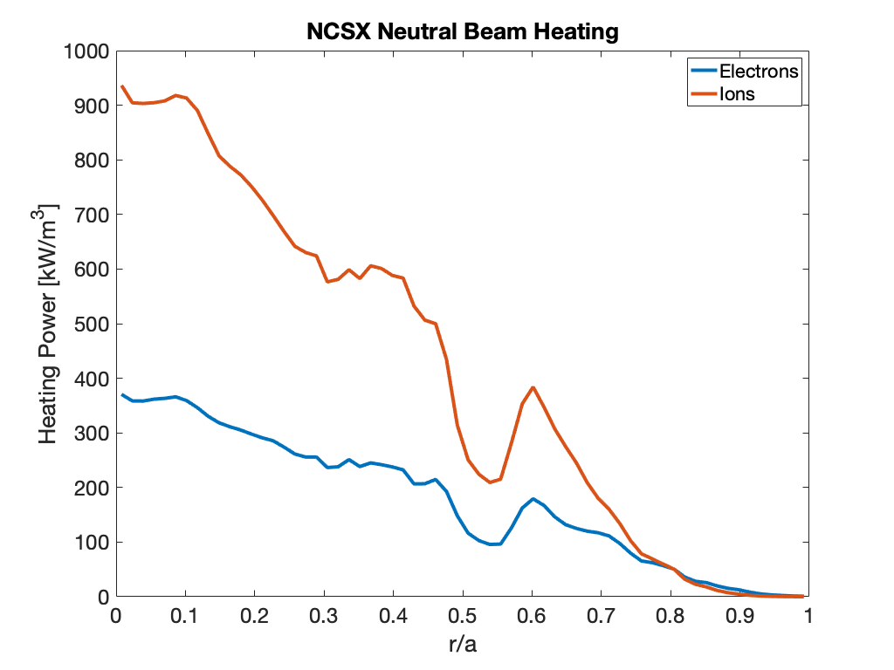
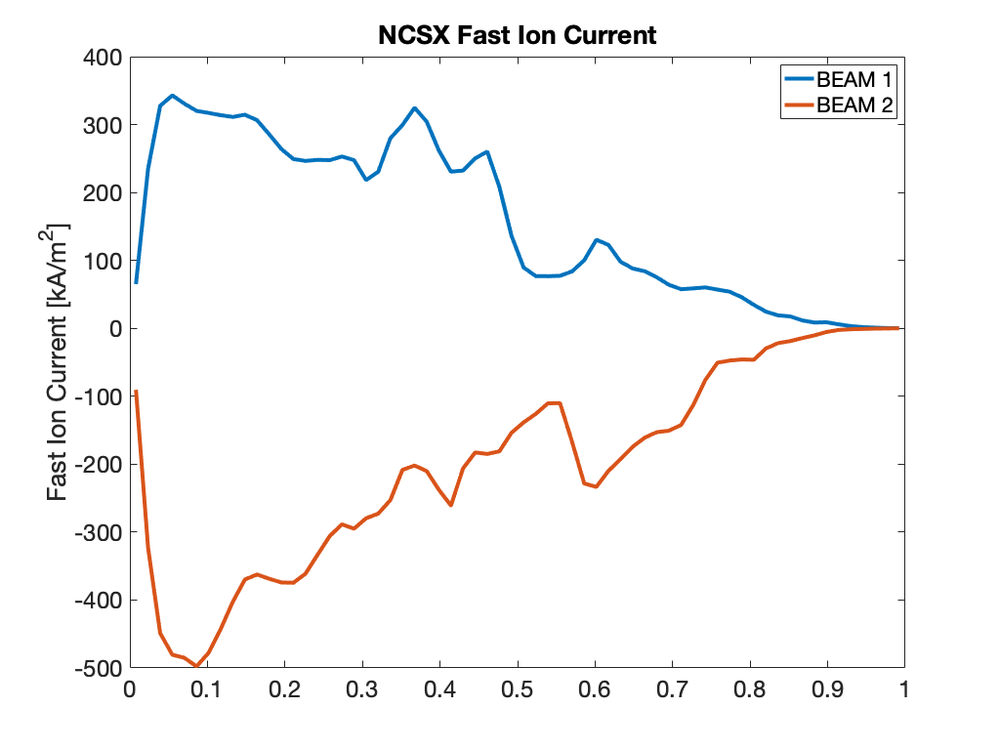
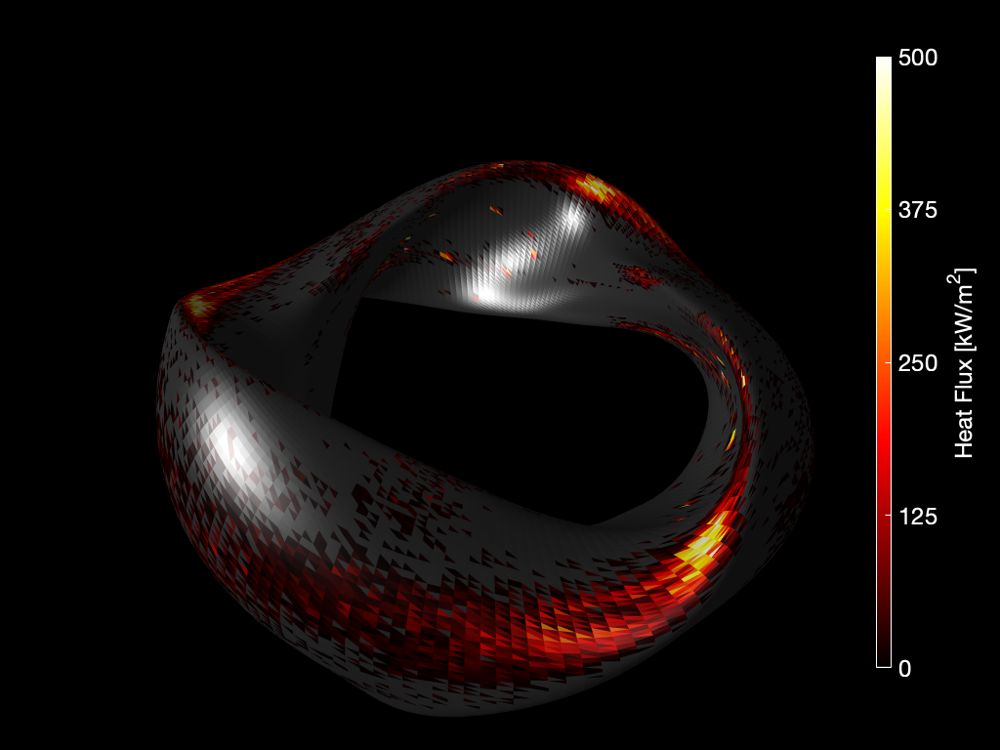

Tutorial: NCSX Neutral Beam Restart Example
=============================================

This tutorial will walk the user through running the BEAMS3D code for
neutral beam slowing down run using the restart feature. Before beginning 
the user should run the [VMEC free boundary tutorial](VMEC Free Boundary Run.md) tutorial to 
generate an input and wout file. The user should also run the
[NCSX Deposition Tutorial](BEAMS3D NCSX Deposition Example.md). We will
make use of that deposition run.

------------------------------------------------------------------------

**Make a copy of the previous exxample**

A copy of the [NCSX Deposition Tutorial](BEAMS3D NCSX Deposition Example.md)
input file should be renamed to `input.ncsx_c09r00_free_slow` and the VMEC wout file
copied to `wout_ncsx_c09r00_free_slow.nc`.  

**Execute the code.**

To execute the code, we first 
invoke the MPI execution command with the number of processors we
wish to use. The BEAMS3D executable is passed next with the VMEC run
extension next. We also pass the previous BEAMS3D run's HDF5 file
via the `-restart` flag.  The `-plasma` flag is used ot indicate that
this is a plasma only run.  Finally, the `-collisions` flag is used
to turn on the collision operators.

```
>mpirun -np 32 ~/bin/xbeams3d -vmec ncsx_c09r00_free_slow -restart beams3d_ncsx_c09r00_free_birth.h5 -plasma -collisions
BEAMS3D Version  4.07
-----  HDF5 (Parallel) Parameters  -----
   HDF5_version:   1.12 release: 02
-----  MPI Parameters  -----
   MPI_version:   3.01
   Intel(R) MPI Library 2021.9 for Linux* OS

   Nproc_total:      2560
   Nproc_shared:       40
-----  GIT Repository  -----
   Repository: git@github.com:PrincetonUniversity/STELLOPT.git
   Branch:     bugfix/MORE_DEBUG
   Version:    v3.00-110-g6f274-dirty
   Built-on:   30.01.2024 13:28:38
   Hash:       6f274ebdda541718eeff3c21f26d3a9345848230
----- Input Parameters -----
   FILE: input.ncsx_c09r00_free_slow
   R   = [  0.75000,  2.40000];  NR:    128
   PHI = [ 0.00000, 2.09440];  NPHI:  120
   Z   = [-1.00000, 1.00000];  NZ:    128
   # of Particles to Start:        0
   COLLISION OPERATOR ON!
   MAGNETIC FIELD FROM PLASMA ONLY!
   Restarting particles!
----- Plasma Parameters -----
   Te   = [  0.00000,  2.90000] keV;  NTE:     99;  S_MAX_TE:  1.00000
   Ti   = [  0.00000,  2.00000] keV;  NTI:     99;  S_MAX_TI:  1.00000
   Ne   = [  0.00000,  0.80000] E20 m^-3;  NNE:     99;  S_MAX_NE:  1.00000
   Ni(1)= [  0.00000,  0.80000] E20 m^-3;  M:   1 amu;  Z:  1;  S_MAX_NI:  1.00000
   Zeff = [  1.00000,  1.00000];  NZEFF:    6;  S_MAX_ZEFF:  1.00000
   PLASMA_MASS =    1.00728 amu
   PLASMA_ZMEAN =    1.00000 [Z]
----- VMEC Information -----
   FILE: ncsx_c09r00_free_slow
   R       = [  1.02249,  1.77878]
   Z       = [-0.64066, 0.64066]
   BETA    =    0.04;  I  =   -0.18 [MA]
   AMINOR  =    0.32 [m]
   PHIEDGE =    0.50 [Wb]
   VOLUME  =    2.96 [m^3]
   CREATING WALL FROM HARMONICS
     Plasma Field Calculation [100]%
----- Constructing Splines -----
   R   = [  0.75000,  2.40000];  NR:    128
   PHI = [ 0.00000, 2.09440];  NPHI:  120
   Z   = [-1.00000, 1.00000];  NZ:    128
   HERMITE FORM: 1
----- Reading Restart File -----
   FILE: beams3d_ncsx_c09r00_free_birth.h5
   NPARTICLES_OLD:   131840
   NPOINC_OLD:        3
   Detected old deposition run! 
   Detected old plasma only run! 
   NPARTICLES_RESTART:   100885
   # of Beams:      2
 -----  Vessel Information  -----
   Wall Name :  HARMONICS
   Date      :  TODAY
   Faces     :   43200
   Blocks    :    4554
   Mean faces per block:    281.00
   Highest faces per block:    1761
   R_WALL   = [  1.02062,  1.77878]
   Z_WALL   = [ -0.64038,  0.64038]
----- FOLLOWING GYROCENTER TRAJECTORIES -----
       Method: LSODE
   Particles:    100885
       Steps:   1000002   dt_min:   17.584E-09   dt_max:  100.000E-09
      NPOINC:         3
         Tol:   10.000E-09  Type: 10
     Trajectory Calculation [  0]%
----- BEAM DIAGNOSTICS -----
 BEAMLINE  E [keV]  Q [e]   M [Mp]   Markers [#]    NDIST [#]    Orbit [%]    Lost [%]   Shine. [%]  Port [%]    T_MIN [s]       T_MAX [s]
    1       40        1        1       50452          1.1E+18        0.0       55.0        0.0        0.0        18.2E-09       100.0E-03
    2       40        1        1       50433          1.4E+18        0.0       37.0        0.0        0.0        18.0E-09       100.0E-03
----- BEAMS3D DONE -----
> 
```


**Examine the output.**

The BEAMS3D code only generates one HDF5 file as output.  This file
contains all information about the backgroud grids, particles,
particle orbits and In this example the file name should be: 
beams3d\_ncsx\_c09r00_birth.h5. The first is an HDF5 file containing
the saved particle trajectory information for the run with the
magnetic field grid information. Here is a sample plot:









