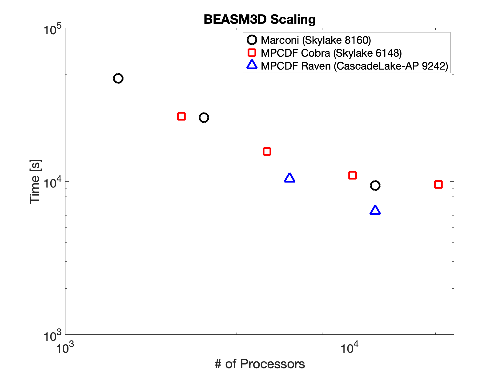

BEAMS3D Validation and Benchmarking on HPC systems
=============================================

This page documents various efforts to validate and benchmark the
BEAMS3d code.

------------------------------------------------------------------------
Table of Contents
   * [Benchmarking](#bench)
   * [Validation](#valid)

------------------------------------------------------------------------

### Benchmarking

As a benchmark test a slowing down to the VMEC last closed flux surface
run is performed based on a W7-X beam deposition run with full port
model for the high mirror configuration.  The simulations starts with
2^18 particles per beam per energy for 2 hydrogen beams so 6x2^18
particles are followed. For each device the scans are in powers of two
in terms of nodes 32-64-128-256-512 (where available).

------------------------------------------------------------------------

### Validation

Various publications document the validation of the BEAMS3D model.

-   [McMillan, M. and Lazerson, S.A. \"BEAMS3D: Neutral beam injection model.\" Plasma Phys. and Control. Fusion 56, 095019 (2014)](https://doi.org/10.1088/0741-3335/56/9/095019)
-   [Cole, M. D. J. et al. \"Comparative collisionless alpha particle confinement in stellarator reactors with the XGC gyrokinetic code\" Phys. Plasmas 26, 032506 (2019)](https://doi.org/10.1063/1.5085349)
-   [Lazerson, S.A. et al. \"Validation of the BEASM3D neutral beam deposition model on Wendelstein 7-X\" Nuclear Fusion 60, 706020 (2020)](https://doi.org/10.1088/1741-4326/ab8e61)
-   [Lazerson, S.A. et al. \"Modeling and measurement of energetic particle slowing down on Wendelstein 7-X\" Nuclear Fusion 61, 096006 (2021)](https://doi.org/10.1088/1741-4326/ac0771)
