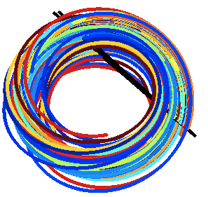
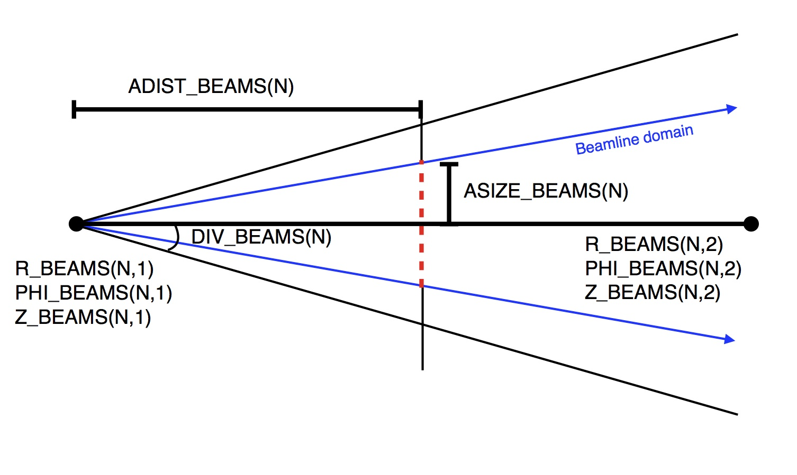

BEAMS3D
=======

The BEAMS3D (Matthew McMillan and Samuel A Lazerson 2014 *Plasma Phys.
Control. Fusion* **56** 095019) code is a guiding center particle code
capable of following both user defined ensembles of particles and
modeling neutral beam injection in parallel. The magnetic field is
represented by a three dimensional splines over a cylindrical grid. It
is currently interfaced to the MAKEGRID coils file, MAKEGRID output
file, and VMEC equilibria. Ionization and recombination models are
provided by ADAS.

------------------------------------------------------------------------

### Theory



The BEAMS3D code follows the guiding center orbit equations on a
cylindrical grid
$\\frac{d\\vec{R}}{dt}=\\frac{\\hat{b}}{qB}\\left(\\mu\\nabla B
+\\frac{mv\_{ll}\^2}{2B}\\left(\\hat{b}\\cdot\\nabla\\right)\\vec{B}\\right)+v\_{ll}\\hat{b} $,
$\\frac{dv\_{ll}}{dt}=-\\frac{\\mu}{m}\\hat{b}\\cdot\\left(\\nabla
B\\right) $. These ODE\'s can be solved via a NAG routine,
LSODE, or Runge-Kutta algorithm. The magnetic field is splined over the
cylindrical grid (R,phi,Z). The initial position and velocity of the
particles can either be specified or modeled using a neutral beam model.
The neutral beam model relies on ADAS for ionization and recombination
physics. $ \\mu = \\frac{mv\_\\perp\^2}{2B} $

------------------------------------------------------------------------

### Compilation

BEAMS3D is distributed as part of the STELLOPT package of codes through
Git.

------------------------------------------------------------------------

### Input Data Format

The BEAMS3D code is controlled through command line inputs and an input
namelist which should be placed in the input.ext file. While the entire
VMEC input name is not required some parts will be read. The name lists
should look like:

```fortran
&INDATA
 ! VMEC input namelist (only need coil currents for usual runs)
 EXTCUR(1) = 10000.00
 EXTCUR(2) = 10000.00
 EXTCUR(3) = 12000.00
 EXTCUR(4) = 12000.00
 EXTCUR(5) = 6000.00
 ! VMEC Axis info (for putting a current on axis -axis option)
 !     This information is utilized if you want to place the net toroidal current
 !     on a magnetic axis.  Useful for doing vacuum tokamak equilibria
 CURTOR = 5000.0
 NFP = 5
 NTOR = 6
 RAXIS = 3.6  0.1 0.001
 ZAXIS = 0.0  0.1 0.001
/
&BEAMS3D_INPUT
 NR = 201                          ! Number of radial gridpoints, overridden if using mgrid
 NPHI = 36                         ! Number of toroidal gridpoints, overridden if using mgrid
 NZ = 201                          ! Number of vertical gridpoints, overridden if using mgrid
 RMIN = 2.5                        ! Minimum extent of radial grid, overridden if using mgrid
 RMAX = 5.0                        ! Maximum extent of radial grid, overridden if using mgrid
 ZMIN = -1.5                       ! Minimum extent of vertical grid, overridden if using mgrid
 ZMAX = 1.5                        ! Maximum extent of radial grid, overridden if using mgrid
 PHIMIN = 0.0                      ! Minimum extent of toroidal grid, overridden if using mgrid
 PHIMAX = 0.628                    ! Maximum extent of toroidal grid, overridden if using mgrid
 R_START_IN =  3.6  3.7  3.8       ! Radial starting locations of particles [m]
 Z_START_IN =  0.0  0.0  0.0       ! Vertical starting locations of particles [m]
 PHI_START_IN =  0.0  0.0  0.0     ! Toroidal starting locations of particles (radians)
 VLL_START_IN =  1.0E6 1.0E6 1.0E6 ! Initial parallel velocity of particles [m/s]
 MU_START_IN =   3*1.0E-15         ! Particle magnetic moment [J/T] (0.5*m*v^2/B)
 CHARGE_IN   =   3*1.60217733E-19  ! Particle charge [C]
 MASS_IN     =   3*1.6726231E-27   ! Particle mass [kg]
 ZATOM_IN    =   3*1.0             ! Particle charge number
 T_END_IN    =   3*0.001           ! How long to follow particles [s]
 NPOINC = 500                      ! Number of toroidal points per-period to output the field line trajectory
 INT_TYPE = 'NAG'                  ! Particle trajectory integration method (NAG, RKH68, LSODE)
 FOLLOW_TOL = 1.0E-12              ! Trajectory following tolerance
 VC_ADAPT_TOL = 1.0E-7             ! Virtual casing tolerance (if using plasma field from equilibria)
 ! The following is used if modeling beam deposition as well
 NPARTICLES_START = 500            ! Number of particles per beam line
 ASIZE_BEAMS = 0.15                ! Aperature Size [m]
 ADIST_BEAMS = 2.0                 ! Aperature Distance [m]
 DIV_BEAMS = 0.1                   ! Beam divergence [rad] (small angle approximation used)
 E_BEAMS   = 6.408E-15             ! Beam energy [J]
 MASS_BEAMS = 1.6726231E-27        ! Beam particle mass [kg]
 CHARGE_BEAMS = 1.60217733E-19     ! Beam particle charge [C]
 ZATOM_BEAMS = 1.0                 ! Beam particle charge number
 R_beams(1,1) = 1.673              ! Neutral beam radial position (Beam #1)
 R_beams(1,2) = 1.400              ! Point defining beam line (Beam #1)
 Z_beams(1,1) = 0.0                ! Neutral beam vertical position (Beam #1)
 Z_beams(1,2) = 0.0                ! Point defining beam line (Beam #1)
 PHI_BEAMS(1,1) = 0.0              ! Neutral beam toroidal poition (Beam #1)
 PHI_BEAMS(1,2) = 1.047            ! Point defining beam line (Beam #1)
 ADIST_BEAMS = 0.1                 ! Beam Appearture distance
 TE_AUX_S  = 0.0 0.5 1.0           ! Electron Temperature Profile (radial knots)
 TE_AUX_F  = 0.0 1.0 2.0           ! Electron Temperature Profile (values)
 NE_AUX_S  = 0.0 0.5 1.0           ! Electron Density Profile (radial knots)
 NE_AUX_F  = 0.0 1.0 2.0           ! Electron Density Profile (values)
 TI_AUX_S  = 0.0 0.5 1.0           ! Ion Temperature Profile (radial knots)
 TI_AUX_F  = 0.0 1.0 2.0           ! Ion Temperature Profile (values)
/
&END
```

It is important to note that neutral beam lines are defined by two
points. The first index of the array is the beam number, the second
defines the two points. The first point (X,1) is the origin on the beam.
The second points (X,2) defines the beamline from that origin.



------------------------------------------------------------------------

### Execution

The BEASM3D code is controlled through a combination of command-line
inputs and an input namelist. The input namelist must be in the
equilibrium input file. That file must also contain the VMEC INDATA
namelist (although only the EXTCUR array will be used). The BEASM3D code
is run from the command line taking an equilibrium input file as a
necessary argument. This input file must have the INDATA (for EXTCUR)
and BEASM3D\_INPUT namelists in it.

    BEASM3D -vmec <VMEC FILE> -coil <COIL FILE> -mgrid <MGRID FILE> -vessel <VESSEL FILE> -vac -full -noverb -help

| Argument | Default | Description |
|:------------- |:-------------:|:----- |
| -vmec | NONE | VMEC input extension |
| -coil | NONE | Coils File |
| -mgrid | NONE | Makegrid style vacuum grid file |
| -vessel | NONE | First wall file |
| -vac | NONE | Only compute the vacuum field |
| -plasma | NONE | Only compute fields inside the plasma domain (places wall at LCFS) |
| -noverb | NONE | Suppresses screen output |
| -field | NONE | Outputs the B-Field on the cylindrical grid only. |
| -raw | NONE | Treats EXTCUR array as raw values (EXTCUR is a scale factor applied to what\'s in the coils file). |
| -hitonly | NONE | Only save vessel strike points.|
| -help | NONE | Print help message. |

In it\'s simplest invokation the code requires
a VMEC input file.

    >~/bin/xbeams3d -vmec ncsx_c09r00_free -mgrid mgrid_c09r00.nc -vac
    BEAMS3D Version 1.00
    ----- Particle Initialization -----
       S   = [  0.24490,  0.24490];   NS:        1
       U   = [  0.00000,  5.96903];   NU:     20
       V   = [  0.00000,  5.96903];   NV:     20
       V_||= [*********,  2.00E+05];  NP:     10
       Mu  = [  0.00000,  2.00E-15];  NP:     10
    ----- Profile Initialization -----
       Ne  = [   0.00,   5.00] 10^19 [m^-3];  Nne:     50
       Te  = [   0.00,   4.58] [keV];  Nte:     50
       Ti  = [   0.00,   4.58] [keV];  Nti:     50
    ----- Input Parameters -----
       R   = [  0.95223,  1.82142];  NR:    201
       PHI = [ 0.00000, 2.09440];  NPHI:   60
       Z   = [-0.66634, 0.66634];  NZ:    201
       # of Particles to Start:   4000
    ----- Constructing Splines -----
       R   = [  0.95223,  1.82142];  NR:    201
       PHI = [ 0.00000, 2.09440];  NPHI:   60
       Z   = [-0.66634, 0.66634];  NZ:    201
       HERMITE FORM: 1
    ----- FOLLOWING PARTICLE TRAJECTORIES -----
          Method: NAG
      Particles: 4000
           Steps:     320   Delta-t: 0.3125E-06
          NPOINC:     320    dt_out: 0.1000E-06
             Tol: 0.1000E-08  Type: M
    ----- WRITING DATA TO FILE -----
       FILE: beams3d_ncsx_c09r00_free.h5
    ----- BEAMS3D DONE -----

------------------------------------------------------------------------

### Output Data Format

The data from the run is output in two fashions. The first is a text
file which contains counts of the number of particles lost from the
simulation domain (hit a structure or the simulation domain). The second
is and HDF5 file containing the simulation domain (magnetic fields on a
grid) and the particle trajectories as a set of points. Each particle
has it\'s trajectory saved NPOINC times.

------------------------------------------------------------------------

### Visualization

The data from the HDF5 file may be easily plotted in many plotting
packages. The R , PHI, Z, and V\_PARALLEL coordinates of each particle
are save NPOINC times along the trajectory. To aid in plotting the
evolution of the distribution function the code outputs a textfile which
bins by VLL the particles at each NPOINC time step.

[Movie of Simulation](https://www.youtube.com/watch?v=8TdZouWdmNY)

------------------------------------------------------------------------

### Tutorials

[NCSX Neutral Beam Injection Example](NCSX Neutral Beam Injection Example.md)
