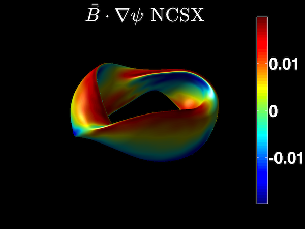

BNORM
=====



The BNORM code calculates the Fourier coefficients of the magnetic field
normal to the VMEC surface.

\$$ \vec{B}\cdot\hat{n}=\frac{1}{4\pi}\int\frac{\vec{j}'
dA}{\|\vec{x}-\vec{x}'\|^{3/2}} $$

It achieves this by utilizing the covariant magnetic field on the VMEC surface to construct
a surface current. It creates input files for the NESCOIL program.

------------------------------------------------------------------------

### Theory

The purpose of this code is to calculate the Fourier components of
outward normal components of the magnetic field. This information is
passed to the NESCOIL routine. The code achieves this by first using the
covariant magnetic field to construct a surface current density

\$$ \vec{K}=B_u \frac{\partial \vec{x}}{\partial v} -
B_v \frac{\partial \vec{x}}{\partial u}. $$

This surface current is then used to construct the vector potential everywhere on
VMEC surface. The calculation of the vector potential requires special
treatment for singularities. At a given point x the vector potential due
to all other points on the surface is calculated. Then a subroutine is
called to handle contribution to the vector potential by the point x.
The curl of this vector potential then provides the normal component of
the magnetic field on the VMEC surface.

------------------------------------------------------------------------

### Compilation

BNORM is a component of the STELLOPT suite of codes.

------------------------------------------------------------------------

### Input Data Format

The BNORM code reads input parameters from command line.
Here are the arguments list.

| index |  argument | description |
|:----:|:-------:|:---------|
| 1 | extension | VMEC 'wout' file |
| 2 | separation | [optional, default: RBC(1,0)] uniformly scale-up separation, unit: same as RBC |
| 3 | nu | [optional, default: 256] poloidal resolution for plasma surface |
| 4 | nv | [optional, default: 256] toroidal resolution for plasma surface per period |
| 5 | mf | [optional, default: 24] poloidal Fourier mode number for Bnormal distribution (mf>=MPOL-1) |
| 6 | nf | [optional, default: 14] toroidal Fourier mode number for Bnormal distribution (nf>=NTOR) |
| 7 | md | [optional, default: 24] poloidal Fourier mode number for surface and Bfield representations |
| 8 | nd | [optional, default: 20] toroidal Fourier mode number for surface and Bfield representations |

------------------------------------------------------------------------

### Execution

To run BNORM with a given input file simply pass the name of the VMEC
output file to BNORM like so (input file named input.test):

```shell
xbnorm wout.test >& bnorm_log.test &
```
The code can take one optional parameter, the coil separation in generalized
units.

```shell
xbrnom wout.test 0.3 >& bnorm_log.test &
```

You can also run BNORM with customized resolutions, like

```shell
xbrnom wout.test 0.3 128 128 16 8 8 8 >& bnorm_log.test &
```
Especially when the default Fourier resolutions are not large
enough. `mf>=MPOL-1` and `nf>=NTOR` should be satisfied.

In the above commands, we've redirected screen output (trapping error messages) to
'bnorm_log.test' and put the process in the background.

------------------------------------------------------------------------

### Output Data Format

The BNORM code outputs two files the 'bnorm.suffix' file and
'nescin.suffix' file (where suffix is the suffix of the VMEC 'wout'
file). The first file contains the Fourier coefficients of the normal
B-Field. The second file is the input file for the NESCOIL code.

The 'bnorm' file has a list of the m, n, and bnormal (sine) Fourier
coefficients. For information on the 'nescin' file please see the
[NESCOIL](NESCOIL) page.

------------------------------------------------------------------------

### Visualization

There are no specific routines to visualize the data in the 'bnorm'
file. However, the matlabVMEC routines should allow a user to plot the
values stored in the 'bnorm' file. The bnorm values are calculated
from the covariant components of the magnetic field from VMEC. Thus, the
Fourier coefficients should have the same parity (sine) as the covariant
components.

------------------------------------------------------------------------

### Tutorials

After running VMEC, simply call the code with the VMEC 'wout' file as
it's input parameter as explained above. This should produce the
'bnorm' and 'nescin' files.

------------------------------------------------------------------------

### References

- [P. Merkel, BNORM code notes](docs/bnorm_prog_notes.pdf)
- [Merkel, P. (1986). An integral equation technique for the exterior and interior Neumann problem in toroidal regions. Journal of Computational Physics, 66(1), 83-98.](https://doi.org/10.1016/0021-9991(86)90055-0)
