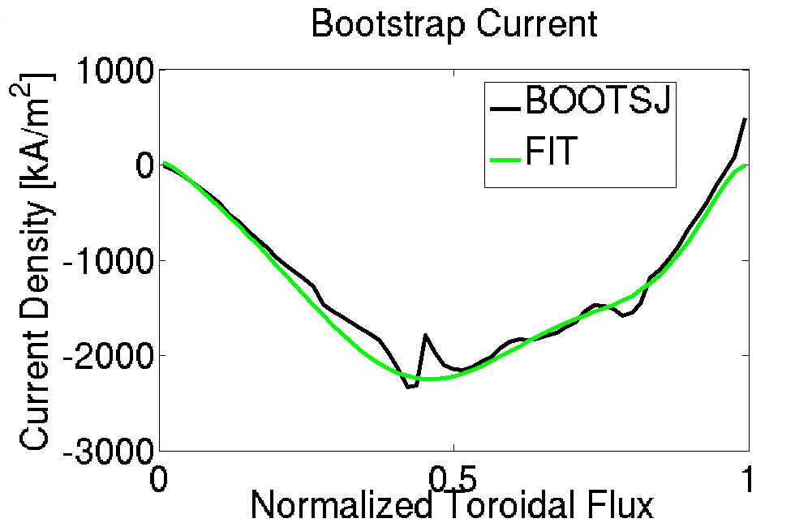

BOOTSJ
======

\<\<toc\>\>

This code calculates the bootstrap current for 3D magnetic equilibria
provided by VMEC.

------------------------------------------------------------------------

### Theory

The code BOOTSJ\<ref\>K.C. Shaing, B.A. Carreras, N. Dominguez, V.E.
Lynch, J.S. Tolliver 1989 *Phys. Fluids B* **1** 1663\</ref\>\<ref\>K.C.
Shaing, E.C. Crume, J.S. Tolliver, S.P. Hirshman, W.I. van Rij 1989
*Phys. Fluids B* **1** 148\</ref\>\<ref\>K.C. Shaing, S.P. Hirshman,
J.S. Tolliver 1986 *Phys. Fluids * **29** 2548\</ref\> calculates the
bootstrap current for 3D VMEC equilibria.

------------------------------------------------------------------------

### Compilation

VMEC is a component of the STELLOPT suite of codes. It is contained
within the \'stellopt.zip\' file. Compilation of the STELLOPT suite is
discussed on the [STELLOPT Compilation Page](STELLOPT Compilation).

------------------------------------------------------------------------

### Input Data Format

The BOOTSJ code takes in input file from the command line. The first
line of the input file is the VMEC extension for a given VMEC
equilibria. The next line (or multiple lines) are a space delimited list
of surfaces on which to calculate the bootstrap current. The BOOTSJ code
requires both an VMEC equilibrium and the output the from BOOZER\_XFORM
code (transformation to boozer coordinates). Additionally, the VMEC
input file must contain an additional namelist BOOTIN. The BOOTIN
namelist reads as follows

    #!fortran
    &BOOTIN
    !  NRHO is obsolete
      NRHO=0
    !  Number of poloidal modes
      MBUSE=0
    !  Number of toroidal modes
      NBUSE=0
    !  Effective Ion Charge
      ZEFF1=1.000000000000000E+00
    !  Damping factor for resonance
      DAMP_BS=-1.000000000000000
    ! Temperature/Density Data
    !    ATE   : Electron temperature (10th order polynomial, keV)
    !    ATI   : Ion temperature (10th order polynomial, keV)
    !    TEMPRES:  Scale temperatures as P^tempres (if tempres >=0)
    !    TETI  : Temperature ratio Te/Ti (if tempres >=0)
    !    DENS0 : Central electron density in 10^20 [m^-3] (if tempres >=0)
    ! Electron Temperature (10th order polynomial, keV)
      ATE=0.000000000000000E+00  0.000000000000000E+00  0.000000000000000E+00
      0.000000000000000E+00  0.000000000000000E+00  0.000000000000000E+00
      0.000000000000000E+00  0.000000000000000E+00  0.000000000000000E+00
      0.000000000000000E+00  0.000000000000000E+00
      ATI=0.000000000000000E+00  0.000000000000000E+00  0.000000000000000E+00
      0.000000000000000E+00  0.000000000000000E+00  0.000000000000000E+00
      0.000000000000000E+00  0.000000000000000E+00  0.000000000000000E+00
      0.000000000000000E+00  0.000000000000000E+00
      TEMPRES = -1.0  ! Set to 1 to use P profile for te/ti
      TETI    = 1.0
      DENS0   = 1.0
    /

If the leading coefficient of either ATE or ATI is negative, the code
assumes maximum density and then calculate the profiles using a power
law given by abs(TEMPRES). The TEMPRES coefficient must be negative and
cannot be greater than one. In this instance the profiles are determined
by DENS0 and TEMPRES. If the user does not specify TEMPRES in the input
namelist it defaults to -1 and the code assume ATE and ATI are the 10th
order polynomials for the electron and ion temperature respectively
(TETI is ignored).

For example if the user wished to calculate the bootstrap current on the
surfaces 2, 5, and 37 for a VMEC run with extension \'test\' the input
file would look like:

    #!fortran
    test
    2 5 37

------------------------------------------------------------------------

### Execution

The BOOTSJ code is executed from the command line by specifying the name
of the input file (described above). The user may suppress screen output
by passing the F flag at the command line. To execute the code with a
input file names in\_bootsj.test the command would look like:

    > xbootsj in_bootsj.test

------------------------------------------------------------------------

### Output Data Format

The BOOTSJ code outputs three text files jBds.ext, answers.ext, and
answers\_plot.ext where \'ext\' is the same extension as the VMEC
equilibria. The jBds and answers file contain text headers explaining
the meaning of each column of data. The answers\_plot file contains
columns of data where each row is a different surface. The columns in
order are:

    R  GNORM  AMAIN  LAMINT  OTHER  dI/ds  J_GRAD_NE  J_GRAD_NI  J_GRAD_TE  J_GRAD_TI  Q  FTRAPPED  <Jbs>/<Jbs-tok>  TE  TI  NE  NE/Zeff  BETA  <Jbs_dot_B>

The column dI/ds is the current density profile in units normalized to
mu0. The total current is the sum of this column divided by
mu0=4\*pi\*1E-6.

------------------------------------------------------------------------

### Visualization

Output are text files which can be read in with many plotting packages.

------------------------------------------------------------------------

### Tutorials

[Bootstrap Calculation for NCSX-Like configuration](Bootstrap Calculation for NCSX-Like configuration)
