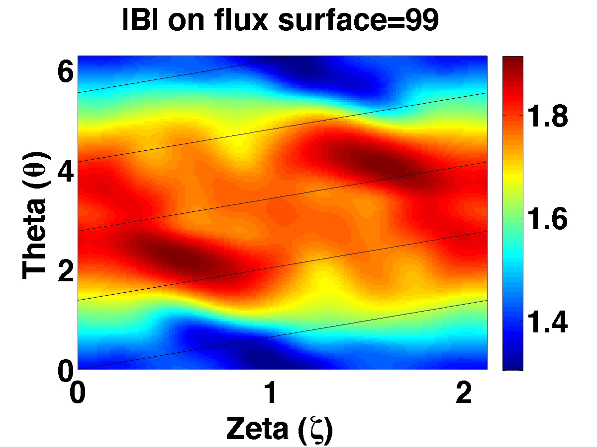

BOOZ\_XFORM
===========

This code calculates the transformation to Boozer coordinates
[(Boozer A. H. \"Plasma equilibrium with rational magnetic surfaces.\" Phys. Fluids 24, 1999 (1981)).](http://link.aip.org/link/doi/10.1063/1.863297)
of a [VMEC](VMEC) equilibria.

------------------------------------------------------------------------

### Theory

The BOOZ\_XFORM code
[Sanchez R., Hirshman S.P., Ware A. S., Berry L. A., and Spong D.A. \"Ballooning stability optimization of low-aspect-ratio stellarators.\" Plas. Phys. Cont. Fusion 42, 641 (2000).](http://iopscience.iop.org/0741-3335/42/6/303)
transforms the [VMEC](VMEC) field-line coordinate system to the
[straight field-line coordinates](http://www-fusion.ciemat.es/wiki/Flux_coordinates)
introduced by Boozer
([Fusionwiki link](http://www-fusion.ciemat.es/wiki/Boozer_coordinates)).
The Boozer coordinates allow the magnetic field to be written in the
form [math](math)
\\vec{B}=\\nabla\\psi\\left(s\\right)\\times\\nabla\\zeta\_b+\\nabla\\theta\_b\\times\\nabla\\chi\\left(s\\right)
[math](math) where the subscript indicates the quantities are
generalized toroidal and poloidal coordinates (xi and theta
respectively). The code transforms the coordinates and magnetic field.
The output quantities are in terms of the Fourier coefficients of the
transformed quantities. It is important to note that Boozer coordinates
may require many more Fourier modes than the equivalent [VMEC](VMEC)
representation to maintain accuracy. In general, it is useful to choose
between 5 and 6 times more poloidal and 2-3 times more toroidal Fourier
resolution than those found in the [VMEC](VMEC) equilibria.

Note: As of v6.9 only stellarator symmetric equilibria can be
transformed. The version distributed with [VMEC](VMEC) 8.47 can handle
non-stellarator symmetric equilibria.

------------------------------------------------------------------------

### Compilation

BOOZ\_XFORM is a component of the STELLOPT suite of codes. Compilation
of the STELLOPT suite is discussed on the
[STELLOPT Compilation Page](STELLOPT Compilation).

------------------------------------------------------------------------

### Input Data Format

The BOOZ\_XFORM code takes an input filename as a command line argument.
The input file contains the number of theta and zeta harmonics to use,
the filename extension of the wout file to read, and a list of surfaces
on which to calculate the transform. Typically the user will choose
surfaces located at 1/4, 1/2, and 3/4 the way from the axis to the edge
of the equilibrium. The choice of surface must coincide with a VMEC
index. For example, if the user wished to specify 72 poloidal harmonics,
15 toroidal harmonics, the \'wout.test\' file, and surfaces 25, 50 and
75, the file would look like:

    72  15
    'test'
    25 50 75

------------------------------------------------------------------------

### Execution

The BOOZ\_XFORM code takes a command line (see above) and optional
output suppression arguments (T/F). For example, if the user had an
input file entitled \'in\_booz.test\' the code could be executed by:

    > xbooz_xform in_booz.test
      0 <= mboz <=   71    -15 <= nboz <=   15
      nu_boz =   290 nv_boz =    62

                 OUTBOARD (u=0)              JS          INBOARD (u=pi)
    -----------------------------------------------------------------------------
      v     |B|vmec    |B|booz    Error             |B|vmec    |B|booz    Error

      0    1.452E+00  1.452E+00  2.350E-10   25    1.571E+00  1.571E+00  2.792E-10
     pi    1.455E+00  1.455E+00  4.914E-10         1.560E+00  1.560E+00  6.248E-11
      0    1.383E+00  1.383E+00  2.688E-09   50    1.688E+00  1.688E+00  2.026E-07
     pi    1.364E+00  1.364E+00  3.235E-09         1.657E+00  1.657E+00  5.820E-07
      0    1.378E+00  1.378E+00  1.047E-06   75    1.796E+00  1.796E+00  2.146E-06
     pi    1.307E+00  1.307E+00  7.323E-07         1.784E+00  1.784E+00  5.163E-06

     TIME IN BOOZER TRANSFORM CODE:    3.02E+00 SEC

------------------------------------------------------------------------

### Output Data Format

The transformed R, Z, p and \|B\| quantities are output into a file
\'boozmn.ext\' where ext is the [VMEC](VMEC) file extension specified in
the input file. The STELLOPT library provides a fortran function for
reading this file: read\_boozer\_file.f. This file can be included in a
code through read\_booz\_mod. The output file is a binary file a general
prescription for reading the file can be found below (taken from
read\_boozer\_file):

    #!fortran
           read(iunit, iostat=ierr, err=100) nfp_b, ns_b, aspect_b, max_b, rmin_b, betaxis_b

           do nsval = 2, ns_b
              read(iunit, iostat=ierr, err=100) iota_b(nsval), pres_b(nsval), beta_b(nsval), phip_b(nsval), phi_b(nsval), bvco_b(nsval), buco_b(nsval)
           end do

           read(iunit, iostat=ierr, err=100) mboz_b, nboz_b, mnboz_b

           read(iunit, iostat=ierr, err=100) version

           read(iunit, iostat=ierr, end=200, err=100) nsval

           do mn = 1, mnboz_b
              read(iunit, iostat=ierr, err=100) ixn_b(mn), ixm_b(mn)
           end do

           do mn = 1, mnboz_b
              read(iunit, iostat=ierr, err=100, end=200) bmn_b(mn,nsval), rmnc_b(mn,nsval), zmns_b(mn,nsval), pmns_b(mn,nsval), gmn_b(mn,nsval)
           end do

           do while (ierr .eq. 0)
              read(iunit, iostat=ierr, end=200, err=100) nsval
              do mn = 1, mnboz_b
                 read(iunit, iostat=ierr, err=100, end=200) bmn_b(mn,nsval), rmnc_b(mn,nsval), zmns_b(mn,nsval), pmns_b(mn,nsval), gmn_b(mn,nsval)
              end do
           end do

Note that this is for version v1.0. The latest version v2.0 outputs in
[netCDF](https://www.unidata.ucar.edu/software/netcdf/) format.

------------------------------------------------------------------------

### Visualization

Once read from the output file the BOOZ\_XFORM data can be transformed
to real space much the way [VMEC](VMEC) data is. It is important to note
that this code utilizes a trigonometric argument of the form (mu-nv). In
Boozer coordinates the toroidal angle is optimized so before preforming
a coordinate transformation the user should first transform the pmns
(sin function) and add the values to the toroidal angle. This angle
should then be used for transforming the remaining quantities.

------------------------------------------------------------------------

### Tutorials

[Boozer Transformation for NCSX-Like Configuration](Boozer Transformation for NCSX-Like Configuration)

[Explanation of the VMEC to Boozer coordinate transformation](https://bitbucket.org/lazerson_princeton/stellopt/wiki/docs/Transformation%20from%20VMEC%20to%20Boozer%20Coordinates.pdf)
