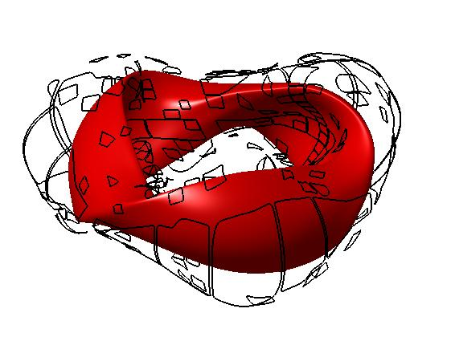

Tutorial: DIAGNO NCSX Tutorial
==============================

This tutorial will walk the user running the DIAGNO code for a
[VMEC free boundary equilibrium](VMEC Free Boundary Run). It is assumed
the user has a converged free boundary equilibrium (wout file).

------------------------------------------------------------------------

1\. **\_\_The diagnostic files.\_\_** \> Each type of diagnostic requires
a diagnostic definition file. For this case we will be using the NCSX
flux loops as our diagnostic (<file:diagno_fluxloops.NCSX>). This file
contains the specification of the 205 saddle type flux loops on NCSX.
Below is a sample from this file.

    205
       301     0     0   1_AA_1
    -1.727866496 -0.196865519 -0.244078684
    -1.728458951 -0.195219041 -0.243707768
    -1.729057223 -0.193576931 -0.243331111
    -1.729661666 -0.191939266 -0.242948435
    -1.730272663 -0.190306020 -0.242559383
    -1.730890620 -0.188677245 -0.242163625
    -1.731515943 -0.187052941 -0.241760781
    -1.732150765 -0.185434148 -0.241348743
    -1.732794604 -0.183820791 -0.240927992
    -1.733444869 -0.182211574 -0.240501170
    -1.734099808 -0.180605506 -0.240070005
    -1.734758303 -0.179001877 -0.239635716
    -1.735419542 -0.177400077 -0.239199141
    -1.736091626 -0.175803306 -0.238752278
    -1.736766935 -0.174210624 -0.238302470
    -1.737441940 -0.172618679 -0.237853474
    -1.738116691 -0.171026557 -0.237405342
    -1.738791214 -0.169433875 -0.236958149
    -1.739465584 -0.167840482 -0.236511948
    -1.740139852 -0.166246454 -0.236066584
    -1.740814222 -0.164652249 -0.235621932
    -1.741488440 -0.163057789 -0.235178219
    -1.742162378 -0.161462872 -0.234735649
    -1.742835986 -0.159867524 -0.234294299
    -1.743509162 -0.158271591 -0.233854244
    -1.744181907 -0.156675049 -0.233415611
    -1.744854194 -0.155077897 -0.232978350
    -1.745526075 -0.153480160 -0.232542512
    -1.746197549 -0.151881891 -0.232108019

2\. \_\_**Add the DIAGNO\_IN name list to the input file**\_\_ \> The
DIAGNO code looks for the \'DIAGNO\_IN\' namelist in the VMEC input file
(). The \'DIAGNO\_IN\' namelist is shown below

    &diagno_in
      NU = 96
      NV = 48
      UNITS = 1.
      FLUX_DIAG_FILE = 'diagno_fluxloops.NCSX'
      INT_TYPE = 'simpson'
      INT_STEP = 2
      LRPHIZ = .false.
    /
                                                               

3 \_\_**Run DIAGNO**\_\_ \> The DIAGNO code takes the VMEC input
extension from the command line as so

     > ~/bin/xdiagno -vmec ncsx_c09r00_free
    ===========================================
    =========  D I A G N O  (v.3.10)  =========
     - Reading input file
     - Reading equilibrium surface
      NZETA= 48  NOT EQUAL TO NP0B= 36  IN MGRID FILE
    ----- Virtual Casing Information -----
       INTEGRAL TYPE: Surface Current
       MIN_GRID_DISTANCE = 8.2976E-02
       NR =    1;   NU =   96;  NV =   48;  NFP =   3
       NUVP =  13824
       ABS_TOL = 1.0000E-05;   REL_TOL = 1.0000E-02
       R       = [   1.02284,   1.77827] [m]
       Z       =   0.64091[m]
       Beta    =   0.04086
       Current =-178.65318[kA]
       Flux    =   0.49707[Wb]
       VMEC v.   8.47
      - Calculating diagnostic responses
      --Calculating Fluxloop Values
         Loop         nseg                  flux
           1            301             -0.26122745E-04
           2            301             -0.20414744E-03
           3            301             -0.23783593E-03
           4            301             -0.20157644E-03
           5            301              0.22268368E-03
           6            301             -0.15810012E-03

4\. \_\_**Examine the Output**\_\_ \> The DIAGNO code will produce a
diagno\_flux.NCSX\_c09r00\_free file which contains the flux loop values
and names.
