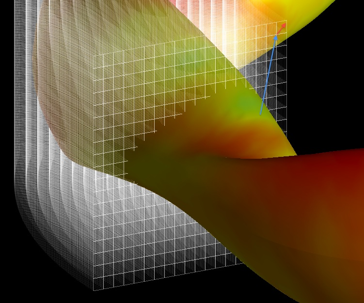

EXTENDER
========

The EXTENDER code (M. Drevlak, D. Monticello and A. Reiman. \"PIES free
boundary stellarator equilibria with improved initial conditions.\"
Nuclear Fusion, 45 (2005)) uses a virtual casing principle (V.D.
Shafranov and L.E. Zakharov. \"Use of the virtual-casing principle in
calculating the containing magnetic field in toroidal plasma systems.\"
Nuclear Fusion 12 (1972)) to solve for the fields at a point in space
due to a coil set and equilibrium ([VMEC](VMEC), PIES).

------------------------------------------------------------------------

### Theory

The EXTENDER code calculates the field of a given MHD equilibrium
through a virtual casing principle. It can also be used to calculate a
field due to a coils definition file. It is interfaced with the
[VMEC](VMEC), PIES and HINT codes and can process their output files.
Output from the code can either be the fields at a point in space
(provided by the user) or on a set of grid planes in a style similar to
the [MAKEGRID](MAKEGRID) code. This field can either be the total field,
field due to coils or the plasma field alone.

The code utilizes a virtual casing principle when calculating the field
due to a given plasma equilibrium. This is achieved through an
invocation of Gauss\'s law, allowing the currents inside the equilibrium
domain to be represented by a surface currents (and dipole moment
densities) on the boundary of the equilibrium.

[math](math) \\vec{K}=-\\frac{1}{\\mu\_0}\\hat{n}\\times\\vec{B}
[math](math) [math](math) \\rho\_{dipole}=-\\hat{n}\\cdot\\vec{B}
[math](math) where the surface normal vector (n) is directed from the
interior of the boundary toward the exterior and the magnetic field is
taken to be that on the surface of the equilibrium. In order to find the
field exterior to the equilibrium the surface current density (and
dipole moment density) must be integrated over the entire surface.
[math](math)
\\vec{B}\_{ext}=\\frac{\\mu\_0}{4\\pi}\\int\\frac{\\vec{K}\'\\times\\left(\\vec{x}-\\vec{x}\'\\right)}{\|\\vec{x}-\\vec{x}\'\|\^3}dA\'+\\frac{\\mu\_0}{4\\pi}\\int\\frac{\\rho\_{dipole}\'\\left(\\vec{x}-\\vec{x}\'\\right)}{\|\\vec{x}-\\vec{x}\'\|\^3}dA\'
[math](math) where the primes indicate quantities evaluated on the
surface. For VMEC equilibria the normal field on the boundary is
identically zero and the second term vanishes. Integration over the
boundary is treated with a
[Newton-Cotes](@http://en.wikipedia.org/wiki/Newton%E2%80%93Cotes_formulas)
method allowing for treatment of points arbitrarily close to the
surface. Calculation of the fields due to a set of field coils is
conducted using a novel Biot-Savart\'s method.

------------------------------------------------------------------------

### Compilation

The EXTENDER code uses a make script to compile the code. The code
requires NAG libraries, netCDF libraries, and MPI libraries. EXTENDER is
written in C++ and has made extensive use of MPI and object oriented
programming.

------------------------------------------------------------------------

### Input Data Format\[\[\#Input\]\]

The EXTENDER code uses command line arguments to control input

    EXTENDER -p <PIES FILE> -v <VMEC FILE> -vmec2000 <VMEC FILE> -vmec_netcdf <VMEC_FILE> -vmec_nyquist <VMEC FILE> -vmec93 <VMEC FILE>
    -b <SURFACE FILE> -c <COILS FILE> -i <CONTROL FILE> -NU <POLOIDAL POINTS> -NV <TOROIDAL POINTS> -NI <NEWTON COTES INTERVALS> -NAIO <SOLVER>
    -ps <PIES SURFACE> -s <SUFFIX> -rel <RELATIVE ERROR> -abs <ABSOLUTE ERROR> -points <POINTS FILE>
    -plasmafield -full

\|\| Argument \|\| Default \|\| Description \|\| \|\| -p \|\| \|\| PIES
netCDF file defining equilibrium \|\| \|\| -v \|\| \|\| VMEC wout file
\|\| \|\| -vmec2000 \|\| \|\| VMEC2000 wout file \|\| \|\| -vmec\_netcdf
\|\| \|\| VMEC wout file (netCDF) \|\| \|\| -vmec\_nyquist \|\| \|\|
VMEC wout file (nyquist netCDF) \|\| \|\| -vmec93 \|\| \|\| VMEC93 wout
file \|\| \|\| -b \|\| Full Grid \|\| Surface file containing the
Fourier coefficients (mu+nv) defining the boundary. \|\| \|\| -c \|\|
NONE \|\| Coils file - NOTE: The EXTENDER codes reads in the current for
each filament from the 4th column of the Coils file. \|\| \|\| -i \|\|
\|\| Control file defining number of radial and vertical points on grid,
number of toroidal cut planes, maximum and minimum radial extend and
maximum vertical extent \|\| \|\| -NU \|\| 120 \|\| Number of poloidal
mesh points for surface integration \|\| \|\| -NV \|\| 120 \|\| Number
of toroidal mesh points for surface integration (per half field period
is stellarator symmetry can be assumed) \|\| \|\| -NI \|\| 3 \|\| Number
of Newton-Cotes intervals to be replace by adaptive integration \|\|
\|\| -NAIO \|\| 4 \|\| Order for adaptive integration \|\| \|\| -s \|\|
NONE \|\| Suffix which is appended to output files \|\| \|\| -rel \|\|
3E-7 \|\| Relative error for adaptive integration \|\| \|\| -abs \|\|
1E-10 \|\| Absolute error for adaptive integration \|\| \|\| -points
\|\| NONE \|\| File specifying a set of points in r, phi and z on which
to calculate the field. \|\| \|\| -plasmafield \|\| \|\| Signals the
code to calculate the field due to the plasma only. If a coils file is
supplied the field inside the equilibrium is calculated by subtracting
the vacuum field from the equilibrium solution. If no coils file is
supplied, EXTENDER uses virtual casing to solve for the vacuum field
inside the domain. The first method is considered more accurate. \|\|
\|\| -full \|\| \|\| Computes the extended field on the whole domain
(NOT recommended when computing the total field) \|\| In it\'s simplest
invocation the code requires an equilibrium output (PIES/VMEC/HINT) and
will calculate the field on a grid.

The surface file (-b option) defines an outer boundary in terms of
Fourier coefficients in NESCOIL format (mu+nv). If the extent of the
grid is not specified in the control file (-i option) then this boundary
file is used to determine the Rmin, Rmax, and Zmax values. Here is an
example file which defines a circle of radius 0.5 centered at R=1.5:

    # m   n           cr               cz
      0   0     1.5000000000e+00     0.0000000000e+00
      1   0     0.5000000000e+00     0.5000000000e+00
    # Comments may be placed in any line

The control file specifies the grid parameters (number of radial points,
number of vertical points, number of toroidal cut planes) it\'s format
is as follows:

    nr 130   # number of radial grid points
    nz 120   # number of vertical grid points
    nphi 110 # number of toroidal cut planes, never be fooled to believe you can save too much on nphi
    rmin 4.0 # optional param., can be computed autom. from boundary
    rmax 7.0 # optional parameter
    zmax 1.3 # optional parameter

If the user wishes the field to be evaluated at a series of points in
space then they simply must provide a pointsfile (-points option). The
points are specified in x y and z:

    # X     Y      Z
     1.5   0.0    0.0
     2.0   0.0    0.0
     2.5   2.5    0.0

------------------------------------------------------------------------

### Execution

The EXTENDER code is executed via the mpirun command and command line
arguments are passed in order to determine the mode of execution. For
example to run the code on 4 processors for a VMEC2000:

    > mpirun -np 4 ./bin/EXTENDER -vmec2000 wout.test -i extender_in.test -c coils.test_machine -NU 360 -NV 72 -s test

------------------------------------------------------------------------

### Output Data Format

The extender code outputs two files by default called extended\_mesh and
extended\_field. Passing the -s option will append a suffix to these
files when output. The extended\_mesh file contains information about
the grid produced by EXTENDER. The extended\_field file contains
information about the fields on the grid. Both are text files.

#### The extended\_mesh File

*(taken from the ONSET User Guide)* The mesh describes a domain of
toroidal topology. Stellarator symmetry is assumed and hence only one
half of one period is represented. The mesh consists of cells,
retangular in (r,phi,z), delimited by points. Points and cells are
located equidistantly in (r,phi,z). The mesh assumes points located in
the range [math](math)
\\left(\\left\[r\_{min},r\_{max}\\right\],\\left\[0,\\pi/N\_{per}\\right\],\\left\[-z\_{max},z\_{max}\\right\]\\right)
[math](math) Of these points, a continuous subset is used for
representing fields. Hence, fields can be made to fit into distorted 3d
domains, like the interior of a coil set. Therefore, meshes are
generated using a toroidal surface selecting the region from which
points arre to be used. A point/cell belonging to the continuous subset
is called active, outside points/cells, are inactive. The mesh file
contains the data marking points/cells as active or inactive and
provides the auxiliary data for addressing the active points/cells in a
continuous memory space. The surface selecting the active region will,
in general, cut through cells located at the edge of the domain. In
order to complete these cells, points just outside the selecting surface
will be added to the domain and marked as active. These points will be
called boundary points. Points inside the domain are inner points.
Points are assigned indicies in their corrdinates, i, j,k, relating to
their position as [math](math) r=r\_{min}+\\Delta r
\\frac{i}{\\left(N\_r-1\\right)},i=0\...N\_r-1 [math](math) [math](math)
\\phi=\\frac{\\pi}{N\_{per}}\\frac{j}{\\left(N\_\\phi-1\\right)},j=0\...N\_\\phi-1
[math](math) [math](math) z=-z\_{max}+\\Delta z
\\frac{k}{\\left(N\_z-1\\right)},k=0\...N\_z-1 [math](math) The
coordinate indicies for cells, in contrast to those of points, range
between \[0\...Nr-2\], \[0\...Nphi-2\], and \[0\...N\_z-2\]. In order to
map the entire set of points, active and inactive, onto a linear
indexing space, they are assigned the total indicies [math](math)
i\_P=i+jN\_r+kN\_rN\_\\phi [math](math) Likewise, cells are indexed as
[math](math)
i\_C=i+j\\left(N\_r-1\\right)+k\\left(N\_r-1\\right)\\left(N\_\\phi-1\\right)
[math](math) A mesh file typically looks like this

    ConstrainedGeometry
    1568000 1526359
    1.92547 1.5708 2.30319
    0.904265 2.82973 1.15159
    2
    140 80 140
    531728 561157
    45297 515860
    0 -1
    0 -1
    0 -1
    0 -1
    .
    .
    .
    591883
    591884
    591885
    591886
    591887
    591888
    591889
    591890
    591891
    591892
    591893
    .
    .
    .

The data printed are:

1.  An identifier of the file contents, ConstrainedGeometry
2.  Number of points Np, number of cells Nc, both active and inactive
3.  Rmax-Rmin, pi/Nper, 2\*Zmax
4.  Rmin,Rmax,Zmax
5.  Nper
6.  Number of steps of the mesh Nr, Nphi, Nz
7.  Number of active points Npa, number of active cells Nca
8.  Number of boundary points Nb, number of interior points Ni
9.  Np lines, containing \> (a) integer flag marking activity of each
    points \> (b) address of point in linear address space, -1 if
    inactive
10. Nc lines, containing \> (a) integer flag marking activity of each
    cell \> (b) address of cell in linear address space, -1 if inactive
11. Npa lines, indicies of active points
12. Nca lines, indicies of active cells

#### The extended \_field File

The field file holds the cylindrical components of a vector field at the
points marked active by the mesh. A field file typically looks like
this:

    ConstrainedVField
    561157
    2
    140
    80
    140
    0.904265
    2.82973
    1.15159
    0.056905
    0.0563255
    0.0557642
    0.0552217
    0.0546985
    0.0541949
    0.0537116
    0.0532488
    .
    .
    .

The data printed are:

1.  An identifier of the file contents, ConstrainedVField
2.  Number of active points Npa
3.  Number of periods Nper
4.  Number of radial points Nr
5.  Number of poloidal points Nphi
6.  Number of axial points Nz
7.  Minimum radius rmin
8.  Maximum radius rmax
9.  Maximum elevation zmax
10. Npa lines, radial components of field at active points (Hr)
11. Npa lines, poloidal components of field at active points (Hphi)
12. Npa lines, axial components of field at active points (Hz)

#### The points File

If the user requested the field be evaluated at a set of points (-points
option) then an output will be generated with the same name as the
points file with \'out\' as a suffix (eg. -p b\_test, b\_test.out). This
is a text file with the following format:

    #  i      r               phi             z               H_r             H_phi           H_z             |H|            inside
           0  4.80242700e+00  6.14355900e+00  4.30900000e-01 -7.86465604e+03 -1.00325890e+03  1.22797224e+04  1.46168028e+04 0
           1  4.63074100e+00  6.10865200e+00  5.10120000e-01 -1.69277773e+04 -3.76178271e+03  1.23201685e+04  2.12717466e+04 0
           2  4.22074400e+00  6.03883900e+00  6.15140000e-01 -3.50921255e+04 -2.06069275e+03 -1.56921383e+04  3.84960639e+04 0

Here the output values are in terms of magnetic induction and must be
multiplied by mu0.

------------------------------------------------------------------------

### Visualization

Visualization of the extender output can be preformed similar to that of
a MAKEGRID file. A visualization package exists in MATLAB to facilitate
plotting of the fields (matlabEXTENDER,
<http://www.mathworks.com/matlabcentral/fileexchange/31470>).

------------------------------------------------------------------------

### Tutorials

[ W7X VMEC Equilibria with EXTENDER](W7X VMEC Equilibria with EXTENDER)
