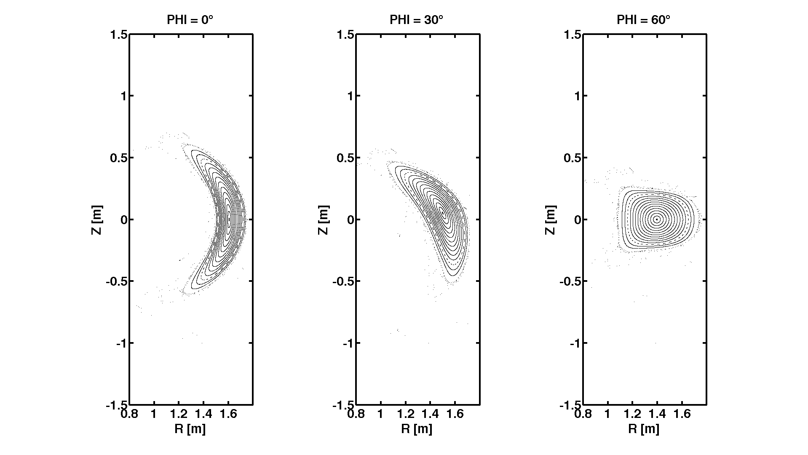

Tutorial: FIELDLINES NCSX Tutorial
==================================

This tutorial will walk the user through running the FIELDLINES code for
a VMEC NCSX equilibrium.

------------------------------------------------------------------------

1\. \_\_**Edit the input namelist text file.**\_\_ \> The input namelist
(input.ncsx\_c09r00\_free) will need to be modified for the
[FIELDLINES](vmecwiki/FIELDLINES)code. The
[FIELDLINES](vmecwiki/FIELDLINES) code utilizes the EXTCUR array from
the [VMEC](vmecwiki/VMEC) INDATA namelist and reads it\'s own
FIELDLINES\_INPUT namelist from this file. For other codes
([PIES](vmecwiki/PIES)[SPEC](vmecwiki/SPEC)) the namelist should be
added to the corresponding input file. Since we will be including the
VMEC plasma and plasma response, we will need the VMEC wout file to be
located in the same directory. The namelist should look like the
following:

     &INDATA
     .
     .
     .
     EXTCUR =   6.52271941985300E+05  6.51868569367400E+05  5.37743588647300E+05
     2.50000000000000E-07  2.50000000000000E-07  2.80949750000000E+04
     -5.48049500000000E+04  3.01228950000000E+04  9.42409100000000E+04
     4.55138737653200E+04
     .
     .
     .
     /
     &FIELDLINES_INPUT
      NR = 201
      NZ = 201
      NPHI = 60
      RMIN = 0.436
      RMAX = 2.436
      ZMIN = -1.0
      ZMAX = 1.0
      PHIMIN = 0.0
      PHIMAX = 2.09439510239
      MU = 0.0
      R_START =  1.6078237350E+00    1.6100000000E+00    1.6200000000E+00    1.6300000000E+00
        1.6400000000E+00    1.6500000000E+00    1.6600000000E+00    1.6700000000E+00
        1.6800000000E+00    1.6900000000E+00    1.7000000000E+00    1.7100000000E+00
        1.7200000000E+00    1.7300000000E+00    1.7400000000E+00    1.7500000000E+00
        1.7510000000E+00    1.7520000000E+00    1.7530000000E+00    1.7540000000E+00
        1.7550000000E+00    1.7560000000E+00    1.7570000000E+00    1.7580000000E+00
        1.7590000000E+00    1.7600000000E+00    1.7610000000E+00
     Z_START = 26*0.00  
     PHI_START = 26*0.00
     PHI_END   = 26*6283.0
     NPOINC    = 120
     INT_TYPE  = 'NAG'
     FOLLOW_TOL = 1.0E-9
     VC_ADAPT_TOL = 1.0E-4
     &END 

\> This will follow 40 field lines for 1000 toroidal transits. The
NPOINC parameter indicates that we wish to save the location of the
field lines 120 times per field period (approximately every degree in
phi). The code will use the NAG routines for following field lines. If
the user does not have access to the NAG libraries, they should replace
NAG with LSODE and use the Livermore solver.

2\. \_\_**Execute the code.**\_\_ \> We execute the code by providing the
type of equilibria followed by the input file extension. Vacuum fields
can either be specified by coil or mgrid, here we\'ve utilized our mgrid
file.

    >~/bin_847/xfieldlines -vmec ncsx_c09r00_free -mgrid mgrid_c09r00.nc
    FIELDLINES Version 1.00
    ----- Input Parameters -----
       FILE: input.ncsx_c09r00_free
       R   = [ 0.43600, 2.43600];  NR:    201
       PHI = [ 0.00000, 2.09440];  NPHI:   60
       Z   = [-1.00000, 1.00000];  NZ:    201
       # of Fieldlines:   27
    ----- MGRID Information -----
       FILE:mgrid_c09r00.nc
       R   = [ 0.43600, 2.43600];  NR   =  201
       PHI = [ 0.00000, 2.09440];  NPHI =   37
       Z   = [-1.00000, 1.00000];  NZ   =  201
    ----- Virtual Casing Information -----
       MIN_GRID_DISTANCE = 8.9562E-02
       NU =   89;  NV =   60;  NFP =   3
       NUVP =  16020
    ----- Constructing Splines -----      
       R   = [ 0.43600, 2.43600];  NR:    201
       PHI = [ 0.00000, 2.09440];  NPHI:   60
       Z   = [-1.00000, 1.00000];  NZ:    201
       HERMITE FORM: 1
    ----- FOLLOWING FIELD LINES -----
          Method: NAG
           Lines:   27
           Steps:  179917   Delta-phi: 0.3491E-01
             Tol: 0.1000E-08  Type: M
    ----- WRITING DATA TO FILE ----- 
       FILE: fieldlines_ncsx_c09r00_free.h5
    ----- FIELDLINES DONE -----

\> The code outputs an HDF5 file with the fieldline data and grid as the
contents. Note that the code is parallelized, so when running the code
on parallel machines, the mpirun command must be used.

3\. \_\_**Examine the output.**\_\_ \> The output of the
[FIELDLINES](vmecwiki/FIELDLINES) code is stored in an HDF5 file called
fieldlines\_ext.h5 where ext is the input extension of the input file.
The field line data is saved NPOINC steps per field period. To construct
a Poincaré plot the user must simply chose the index of the cross
section they\'d like and step by NPOINC indexes to find the next point.
This assumes the user started all field lines from the same phi plane.
Additionally, the grid and field (B\_R/B\_PHI and B\_Z/B\_PHI) are
stored in the file, this is done to aide in restarts.

}
