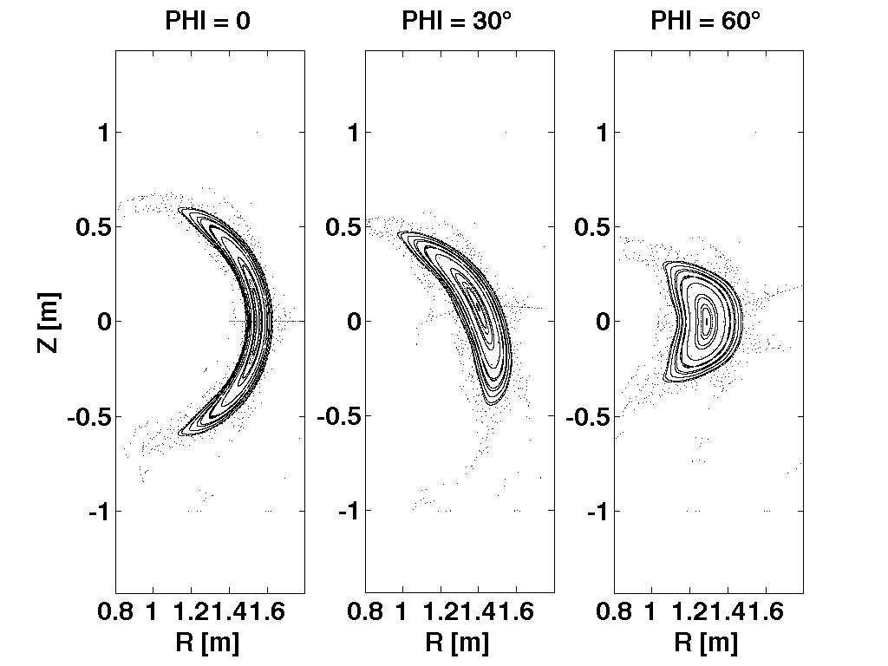

Tutorial: FIELDLINES Vacuum NCSX Tutorial
=========================================

This tutorial will walk the user through running the FIELDLINES code for
a vacuum NCSX configuration.

------------------------------------------------------------------------

1\. \_\_**Edit the input namelist text file.**\_\_ \> The input namelist
(input.ncsx\_c09r00\_free) will need to be modified for the
[FIELDLINES](FIELDLINES) code. The [FIELDLINES](FIELDLINES) code
utilizes the EXTCUR array from the [VMEC](VMEC) INDATA namelist and
reads it\'s own FIELDLINES\_INPUT namelist from this file. For other
codes ([PIES](PIES)/[SPEC](SPEC)) the namelist should be added to the
corresponding input file. Since we will be following fieldlines in
vacuum there is no need to have an output (wout file) present in the
working directory. The namelist should look like the following:

     &INDATA
     .
     .
     .
     EXTCUR =   6.52271941985300E+05  6.51868569367400E+05  5.37743588647300E+05
     2.50000000000000E-07  2.50000000000000E-07  2.80949750000000E+04
     -5.48049500000000E+04  3.01228950000000E+04  9.42409100000000E+04
     4.55138737653200E+04
     .
     .
     .
     /
     &FIELDLINES_INPUT
     NR = 201
     NZ = 201
     NPHI = 36
     RMIN = 0.436
     RMAX = 2.436
     ZMIN = -1.0
     ZMAX = 1.0
     PHIMIN = 0.0
     PHIMAX = 2.09439510239
     MU = 0.0
     R_START = 1.40  1.41  1.42  1.43  1.44
     1.45  1.46  1.47  1.48  1.49
     1.50  1.51  1.52  1.53  1.54
     1.55  1.56  1.57  1.59  1.59
     1.60  1.61  1.62  1.63  1.64
     1.65  1.66  1.67  1.68  1.69
     1.70  1.71  1.72  1.73  1.74
     1.75  1.76  1.77  1.78  1.79
     Z_START = 0.00  0.00  0.00  0.00  0.00
     0.00  0.00  0.00  0.00  0.00
     0.00  0.00  0.00  0.00  0.00
     0.00  0.00  0.00  0.00  0.00
     0.00  0.00  0.00  0.00  0.00
     0.00  0.00  0.00  0.00  0.00
     0.00  0.00  0.00  0.00  0.00
     0.00  0.00  0.00  0.00  0.00
     PHI_START = 40*0.00
     PHI_END   = 40*6283.0
     NPOINC    = 120
     INT_TYPE  = 'NAG'
     FOLLOW_TOL = 1.0E-9
     VC_ADAPT_TOL = 1.0E-7
     &END

\> This will follow 40 field lines for 1000 toroidal transits. The
NPOINC parameter indicates that we wish to save the location of the
field lines 120 times per field period (approximately every degree in
phi). The code will use the NAG routines for following field lines. If
the user does not have access to the NAG libraries, they should replace
NAG with LSODE and use the Livermore solver. The VC\_ADAPT\_TOL
parameter will be ignored as we will be following field lines in vacuum
and do not need to preform a virtual casing. 2. \_\_**Execute the
code.**\_\_ \> We execute the code by providing the type of equilibria
followed by the input file extension. Vacuum fields can either be
specified by coil or mgrid, here we\'ve utilized our mgrid file.
Finally, we instruct the code that we wish to calculate vacuum field via
the -vac command line option.

     >~/bin_847/xfieldlines -vmec ncsx_c09r00_free -mgrid mgrid_c09r00.nc -vac
     FIELDLINES Version 0.50
     ----- Input Parameters -----
     FILE: input.ncsx_c09r00_free
     R = [ 0.43600, 2.43600]; NR: 201
     PHI = [ 0.00000, 2.09440]; NPHI: 36
     Z = [-1.00000, 1.00000]; NR: 201
     # of Fieldlines: 40
     VACUUM FIELDS ONLY!
     ----- MGRID Information -----
     FILE:mgrid_c09r00.nc
     R = [ 0.43600, 2.43600]; NR = 201
     PHI = [ 0.00000, 2.09440]; NPHI = 37
     Z = [-1.00000, 1.00000]; NZ = 201
     ----- FOLLOWING FIELD LINES -----
     Method: NAG
     Lines: 40
     Tol: 0.1000E-08 Type: M
     Delta-phi: 0.1745E-01
     Lines: 359989
     ----- WRITING DATA TO FILE -----
     FILE: fieldlines_ncsx_c09r00_free.h5
     ----- FIELDLINES DONE -----

\> The code outputs an HDF5 file with the fieldline data and grid as the
contents. Note that the code is parallelized, so when running the code
on parallel machines, the mpirun command must be used. 3. \_\_**Examine
the output.**\_\_ \> The output of the [FIELDLINES](FIELDLINES) code is
stored in an HDF5 file called fieldlines\_ext.h5 where ext is the input
extension of the input file. The field line data is saved NPOINC steps
per field period. To construct a Poincaré plot the user must simply
chose the index of the cross section they\'d like and step by NPOINC
indexes to find the next point. This assumes the user started all field
lines from the same phi plane. Additionally, the grid and field
(B\_R/B\_PHI and B\_Z/B\_PHI) are stored in the file, this is done to
aide in restarts.

