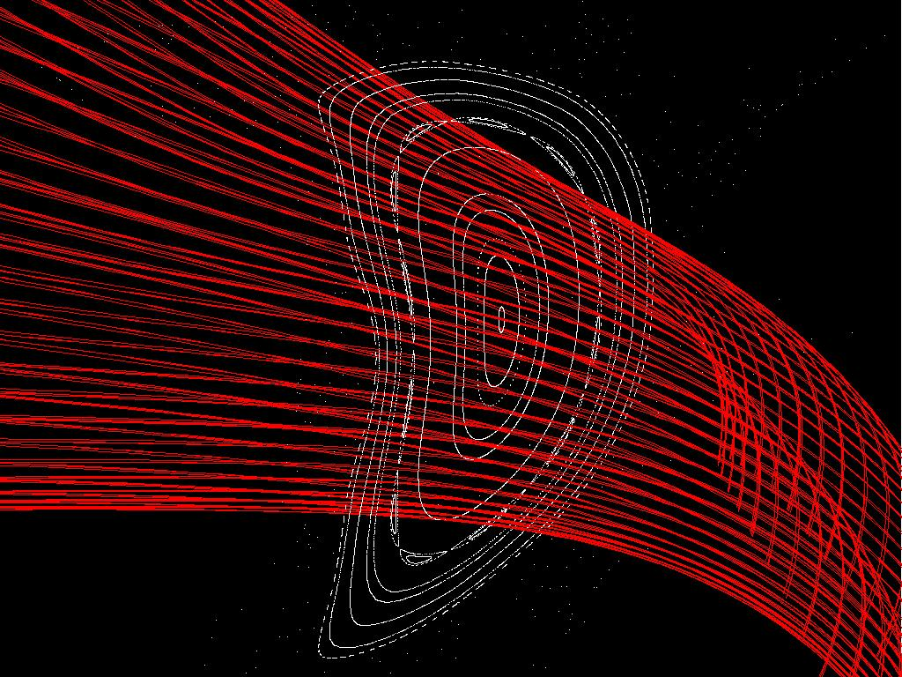
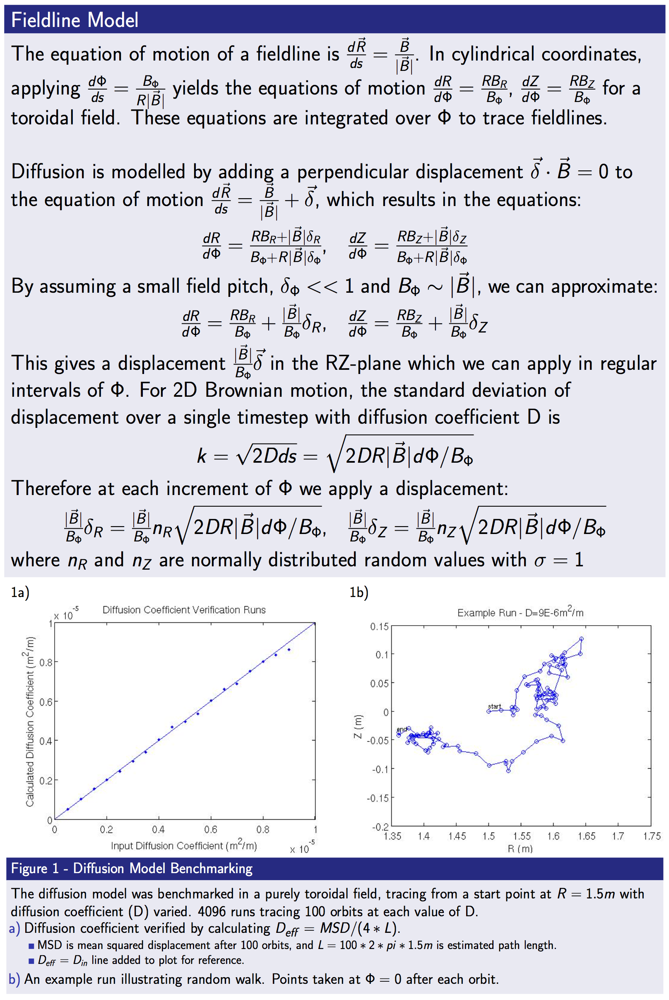

 
FIELDLINES
==========
 
--- 
Table of Contents 
 
   * [Theory](#theory) 
   * [Compilation](#compilation) 
   * [Input Data Format](#input-data-format) 
   * [Execution](#execution) 
   * [Output Data Format](#output-data-format) 
   * [Visualization](#visualization) 
   * [Tutorials]](#tutorials) 
 
--- 
 

The FIELDLINES code follows field lines in a toroidal domain given a
vacuum, [VMEC](VMEC), [PIES](PIES), or [SPEC](SPEC) equilibria, and is
parallelized over the field line trajectories.

------------------------------------------------------------------------

### Theory

The FIELDLINES code follows fieldlines in a toroidal domain. This is
achieved by placing the magnetic field on an R-phi-Z mesh and
constructing splines over that mesh. An ODE for following field lines as
a function of the toroidal angle can be constructed by relating the
motions in R and Z as a function of phi through

$$ \frac{\partial R}{\partial \phi} =
R\frac{B_R}{B_\phi} $$ and $$ \frac{\partial
Z}{\partial \phi} = R\frac{B_Z}{B_\phi} $$

In this representation the trajectory of the fieldline can be
parameterized by toroidal angle. The resulting ODE is solved with a user
determined step-size and accuracy. The available ODE packages are:
[LSODE](https://computation.llnl.gov/casc/odepack/odepack_home.html),
[NAG D02CJF](http://www.nag.co.uk/numeric/fl/manual/pdf/D02/d02cjf.pdf)(requires
license), and a Runge-Kutta-Hutta 6-th order 8 step method
([D. Sarafyan, J. Math. Anal. Appl. 40, 436-455 (1972)](http://dx.doi.org/10.1016/0022-247X(72)90062-5))
. The calculation of field line trajectories is parallelized over each
field line. Thus each processor can follow each field line independently
to speed computation.

The code assembles fields from various sources. The vacuum component of
the field can be calculated directly from a coils file or an mgrid file.
In the later case the FIELDLINES grid must match the mgrid file. The
plasma field inside the equilibria domain is placed directly on the
background grid. The plasma response external to the equilibria is
calculated using a virtual casing principle. In order to maintain
accuracy near the surface of the plasma, the virtual casing principle
employs an adaptive integration scheme over the surface current. This
scheme is either handled by
[NAG D01EAF](http://www.nag.co.uk/numeric/fl/manual/pdf/D01/d01eaf.pdf)
(if available), or the
[DCUHRE](http://www.math.wsu.edu/faculty/genz/software/software.html)
algorithm
([J. Berntsen, T. O. Espelid and A. Genz, Trans. Math. Softw. 17 (1991), pp. 437-451.](http://dx.doi.org/10.1145/210232.210233),
[J. Berntsen, T. O. Espelid and A. Genz, Trans. Math. Softw. 17 (1991), pp. 452-456.](http://dx.doi.org/10.1145/210232.210234))
. This part of the code is parallelized over the vertical dimension (Z).
Thus the z-axis is domain decomposed.

The code can also be given a limiting surface (vessel, first wall,
divertor). Field lines which pass through this surface are not followed
beyond that point. An artificial diffusion can also be applied to aid in
modeling divertor strike points.

If the user wishes, the code can automatically locate the magnetic axis,
find the \'edge\' of the flux surfaces, and output the periodic orbit of
the edge with the -full option. Here the code begins by first following
fieldlines from the minimum and maximum values in R_START and Z_START.
A magnetic axis is identified using a periodic orbit search. The edge is
then refined once so any edge stochastic region may be resolved. The
code then follows fieldlines in this domain from the axis to the
\'edge.\' If the user supplies an R,PHI,Z guess for the edge periodic
orbit the code will find it and the associated separatrix.

------------------------------------------------------------------------

### Compilation

FIELDLINES is a component of the STELLOPT suite of codes. It is
contained within the \'stellopt.zip\' file. Compilation of the STELLOPT
suite is discussed on the
[STELLOPT Compilation Page](vmecwiki/STELLOPT Compilation). To obtain
the code please contact the author Samuel A. Lazerson
(<lazerson@pppl.gov>).

------------------------------------------------------------------------

### Input Data Format

The FIELDLINES code is controled through command line inputs and an
input namelist which should be placed in the input.ext file. While the
entire VMEC input name is not required the EXTCUR array is required. The
name lists should look like:

    #!fortran
    &INDATA
     ! VMEC input namelist (only need coil currents for usual runs)
     EXTCUR(1) = 10000.00
     EXTCUR(2) = 10000.00
     EXTCUR(3) = 12000.00
     EXTCUR(4) = 12000.00
     EXTCUR(5) = 6000.00
     ! VMEC Axis info (for putting a current on axis -axis option)
     !     This information is utilized if you want to place the net toroidal current
     !     on a magnetic axis.  Useful for doing vacuum tokamak equilibria
     CURTOR = 5000.0
     NFP = 5
     NTOR = 6
     RAXIS = 3.6  0.1 0.001
     ZAXIS = 0.0  0.1 0.001
    /
    &FIELDLINES_INPUT
     NR = 251                          ! Number of radial gridpoints, overridden if using mgrid
     NPHI = 36                         ! Number of toroidal gridpoints, overridden if using mgrid
     NZ = 301                          ! Number of vertical gridpoints, overridden if using mgrid
     RMIN = 2.5                        ! Minimum extent of radial grid, overridden if using mgrid
     RMAX = 5.0                        ! Maximum extent of radial grid, overridden if using mgrid
     ZMIN = -1.5                       ! Minimum extent of vertical grid, overridden if using mgrid
     ZMAX = 1.5                        ! Maximum extent of radial grid, overridden if using mgrid
     PHIMIN = 0.0                      ! Minimum extent of toroidal grid, overridden if using mgrid
     PHIMAX = 0.628                    ! Maximum extent of toroidal grid, overrideen if using mgrid
     MU = 0.0                          ! Fieldline diffusion (mu=sqrt(D*tau*2))
     R_START =  3.6  3.7  3.8          ! Radial starting locations of fieldlines
     Z_START =  0.0  0.0  0.0          ! Vertical starting locations of fieldlines
     PHI_START =  0.0  0.0  0.0        ! Toroidal starting locations of fieldlines (radians)
     PHI_END =  629.0  629.0  629.0    ! Maximum distance in toroidal direction to follow fieldlines
     NPOINC = 72                       ! Number of toroidal points per-period to output the field line trajectory
     INT_TYPE = 'NAG'                  ! Fieldline integration method (NAG, RKH68, LSODE)
     FOLLOW_TOL = 1.0E-12              ! Fieldline following tollerance
     VC_ADAPT_TOL = 1.0E-7             ! Virtual casing tolerance (if using plasma field from equilibria)
     R_HC = 3.5                        ! R Location of periodic orbit (-full)
     Z_HC = 0.5                        ! Z Location guess for periodic orbit (-full)
     PHI_HC = 0.0                      ! PHI Location for periodic orbit(-full)
     NUM_HCP = 512                     ! Number of points for separatrix plot (-full)
     DELTA_HC = 1.0E-4                ! Initial length of separatrix line (-full)
    /
    &END

If you wish to model an NFP=1 system please comment out the PHIMAX line
(this sets PHIMAX to 2\*pi to machine precision). If you system has an
underlying field symmetry (such as a stellarator) please make sure the
choice of NPHI is consistent. For example a 5 field period machine which
was modeled with NFP=5 and NPHI=36, would require NPHI=176 and NFP=1 for
consistency. This places a spline knot at every point in the original 5
field period model. In general the formula is NPHI1=(NPHI-1)\*NFP+1,
where NPHI1 is the full device model (nphi) and NPHI is the field period
model (nphi).

To use MU you need to take the actual diffusion coefficient D \[m^2/s\]
multiply it by TAU \[s\] which is the timescale of the simulation and
the factor 2, then take the square root. This will give you the proper
value of MU. To calculate TAU use the formula
TAU=\<PHI_END\*R_START\>/V_PART where V_PART is the velocity of a
particle (assumed) and the operator \<\> means average. (Note this works
as of version 1.31)

------------------------------------------------------------------------

### Execution

The FIELDLINES code is controlled through a combination of command-line
inputs and an input namelist. The input namelist must be in the
equilibrium input file. That file must also contain the VMEC INDATA
namelist (although only the EXTCUR array will be used). The FIELDLINES
code is run from the command line taking an equilibrium input file as a
necessary argument. This input file must have the INDATA (for EXTCUR)
and FIELDLINES_IN namelists in it.

    XFIELDLINES -vmec <VMEC FILE> -pies <PIES_FILE> -spec <SPEC FILE> -coil <COIL FILE> -mgrid <MGRID FILE> -vessel <VESSEL FILE> -vac -full -noverb -help

| Argument | Default | Description | 
| --- | --- | --- | 
| -vmec   | NONE | VMEC input extension | 
| -pies   | NONE | PIES input extension |
| -spec   | NONE | SPEC input extension |
| -coil   | NONE | Coils File | 
| -mgrid  | NONE | Makegrid style vacuum grid file | 
| -vessel | NONE | First wall file | 
| -screen | NONE | Poincaré Screen file | 
| -vac    | NONE | Only compute the vacuum field | 
| -hitonly | NONE | Only save strikepoint locations (used in conjunction with -vessel) | 
| -full | NONE | Auto calculate axis and edge maximum resolution | 
| -edge | NONE | Place all starting points at VMEC boundary. | 
| -noverb | NONE | Suppresses screen output | 
| -field | NONE | Outputs the B-Field on the cylindrical grid only. | 
| -raw | NONE | Treats EXTCUR array as raw values (EXTCUR is a scale factor applied to what\'s in the coils file). | 
| -auto | NONE | Starting points set equal to radial grid and run from the min to max values of R_START and Z_START | 
| -help | NONE | Print help message |

In it\'s simplest invokation the code requires a VMEC input file and some source of vacuum field.  Please note that FIELDLINES takes advantage of shared memory MPI so the user must request full nodes

    >mpirun -N 6 ~/bin_847/xfieldlines -vmec ncsx_c09r00_free -mgrid mgrid_c09r00.nc -vac
    FIELDLINES Version 0.50
    ----- Input Parameters -----
       FILE: input.ncsx_c09r00_free
       R   = [ 0.43600, 2.43600];  NR:    201
       PHI = [ 0.00000, 2.09440];  NPHI:   36
       Z   = [-1.00000, 1.00000];  NR:    201
       # of Fieldlines:   40
       VACUUM FIELDS ONLY!
    ----- MGRID Information -----
       FILE:mgrid_c09r00.nc
       R   = [ 0.43600, 2.43600];  NR   =  201
       PHI = [ 0.00000, 2.09440];  NPHI =   37
       Z   = [-1.00000, 1.00000];  NZ   =  201
    ----- FOLLOWING FIELD LINES -----
          Method: NAG
           Lines:   40
             Tol: 0.1000E-08  Type: M
       Delta-phi: 0.1745E-01
           Lines:  359989
    ----- WRITING DATA TO FILE -----
       FILE: fieldlines_ncsx_c09r00_free.h5
    ----- FIELDLINES DONE -----

------------------------------------------------------------------------

### Output Data Format

The FIELDLINES code outputs data in the
[HDF5 data format](http://www.hdfgroup.org/HDF5/). The trajectory of
each field line and relevant quantities for each run are stored in a
fieldline_ext.h5 file. A MATLAB routine for reading the HDF5 file is
available
([MATLAB File Exchange: read_fieldlines.m](@http://www.mathworks.com/matlabcentral/fileexchange/54931-read-fieldlines)).
A sample of the HDF5 data structure looks like:

    HDF5 "fieldlines_ncsx_c09r00_free.h5" {
    GROUP "/" {
       DATASET "B_R" {
          DATATYPE  H5T_IEEE_F64LE
          DATASPACE  SIMPLE { ( 201, 36, 201 ) / ( 201, 36, 201 ) }
       }
       DATASET "B_Z" {
          DATATYPE  H5T_IEEE_F64LE
          DATASPACE  SIMPLE { ( 201, 36, 201 ) / ( 201, 36, 201 ) }
       }
       DATASET "PHI_lines" {
          DATATYPE  H5T_IEEE_F64LE
          DATASPACE  SIMPLE { ( 359990, 40 ) / ( 359990, 40 ) }
       }
       DATASET "R_lines" {
          DATATYPE  H5T_IEEE_F64LE
          DATASPACE  SIMPLE { ( 359990, 40 ) / ( 359990, 40 ) }
       }
       DATASET "Z_lines" {
          DATATYPE  H5T_IEEE_F64LE
          DATASPACE  SIMPLE { ( 359990, 40 ) / ( 359990, 40 ) }
       }
       DATASET "lcoil" {
          DATATYPE  H5T_STD_I32LE
          DATASPACE  SIMPLE { ( 1 ) / ( 1 ) }
       }
       DATASET "lmgrid" {
          DATATYPE  H5T_STD_I32LE
          DATASPACE  SIMPLE { ( 1 ) / ( 1 ) }
       }
       DATASET "lmu" {
          DATATYPE  H5T_STD_I32LE
          DATASPACE  SIMPLE { ( 1 ) / ( 1 ) }
       }
       DATASET "lpies" {
          DATATYPE  H5T_STD_I32LE
          DATASPACE  SIMPLE { ( 1 ) / ( 1 ) }
       }
       DATASET "lspec" {
          DATATYPE  H5T_STD_I32LE
          DATASPACE  SIMPLE { ( 1 ) / ( 1 ) }
       }
       DATASET "lvac" {
          DATATYPE  H5T_STD_I32LE
          DATASPACE  SIMPLE { ( 1 ) / ( 1 ) }
       }
       DATASET "lvessel" {
          DATATYPE  H5T_STD_I32LE
          DATASPACE  SIMPLE { ( 1 ) / ( 1 ) }
       }
       DATASET "lvmec" {
          DATATYPE  H5T_STD_I32LE
          DATASPACE  SIMPLE { ( 1 ) / ( 1 ) }
       }
       DATASET "nlines" {
          DATATYPE  H5T_STD_I32LE
          DATASPACE  SIMPLE { ( 1 ) / ( 1 ) }
       }
       DATASET "nphi" {
          DATATYPE  H5T_STD_I32LE
          DATASPACE  SIMPLE { ( 1 ) / ( 1 ) }
       }
       DATASET "npoinc" {
          DATATYPE  H5T_STD_I32LE
          DATASPACE  SIMPLE { ( 1 ) / ( 1 ) }
       }
       DATASET "nr" {
          DATATYPE  H5T_STD_I32LE
          DATASPACE  SIMPLE { ( 1 ) / ( 1 ) }
       }
       DATASET "nsteps" {
          DATATYPE  H5T_STD_I32LE
          DATASPACE  SIMPLE { ( 1 ) / ( 1 ) }
       }
       DATASET "nz" {
          DATATYPE  H5T_STD_I32LE
          DATASPACE  SIMPLE { ( 1 ) / ( 1 ) }
       }
       DATASET "phiaxis" {
          DATATYPE  H5T_IEEE_F64LE
          DATASPACE  SIMPLE { ( 36 ) / ( 36 ) }
       }
       DATASET "raxis" {
          DATATYPE  H5T_IEEE_F64LE
          DATASPACE  SIMPLE { ( 201 ) / ( 201 ) }
       }
       DATASET "zaxis" {
          DATATYPE  H5T_IEEE_F64LE
          DATASPACE  SIMPLE { ( 201 ) / ( 201 ) }
       }
    }
    }

------------------------------------------------------------------------

### Visualization

Various visualization packages exist which can read the HDF5 file. Each
field line is defined as a set of points in R phi and Z.

------------------------------------------------------------------------

### Tutorials\]

[FIELDLINES Vacuum NCSX Tutorial](FIELDLINES Vacuum NCSX Tutorial)

[FIELDLINES NCSX Tutorial](FIELDLINES NCSX Tutorial)
