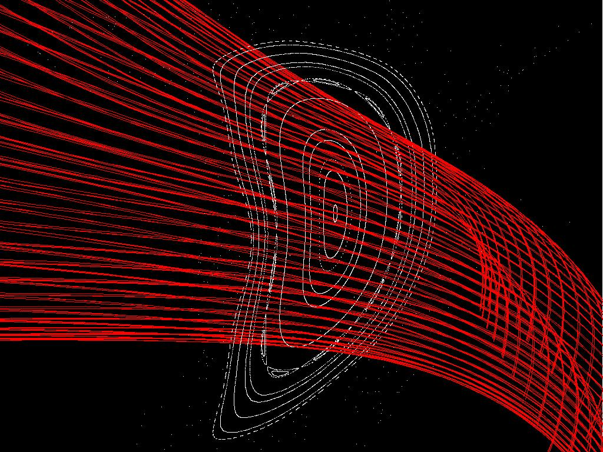
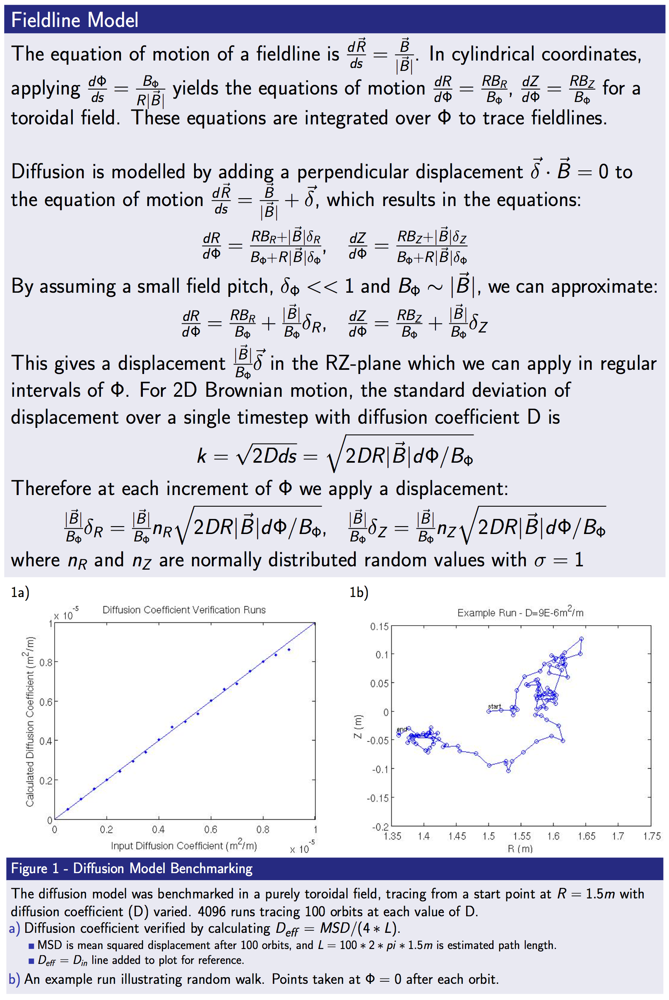

 
FIELDLINES
==========
 
--- 
Table of Contents 
 
   * [Theory](#theory) 
   * [Compilation](#compilation) 
   * [Input Data Format](#input-data-format) 
   * [Execution](#execution) 
   * [Output Data Format](#output-data-format) 
   * [Visualization](#visualization) 
   * [Tutorials](#tutorials) 
 
--- 
 

The FIELDLINES code follows field lines in a toroidal domain given a
vacuum, [VMEC](VMEC), [PIES](PIES), or [SPEC](SPEC) equilibria, and is
parallelized over the field line trajectories.

------------------------------------------------------------------------

### Theory

The FIELDLINES code follows fieldlines in a toroidal domain. This is
achieved by placing the magnetic field on an R-phi-Z mesh and
constructing splines over that mesh. An ODE for following field lines as
a function of the toroidal angle can be constructed by relating the
motions in R and Z as a function of phi through

$$ \frac{\partial R}{\partial \phi} =
R\frac{B_R}{B_\phi} $$ and $$ \frac{\partial
Z}{\partial \phi} = R\frac{B_Z}{B_\phi} $$

In this representation the trajectory of the fieldline can be
parameterized by toroidal angle. The resulting ODE is solved with a user
determined step-size and accuracy. The available ODE packages are:
[LSODE](https://computation.llnl.gov/casc/odepack/odepack_home.html),
[NAG D02CJF](http://www.nag.co.uk/numeric/fl/manual/pdf/D02/d02cjf.pdf)(requires
license), and a Runge-Kutta-Hutta 6-th order 8 step method
([D. Sarafyan, J. Math. Anal. Appl. 40, 436-455 (1972)](http://dx.doi.org/10.1016/0022-247X(72)90062-5))
. The calculation of field line trajectories is parallelized over each
field line. Thus each processor can follow each field line independently
to speed computation.  It should be noted that `PHI_END` and `PHI_START`
define the direction of integration.  The `-reverse` flag is present to
aide in switching the sign of `PHI_END` automatically.

The code assembles fields from various sources. The vacuum component of
the field can be calculated directly from a coils file or an mgrid file.
In the later case the FIELDLINES grid must match the mgrid file. The
plasma field inside the equilibria domain is placed directly on the
background grid. The plasma response external to the equilibria is
calculated using a virtual casing principle. In order to maintain
accuracy near the surface of the plasma, the virtual casing principle
employs an adaptive integration scheme over the surface current. This
scheme is either handled by
[NAG D01EAF](http://www.nag.co.uk/numeric/fl/manual/pdf/D01/d01eaf.pdf)
(if available), or the
[DCUHRE](http://www.math.wsu.edu/faculty/genz/software/software.html)
algorithm
([J. Berntsen, T. O. Espelid and A. Genz, Trans. Math. Softw. 17 (1991), pp. 437-451.](http://dx.doi.org/10.1145/210232.210233),
[J. Berntsen, T. O. Espelid and A. Genz, Trans. Math. Softw. 17 (1991), pp. 452-456.](http://dx.doi.org/10.1145/210232.210234))
. This part of the code is parallelized over the vertical dimension (Z).
Thus the z-axis is domain decomposed.

The code can also be given a limiting surface (vessel, first wall,
divertor). Field lines which pass through this surface are not followed
beyond that point. An artificial diffusion can also be applied to aid in
modeling divertor strike points.

If the user wishes, the code can automatically locate the magnetic axis,
find the \'edge\' of the flux surfaces, and output the periodic orbit of
the edge with the -full option. Here the code begins by first following
fieldlines from the minimum and maximum values in R_START and Z_START.
A magnetic axis is identified using a periodic orbit search. The edge is
then refined once so any edge stochastic region may be resolved. The
code then follows fieldlines in this domain from the axis to the
\'edge.\' If the user supplies an R,PHI,Z guess for the edge periodic
orbit the code will find it and the associated separatrix.

------------------------------------------------------------------------

### Compilation

FIELDLINES is a component of the STELLOPT suite of codes.

------------------------------------------------------------------------

### Input Data Format

The FIELDLINES code is controled through command line inputs and an
input namelist which should be placed in the input.ext file. While the
entire VMEC input name is not required the EXTCUR array is required. The
name lists should look like:

    #!fortran
    &INDATA
     ! VMEC input namelist (only need coil currents for usual runs)
     EXTCUR(1) = 10000.00
     EXTCUR(2) = 10000.00
     EXTCUR(3) = 12000.00
     EXTCUR(4) = 12000.00
     EXTCUR(5) = 6000.00
     ! VMEC Axis info (for putting a current on axis -axis option)
     !     This information is utilized if you want to place the net toroidal current
     !     on a magnetic axis.  Useful for doing vacuum tokamak equilibria
     CURTOR = 5000.0
     NFP = 5
     NTOR = 6
     RAXIS = 3.6  0.1 0.001
     ZAXIS = 0.0  0.1 0.001
    /
    &FIELDLINES_INPUT
    !---------- Background Grid Parameters ------------
     NR = 251                          ! Number of radial gridpoints
     NPHI = 36                         ! Number of toroidal gridpoints
     NZ = 301                          ! Number of vertical gridpoints
     RMIN = 2.5                        ! Minimum extent of radial grid
     RMAX = 5.0                        ! Maximum extent of radial grid
     ZMIN = -1.5                       ! Minimum extent of vertical grid
     ZMAX = 1.5                        ! Maximum extent of vertical grid
     PHIMIN = 0.0                      ! Minimum extent of toroidal grid, overridden by mgrid or coils file
     PHIMAX = 0.628                    ! Maximum extent of toroidal grid, overridden by mgrid or coils file
     VC_ADAPT_TOL = 1.0E-7             ! Virtual casing tolerance (if using plasma field from equilibria)
    !---------- Magnetic Material Parameters ----------
     MUMATERIAL_NITER = 1000           ! Maximum number of iterations in magnetization solve
     MUMATERIAL_TOL   = 1.0E-5         ! Error Threshold
     MUMATERIAL_LAMTHRESH = 10         ! 
     MUMATERIAL_LAMBDA    = 0.7        ! Damping Factor for Picard Iteration
     MUMATERIAL_LAMFACTOR = 0.75       !
     MUMATERIAL_PADFACTOR = 0.3        ! Factor of NN in terms of total domain
     MUMATERIAL_CONVCHECK = 99.0       ! Convergence Check in % 
    !---------- Marker Tracking Parameters ------------
     INT_TYPE = 'LSODE'                ! Fieldline integration method (NAG, RKH68, LSODE)
     FOLLOW_TOL = 1.0E-12              ! Fieldline ODE solver tollerance
     NPOINC = 72                       ! Number of toroidal points per-period to output the field line trajectory
     MU = 0.0                          ! Fieldline diffusion (mu=D/v) [m^2/m]
     R_START =  3.6  3.7  3.8          ! Radial starting locations of fieldlines
     Z_START =  0.0  0.0  0.0          ! Vertical starting locations of fieldlines
     PHI_START =  0.0  0.0  0.0        ! Toroidal starting locations of fieldlines (radians)
     PHI_END =  629.0  629.0  629.0    ! Maximum distance in toroidal direction to follow fieldlines
    !---------- Periodic Orbits (-full) ------------
     NUM_HCP = 512                     ! Number of points for separatrix plot (-full)
     DELTA_HC = 1.0E-4                 ! Initial length of separatrix line (-full)
     R_HC = 3.5                        ! R Location of periodic orbit (-full)
     Z_HC = 0.5                        ! Z Location guess for periodic orbit (-full)
     PHI_HC = 0.0                      ! PHI Location for periodic orbit(-full)
    !---------- Error Fields ------------
     ERRORFIELD_AMP =   1.0E-4 0.0 0.0 ! Amplitude of analytic error field
     ERRORFIELD_PHASE = 1      2   3   ! Toroidal phase (n) of error field
    /
    &END

The toroidal background grid repeats the endpoint so that grid points
`1` and `NPHI` are the same. To enforce the half field period point,
one should choose an odd number for number of gridpoints.  The
following table outlines some common choices for 1 degree separation

| NPF | NPHI |
| --- | --- |
|  1  | 361 |
|  2  | 181 |
|  3  | 121 |
|  4  |  91 |
|  5  |  73 |
| 10  |  19 |

When modeling an `NFP=1` system it is best to comment out `PHIMAX` as
this sets it to `2*pi` at machine precision. It is important to remember
that if you system has an underlying stellarator symmetry you need to
carefully choose the number of grid points. The general rule is if you
want NPHI0 unique gridpoints per field period, then you need to set
`NPHI = NPHI0*NFP+1`.  The following table should help

| NPF | 1 deg | Half res |
| --- | --- | --- |
|  1  | 361 | 181 |
|  2  | 361 | 181 |
|  3  | 361 | 181 |
|  4  | 361 | 177 |
|  5  | 361 | 181 |
| 10  | 361 | 181 |

The MU diffusion coefficient has units of \[m^2/m\]. To convert the
traditional diffusion coefficient D \[m^2/s\] to MU you simply divide
D by the typical velocity (usually the sound speed) of your particle.

------------------------------------------------------------------------

### Execution

The FIELDLINES code is controlled through a combination of command-line
inputs and an input namelist. The input namelist must be in the
equilibrium input file. That file must also contain the VMEC INDATA
namelist (although only the EXTCUR array will be used). The FIELDLINES
code is run from the command line taking an equilibrium input file as a
necessary argument. This input file must have the INDATA (for EXTCUR)
and FIELDLINES_IN namelists in it.

    XFIELDLINES -vmec <VMEC ID> -pies <PIES_FILE> -spec <SPEC FILE> -coil <COIL FILE> -mgrid <MGRID FILE> -vessel <VESSEL FILE> -vac -full -noverb -help

| Argument | Default | Description | 
| --- | --- | --- | 
| -vmec   | NONE | VMEC input extension | 
| -hint   | NONE | HINT input/magslice extension | 
| -eqdsk  | NONE | FIELDLINES input extension and gfile |
| -coil   | NONE | Coils File | 
| -mgrid  | NONE | Makegrid style vacuum grid file | 
| -nescoil | NONE | NESCOIL file (for vacuum) |
| -vessel | NONE | First wall file | 
| -screen | NONE | Poincaré Screen file | 
| -mumat  | NONE | Magnetic materials mesh file |
| -mumat_magfile | NONE | Magnetic materials magnetization file |
| -mumat_skipiter | NONE | Skip iterations |
| -mumat_writemagfile | NONE | Write out magnetization file |
| -vac    | NONE | Only compute the vacuum field | 
| -raw    | NONE | Treat vacuum field current in RAW format (EXTCUR as scaling factor) | 
| -plasma | NONE | Plasma field only | 
| -field | NONE | Outputs the B-Field on the cylindrical grid only. |  
| -vecpot | NONE | Outputs the vector potential on the cylindrical grid only. |  
| -emc3   | NONE | Output EMC3 Grid (very experimental) | 
| -gridgen   | NONE | Create a fieldline grid for BEAMS3D. | 
| -modb | NONE | Save |B| along fieldline. |  
| -field_start | NONE | Extension and fieldline number to use for initializing run. |
| -auto | NONE | Starting points set equal to radial grid and run from the min to max values of R_START and Z_START |
| -full | NONE | Auto calculate axis and edge maximum resolution | 
| -hitonly | NONE | Only save strikepoint locations (used in conjunction with -vessel) |
| -reverse | NONE | Follow particles in oposite direction. | 
| -edge | NONE | Place all starting points at VMEC boundary. | 
| -noverb | NONE | Suppresses screen output | 
| -help | NONE | Print help message |

In it\'s simplest invokation the code requires a VMEC input file and some source of vacuum field.  Please note that FIELDLINES takes advantage of shared memory MPI so the user must request full nodes

    >mpirun -N 6 ~/bin_847/xfieldlines -vmec ncsx_c09r00_free -mgrid mgrid_c09r00.nc -vac
    FIELDLINES Version 0.50
    ----- Input Parameters -----
       FILE: input.ncsx_c09r00_free
       R   = [ 0.43600, 2.43600];  NR:    201
       PHI = [ 0.00000, 2.09440];  NPHI:   36
       Z   = [-1.00000, 1.00000];  NR:    201
       # of Fieldlines:   40
       VACUUM FIELDS ONLY!
    ----- MGRID Information -----
       FILE:mgrid_c09r00.nc
       R   = [ 0.43600, 2.43600];  NR   =  201
       PHI = [ 0.00000, 2.09440];  NPHI =   37
       Z   = [-1.00000, 1.00000];  NZ   =  201
    ----- FOLLOWING FIELD LINES -----
          Method: NAG
           Lines:   40
             Tol: 0.1000E-08  Type: M
       Delta-phi: 0.1745E-01
           Lines:  359989
    ----- WRITING DATA TO FILE -----
       FILE: fieldlines_ncsx_c09r00_free.h5
    ----- FIELDLINES DONE -----

------------------------------------------------------------------------

### Output Data Format

The FIELDLINES code outputs data in the
[HDF5 data format](http://www.hdfgroup.org/HDF5/). The trajectory of
each field line and relevant quantities for each run are stored in a
fieldline_ext.h5 file. A MATLAB routine for reading the HDF5 file is
available
([MATLAB File Exchange: read_fieldlines.m](@http://www.mathworks.com/matlabcentral/fileexchange/54931-read-fieldlines)).
A sample of the HDF5 data structure looks like:

    HDF5 "fieldlines_ncsx_c09r00_free.h5" {
    GROUP "/" {
       DATASET "B_R" {
          DATATYPE  H5T_IEEE_F64LE
          DATASPACE  SIMPLE { ( 201, 36, 201 ) / ( 201, 36, 201 ) }
       }
       DATASET "B_Z" {
          DATATYPE  H5T_IEEE_F64LE
          DATASPACE  SIMPLE { ( 201, 36, 201 ) / ( 201, 36, 201 ) }
       }
       DATASET "PHI_lines" {
          DATATYPE  H5T_IEEE_F64LE
          DATASPACE  SIMPLE { ( 359990, 40 ) / ( 359990, 40 ) }
       }
       DATASET "R_lines" {
          DATATYPE  H5T_IEEE_F64LE
          DATASPACE  SIMPLE { ( 359990, 40 ) / ( 359990, 40 ) }
       }
       DATASET "Z_lines" {
          DATATYPE  H5T_IEEE_F64LE
          DATASPACE  SIMPLE { ( 359990, 40 ) / ( 359990, 40 ) }
       }
       DATASET "lcoil" {
          DATATYPE  H5T_STD_I32LE
          DATASPACE  SIMPLE { ( 1 ) / ( 1 ) }
       }
       DATASET "lmgrid" {
          DATATYPE  H5T_STD_I32LE
          DATASPACE  SIMPLE { ( 1 ) / ( 1 ) }
       }
       DATASET "lmu" {
          DATATYPE  H5T_STD_I32LE
          DATASPACE  SIMPLE { ( 1 ) / ( 1 ) }
       }
       DATASET "lpies" {
          DATATYPE  H5T_STD_I32LE
          DATASPACE  SIMPLE { ( 1 ) / ( 1 ) }
       }
       DATASET "lspec" {
          DATATYPE  H5T_STD_I32LE
          DATASPACE  SIMPLE { ( 1 ) / ( 1 ) }
       }
       DATASET "lvac" {
          DATATYPE  H5T_STD_I32LE
          DATASPACE  SIMPLE { ( 1 ) / ( 1 ) }
       }
       DATASET "lvessel" {
          DATATYPE  H5T_STD_I32LE
          DATASPACE  SIMPLE { ( 1 ) / ( 1 ) }
       }
       DATASET "lvmec" {
          DATATYPE  H5T_STD_I32LE
          DATASPACE  SIMPLE { ( 1 ) / ( 1 ) }
       }
       DATASET "nlines" {
          DATATYPE  H5T_STD_I32LE
          DATASPACE  SIMPLE { ( 1 ) / ( 1 ) }
       }
       DATASET "nphi" {
          DATATYPE  H5T_STD_I32LE
          DATASPACE  SIMPLE { ( 1 ) / ( 1 ) }
       }
       DATASET "npoinc" {
          DATATYPE  H5T_STD_I32LE
          DATASPACE  SIMPLE { ( 1 ) / ( 1 ) }
       }
       DATASET "nr" {
          DATATYPE  H5T_STD_I32LE
          DATASPACE  SIMPLE { ( 1 ) / ( 1 ) }
       }
       DATASET "nsteps" {
          DATATYPE  H5T_STD_I32LE
          DATASPACE  SIMPLE { ( 1 ) / ( 1 ) }
       }
       DATASET "nz" {
          DATATYPE  H5T_STD_I32LE
          DATASPACE  SIMPLE { ( 1 ) / ( 1 ) }
       }
       DATASET "phiaxis" {
          DATATYPE  H5T_IEEE_F64LE
          DATASPACE  SIMPLE { ( 36 ) / ( 36 ) }
       }
       DATASET "raxis" {
          DATATYPE  H5T_IEEE_F64LE
          DATASPACE  SIMPLE { ( 201 ) / ( 201 ) }
       }
       DATASET "zaxis" {
          DATATYPE  H5T_IEEE_F64LE
          DATASPACE  SIMPLE { ( 201 ) / ( 201 ) }
       }
    }
    }

------------------------------------------------------------------------

### Visualization

A command line tool for visualizing FIELDLINES data is provided called
`fieldlines_util.py`. It is installed when you install the pySTEL
library included with STELLOPT.

------------------------------------------------------------------------

### Tutorials

[FIELDLINES Vacuum NCSX Tutorial](FIELDLINES Vacuum NCSX Tutorial)

[FIELDLINES NCSX Tutorial](FIELDLINES NCSX Tutorial)

------------------------------------------------------------------------

### References

-   [Lazerson, S.A. et al. \"First measurements of error fields on W7-X using flux surface mapping\" Nuclear Fusion 56, 106005 (2016)](https://doi.org/10.1088/0029-5515/56/10/106005)
-   [Lazerson, S.A. et al. \"Error field measurement, correction and heat flux balancing on Wendelstein 7-X\" Nuclear Fusion 56, 046026 (2017)](https://doi.org/10.1088/1741-4326/aa60e7)
-   [Lazerson, S.A. et al. \"Error fields in the Wendelstein 7-X stellarator\" Plasma Phys. Control. Fusion 60, 124002 (2018)](https://doi.org/10.1088/1361-6587/aae96b)
-   [Lazerson, S.A. et al. \"Tuning of the rotational transform in Wendelstein 7-X\" Nuclear Fusion 59, 126004 (2019)](https://doi.org/10.1088/1741-4326/ab3df0)
-   [Engels, D. et al. \"Investigating the n=1 and n=2 error fields in W7-X using the newly accelerated FIELDLINES code\" Plasma Phys. Control. Fusion (accepted) (2022) ](https://doi.org/10.1088/1361-6587/ac43ef)
