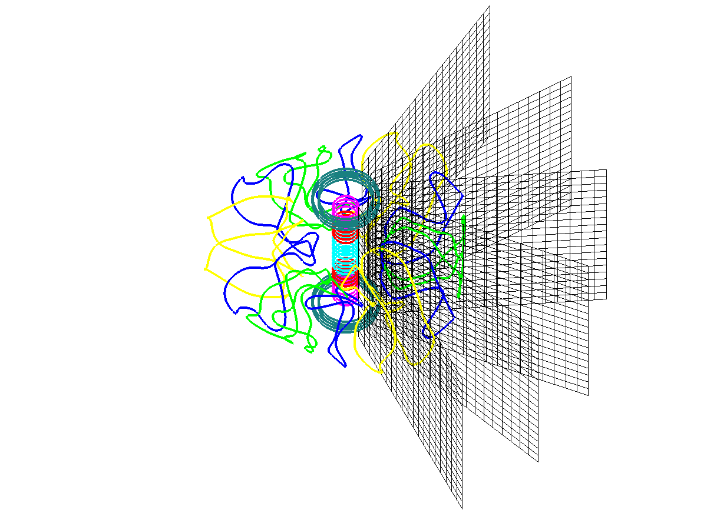

MAKEGRID
========

The MAKEGRID code computes the external magnetic field due to field
coils used for free boundary runs of the [VMEC](VMEC) code. Specifically
it computes the magnetic field on a grid at specific toroidal angles.
This results in the generation of the \'mgrid\' file used by
[VMEC](VMEC) to compute the influence of external coils on the plasma.

------------------------------------------------------------------------

### Theory

The MAKEGRID code generates magnetic field data on R-Z grids at specific
toroidal intervals based on a coil definition file and the Biot-Savart
law. The coils file contains a sequence of points in cartesian space
which define segments of wire. In essence, they define the coil in terms
of a patch line. In addition to x, y, and z data, a current is specified
for each segment. The last segment of each line should have zero
current, a group number, and a name. The group number allows the coils
to be grouped by similar currents. The names are simply used as labels
for runtime output. In this way coils which carry the same current (are
on the same circuit or are symmetric) may be modified with one current
value. The values of the currents in the \'coils\' file are simply a
reference as the fields generated by MAKEGRID are normalized to a unit
current.

The MAKEGRID code uses the Biot-Savart law to calculate the contribution
of each coil segment to a given point on the grid. This is done for each
coil group assuming unit current. The resulting field for a given coil
group may then be multiplied by a different current to generate it\'s
field. This allows codes which use the \'mgrid\' file (generated by
MAKEGRID) to examine different current configurations without
recalculating the magnetic field on the grid. The user may also turn off
a given current group by setting it\'s current to zero (usually handled
by the EXTCUR array in an input namelist).

------------------------------------------------------------------------

### Compilation

The MAKEGRID code is compiled as part of the STELLOPT suite of codes. To
compile XGRID please examine the
[STELLOPT Compilation page.](STELLOPT Compilation)

------------------------------------------------------------------------

### Input Data Format

The MAKEGRID code may be run interactively or through a command script
passed to it via the command line. The code requires a coils file which
specifies the magnetic coils from which the magnetic field is
calculated.

The code can be run interactively (prompting the user for information)
or by passing the values in order via the command line. If the user
wishes, the commands can be entered into a text file and the contents of
the file passed to the command
([see the tutorial](VMEC Free Boundary Run)). Newer versions of the code
prompt the user for 10 values (older versions only 9, see line in blue
below).

1.  Coils file suffix
2.  Current format (S/R : Scale current to unit current or use raw
    currents, old version did not prompt the user for this and assumed
    scaled current)
3.  Stellarator Symmetry (T/F)
4.  Minimum radial extent (Rmin)
5.  Maximum radial extent (Rmax)
6.  Minimum vertical extent (Vmin)
7.  Maximum vertical extent (Vmax)
8.  Number of toroidal cutplanes (per half period if stellarator
    symmetry is assumed)
9.  Number of radial grid points
10. Number of vertical grid points

The coils file suffix is simply the suffix for the coils file. New
versions of the code allow the user to scale all currents to unit
current (S) or use the raw current (found from the coils file) in the
calculations of the fields. If the users chooses Scaled (S) currents
then when running [VMEC](VMEC) the user would supply the actual coil
currents used in the machine (this may be the current per turn for
multi-filament coils or total current for single filament coils). If the
user chooses Raw (R) currents then when running [VMEC](VMEC) the user
would supply a multiple of the current found in the coils file (1 for
using the current in the coils file, 0.5 for half the current and so
on). If stellarator symmetry is assumed then only the first half of the
toroidal cuts are calculated, the field is then mirrored for the rest of
the calculation to save computation time. The Rmin, Rmax, Zmin, and Zmax
specify the radial and vertical extents in \[m\]. Remember that the grid
plane must be large enough to contain the whole plasma in each cross
section. The number of toroidal cut planes indicates the number of
individual planes per field period to calculate the field on. A good
rule here is to choose at least 4 times as many cut planes as the
maximum toroidal mode number (ex. if ntor=6 then you should have at
least 24 cut planes). The choice of the number or radial and vertical
gridpoints is not as straightforward. The [VMEC](VMEC) code uses these
grids to \'deform\' the plasma boundary in a iterative sense. The
complication revolves around the spectral condensation [VMEC](VMEC)
preforms in the poloidal direction. The code calculates the location of
the poloidal grid points so that an optimized choice is made for the
form of the plasma (more point where needed, points, and less where
they\'re not, straight segments). The user should decide how accurately
the wish to know the plasma boundary. If \[cm\] precision is required
then the number of grid points chosen should provide at least this
resolution. Remember that the more datapoints, the longer the MAKEGRID
run and the slower [VMEC](VMEC) will run.

The coils file is a standard filament format which has it\'s origin in
coil design software. The first line indicates the number of field
periods for a run. The next line indicates the beginning of the filament
section. The third line is read by MAKEGRID but ignored. Then the
definition of a coil begins. The coils is specified by connecting points
in space along a line defining a coil. For each point a current is
specified. The last point should correspond with the first in a given
loop and have zero current. In the following example, a square coil is
specified.

    periods 3
    begin filament
    mirror NIL
    0.0   0.0   0.0   5.0
    1.0   0.0   0.0   5.0
    1.0   1.0   0.0   5.0
    0.0   1.0   0.0   5.0
    0.0   0.0   0.0   0.0   1   SQ
    end

The last line also contains a number which associates this coil with
coilgroup 1 and a name \'SQ.\' The fields from all coils of the same
coilgroup will be summed. In a sense, the user can think of coilgroups
as indicating common (or coupled) power supplies.

------------------------------------------------------------------------

### Execution

The MAKEGRID code (executable name xgrid) may be executed interactively
or the user may pass a command script via the command line (see the
[VMEC Free Boundary Tutorial](VMEC Free Boundary Run) for and example).

    > ~/bin/xgrid < input_xgrid.dat >& log_xgrid.coil_suffix &

------------------------------------------------------------------------

### Output Data Format

The MAKEGRID code creates two output files (three if the user redirects
screen output to a log file). The first is the \'mgrid\' file. This file
contains the magnetic field generated by each coil group along with
magnetic measurements if they were included in the \'coils\' file. The
\'mgrid\' file is binary in older versions of the code, newer versions
support both binary and
[netCDF](http://www.unidata.ucar.edu/software/netcdf/) output. The
second file is the \'extcur\' file. This file contains a suggestion for
coil group currents based on the values found in the \'coils\' file.
These values can be copied to the [VMEC](VMEC) \'input\' file.

The \'mgrid\' file is organized so that the contribution from each coil
group to the net magnetic field is stored separately. While the
methodology for reading a binary file will vary by environment, the
Fortran routine \'read\_mgrid.f\' in \'\.../VMEC2000/vsource/\' does
provide a basic outline. The read statements from the codes (in order)
are retraced below (for the magnetic field only)

    #!fortran
          read(iunit,iostat=ierr) nr0b, nz0b, np0b, nfper0, nextcur !n_radial,n_vertical,n_toroidal,n_fieldperiod,n_extcur
          read(iunit,iostat=ierr) rminb, zminb, rmaxb, zmaxb        !R_min,Z_min,R_max,Z_max
          read(iunit,iostat=istat) (curlabel(n),n=1,nextcur)        !Read each Current Group Label
          do ii = 1,nextcur                                         !nbvac=nr0b*nz0b*np0b Total number of gridpoints
             read(iunit) (btemp(i,1,ii),btemp(i,2,ii),btemp(i,3,ii), !Read Magnetic field generated by
         1              i=1,nbvac)                                   !each current group on each toroidal cut plane
          enddo

Users interested in the inclusion of magnetic diagnostics in the
\'mgrid\' file should examine the \'read\_mgrid.f\' routine. For
[netCDF](http://www.unidata.ucar.edu/software/netcdf/) files the user
can use the ncdump utility to see the contents for example:

    #!c
    netcdf mgrid_c09r00 {
    dimensions:
        stringsize = 30 ;
        external_coil_groups = 10 ;
        dim_00001 = 1 ;
        external_coils = 10 ;
        rad = 201 ;
        zee = 201 ;
        phi = 24 ;
    variables:
        int ir ;
        int jz ;
        int kp ;
        int nfp ;
        int nextcur ;
        double rmin ;
        double zmin ;
        double rmax ;
        double zmax ;
        char coil_group(external_coil_groups, stringsize) ;
        char mgrid_mode(dim_00001) ;
        double raw_coil_cur(external_coils) ;
        double br_001(phi, zee, rad) ;
        double bp_001(phi, zee, rad) ;
        double bz_001(phi, zee, rad) ;
        double br_002(phi, zee, rad) ;
        double bp_002(phi, zee, rad) ;
        double bz_002(phi, zee, rad) ;
        double br_003(phi, zee, rad) ;
        double bp_003(phi, zee, rad) ;
        double bz_003(phi, zee, rad) ;
        double br_004(phi, zee, rad) ;
        double bp_004(phi, zee, rad) ;
        double bz_004(phi, zee, rad) ;
        double br_005(phi, zee, rad) ;
        double bp_005(phi, zee, rad) ;
        double bz_005(phi, zee, rad) ;
        double br_006(phi, zee, rad) ;
        double bp_006(phi, zee, rad) ;
        double bz_006(phi, zee, rad) ;
        double br_007(phi, zee, rad) ;
        double bp_007(phi, zee, rad) ;
        double bz_007(phi, zee, rad) ;
        double br_008(phi, zee, rad) ;
        double bp_008(phi, zee, rad) ;
        double bz_008(phi, zee, rad) ;
        double br_009(phi, zee, rad) ;
        double bp_009(phi, zee, rad) ;
        double bz_009(phi, zee, rad) ;
        double br_010(phi, zee, rad) ;
        double bp_010(phi, zee, rad) ;
        double bz_010(phi, zee, rad) ;
    }

------------------------------------------------------------------------

### Visualization

The magnetic field data stored in the \'mgrid\' file is stored for each
toroidal cut and for each current group. In order to obtain the \'net\'
magnetic field, the user must sum the magnetic field over the current
groups at each point on the grid. Additionally, these magnetic fields
may have been normalized to unit current. The magnetic field from each
current group must then be multiplied by the current for that group.

The matlabMAKEGRID package contains routines for reading the mgrid and
coils file, along with routine for plotting their contents. It is
available through the MATLAB File Exchange
(<http://www.mathworks.com/matlabcentral/fileexchange/29810-matlabmakegridvmec>).

------------------------------------------------------------------------

### Tutorials

[VMEC Free Boundary Tutorial](VMEC Free Boundary Run)
