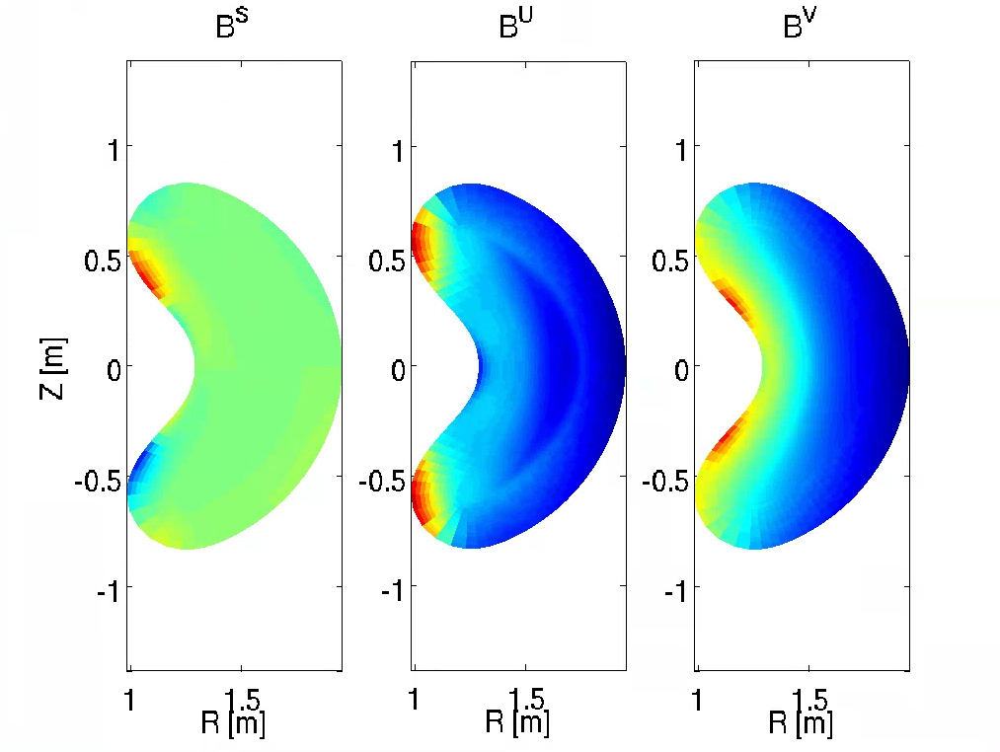
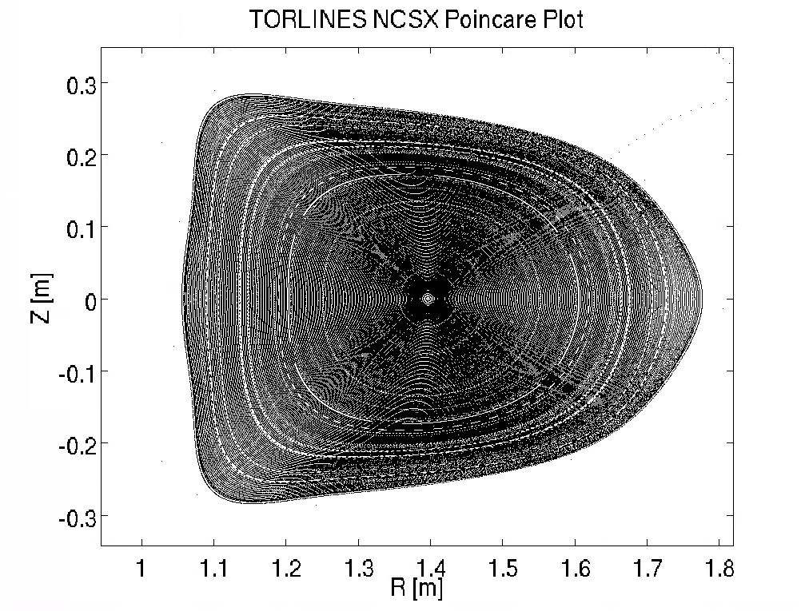

Tutorial: TORLINES NCSX Run
===========================

This tutorial will walk the user through running TORLINES using the VMEC
equilibrium file generated in the tutorial:
[VMEC Free Boundary Run](VMEC Free Boundary Run).

------------------------------------------------------------------------

\> 1. \_\_**Edit the input file to include the TORLINES\_INPUT
namelist.**\_\_ \> The TORLINES code will read the VMEC input file for
two namelists. It will use the INDATA namelist to specify the EXTCUR
array for the vacuum field. It will then read the TORLINES\_INPUT
nameslist for information controlling the runtime behaviour of TORLINES

    &INDATA
    .
    .
    .
    /
    &TORLINES_INPUT
     K = 70
     NU = 90
     NV = 60
     NPOINC = 60
     NU_VC = 128
     NV_VC = 128
     VC_ADAPT_TOL = 1.0E-3
     INT_TYPE = 'LSODE'
     FOLLOW_TOL = 1.0E-09
     BOUND_SEPARATION = 1.2
    /

\> 2. \_\_**Execute the code.**\_\_ \> To execute the code we need to
supply the input extension for the input file and wout file (they must
match). The code will also require vacuum field information, which can
be supplied by a coils file or MAKEGRID file.

    >mpirun -np 32 ~/bin/xtorlines -vmec ncsx_c09r00_free -coil coils.c09r00
    TORLINES Version 1.20
     -----TORLINES File Parameters-----
              k:  70
             nu:  90   nv:  60
      bound_sep:    1.200
     -----VMEC File Parameters-----
        file: ncsx_c09r00_free
           m:  11   nu:  90
           n:   6   nv:  60
       mnmax:  137
         nfp:   3
          ns:  99
       Total Current: -178.653 [kA]
    ----- Vacuum Grid Info. -----
           Eq. Surface:     59
           Grid Points:  59400
    ----- COILS Information -----
       FILE: /u/slazerso/Sims/NCSX/coils/coils.c09r00
       Coil Periodicity:   3
       Current Systems:  10
       Current Type:      SCALED
       Num Coils  =    6  EXTCUR =  652.272 [kA]
       Num Coils  =    6  EXTCUR =  651.869 [kA]
       Num Coils  =    6  EXTCUR =  537.744 [kA]
       Num Coils  =    8  EXTCUR =    0.000 [A]
       Num Coils  =    8  EXTCUR =    0.000 [A]
       Num Coils  =    8  EXTCUR =   28.095 [kA]
       Num Coils  =   12  EXTCUR =  -54.805 [kA]
       Num Coils  =    4  EXTCUR =   30.123 [kA]
       Num Coils  =    2  EXTCUR =   94.241 [kA]
       Num Coils  =   18  EXTCUR =   45.514 [kA]
         Vacuum Field Calculation [ 99]% 
    ----- Virtual Casing Information -----
       INTEGRAL TYPE: Surface Current
       MIN_GRID_DISTANCE =  6.0493E-02
       NORMAL_AREA =  2.4595E+01
       NR =    1;   NU =  128;  NV =  128;  NFP =   3
       NUVP =  49152
       ABS_TOL =  0.0000E+00;   REL_TOL =  5.0000E-03
       MIN_CLS =      0   (16777216)
         Plasma Field Calculation [ 99]% 
    ---------- EXECUTION ----------
      ----- FOLLOWING FIELD LINES -----
          Method: LSODE
           Lines:    256
           Steps:  180000   Delta-phi: 0.3491E-01
             Tol: 0.1000E-08  Type: 10
         Fieldline Calculation [100]% 
    ---------- TORLINES DONE ----------              
    >                                                                   

\>3. \_\_**Examine the output.**\_\_ \> In it\'s most basic form the
code launches 256 field lines equally spaced from axis to edge (from the
outboard side of the simulation at PHI=0). The background grid
information is output in the HDF5 file:
 The contravariant components of the
magnetic field are also stored in the HDF5 file:
 Finally, Poinccaré data is also
stored in the HDF5 file: 
