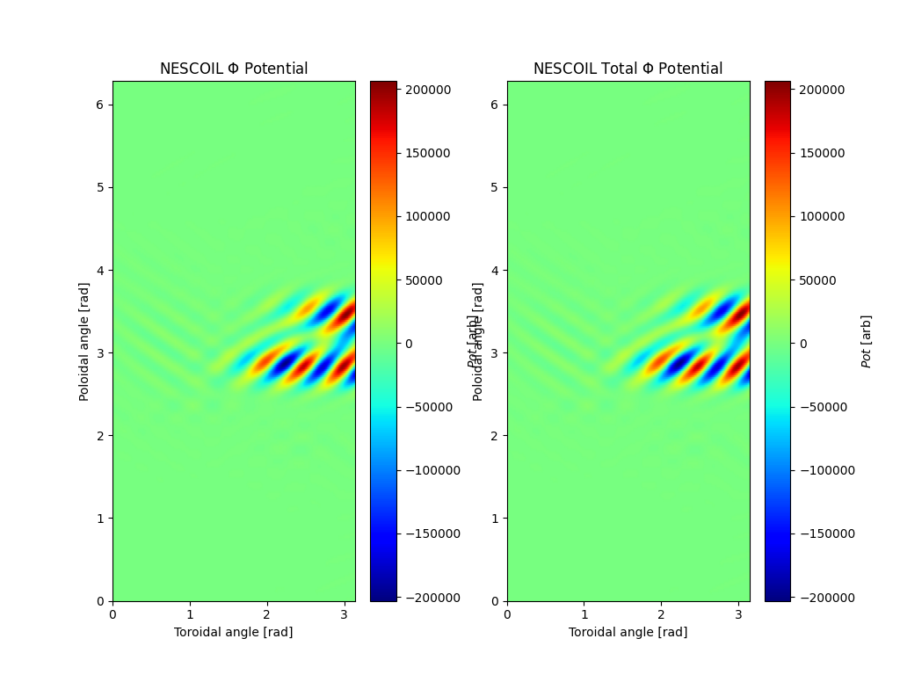

Tutorial: NCSX NESCOIL Example
=============================================

This tutorial will walk the user through running the [NESCOIL](NESCOIL.nd) code for
generating a coil based on NCSX. Before beginning the user should run the
[BNORM NCSX tutorial](BNORM NCSX Example.md) to generate a bnorm and
nescin file.

------------------------------------------------------------------------

**Run the NESCOIL code**

From the directory where the VMEC nescin and bnorm files are located 
execute the NESCOIL code.

```
>~/bin/xnescoil nescin.ncsx_c09r00_fixed
```

**Examine the output.**

The NESCOIL code will generate a `nescout.ncsx_c09r00_fixed` file containing
the output current potential of the nescoil code. The results can be plotted
using the pySTEL python routine `nescoil_util.py`.




**Cut coils**

The python utility `nescoil_util.py` can be used to cut coils from the
NESCOIL current potential.
