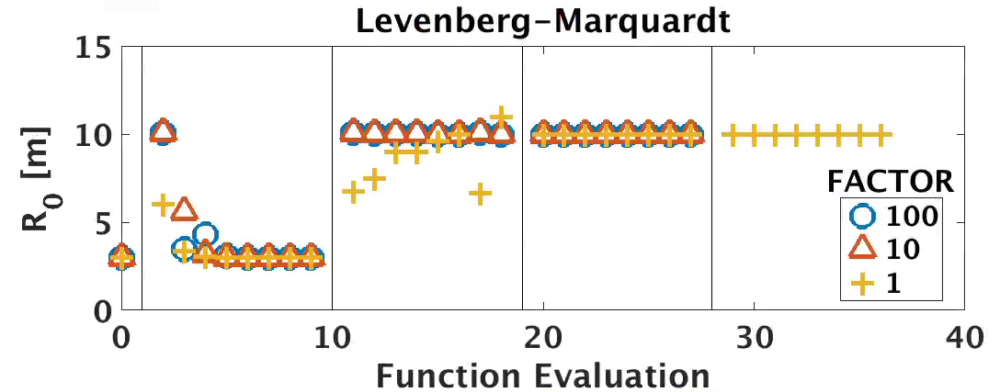

 

On this page we provide a simple tutorial exercise to demonstrate how
each optimizers works. The basis of this tutorial is a circular cross
section tokamak fixed boundary VMEC equilibria with a major radius of 3
and a minor radius of 1 \[m\]. The optimization goal to to change the
major radius to 10 m. While this is a trivial example problem, it
highlight the ability of the optimizers to perform a basic task.

---

###The baseline equilibrium

Below you can find the input name list for our VMEC fixed boundary
equilibrium

	&INDATA 
	! Runtime Parameters 
	DELT = 1.00000000000000E+00 
	NITER = 20000 
	NSTEP = 200 
	NS_ARRAY = 16 32 64 128 
	NITER\_ARRAY = 1000 2000 4000 10000 
	FTOL\_ARRAY = 1.0E-30 1.0E-30  1.0E-30 1.0E-14 !
	! Grid Parameters 
	LASYM = F 
	NFP = 1
	MPOL = 10 
	NTOR = 0 
	PHIEDGE = 7.85 
	! Free Boundary Parameters
	LFREEB = F 
	! Pressure Parameters 
	GAMMA = 0.00000000000000E+00
	BLOAT = 0.00000000000000E+00
	SPRES_PED = 0.00000000000000E+00
	PRES_SCALE = 0.00000000000000E+00 
	PMASS_TYPE = 'power_series' 
	AM = 1.0 -1.0 0.0 0.0 -1.0 1.0
	! Current/Iota Parameters
	NCURR = 0
	PIOTA_TYPE = 'power_series' 
	AI = 1.0 0.0 -0.7 
	! Axis Parameters
	RAXIS = 3.00000000000000E+00
	ZAXIS =0.00000000000000E+00 
	! Boundary Parameters
	 RBC( 0, 0) = 3.0000000000e+00 ZBS( 0, 0) = 0.0000000000e+00
	 RBC( 0, 1) = 1.0000000000e+00 ZBS( 0, 1) = 1.0000000000e+00 
	 /

###Levenberg-Mardquart Algorithm

In this section we will evaluate the Levenberg-Mardquart algorithm in
STELLOPT. We will use the following OPTIMUM name list for STELLOPT

	&OPTIMUM
	!------------------------------------------------------------------
	! OPTIMIZER RUN CONTROL PARAMETERS
	!------------------------------------------------------------------
	 NFUNC_MAX = 1000
	 EQUIL_TYPE = 'VMEC2000' 
	 OPT_TYPE = 'LMDIF' 
	 FTOL = 1.0E-4 
	 XTOL = 1.0E-2 
	 GTOL = 1.0E-30 
	 FACTOR = 100.0 
	 EPSFCN = 1.0E-6
	 NOPTIMIZERS = 8 
	 LKEEP_MINS = T
	!------------------------------------------------------------------
	! OPTIMIZED QUANTITIES
	!------------------------------------------------------------------
	LBOUND_OPT(0,0) = T 
	RBC_MIN(0,0)=2.0 
	RBC_MAX(0,0)=20.0 
	RHO_EXP = 4
	!------------------------------------------------------------------
	! PLASMA PROPERTIES
	!------------------------------------------------------------------
	TARGET_R0 = 10.0 SIGMA_R0 = 1.0 
	/

We note that while we
have specified RBC\_MIN and RBC\_MAX, these parameters are ignored by
the choice of OPT\_TYPE as LMDIF. The choice of NFUNC\_MAX, FTOL, XTOL,
and GTOL only determine when the code ceases to iterate. The choice of
EPSFCN will result in a 0.1% perturbation to all quantities in order to
calculate the finite difference Jacobian. In the following we show a
scan of the FACTOR parameter which sets an initial scaling on how far to
move in the descent direction.

Each simulation was run with an optimizer population of 8. Thus at each
stage of the optimization 8 values for R0 were scanned. Vertical lines
denote the different iterations of the LMDIF algorithm. We can see that
for a factor of 100 or 10, the code appears to achieve R0=10 in the
first iteration of the Levenberg algorithm. These cases also achieve
their convergence tolerance in the third pass through the optimization
loop. For a choice of FACTOR = 1 the code appears to only achieve R0=10
in the second iteration and takes another whole iteration to achieve the
desired tolerance.

------------------------------------------------------------------------

The Genetic Algorithm with Differential Evolution
-------------------------------------------------

In this section we evaluate the Genetic Algorithm with differential
evolution in STELLOPT. We will use the following OPTIMUM name list for
STELLOPT: [code](code) &OPTIMUM
!\-\-\-\-\-\-\-\-\-\-\-\-\-\-\-\-\-\-\-\-\-\-\-\-\-\-\-\-\-\-\-\-\-\-\-\-\-\-\-\-\-\-\-\-\-\-\-\-\-\-\-\-\-\-\-\-\-\-\-\-\-\-\-\-\-\-\-\-\-\--
! OPTIMIZER RUN CONTROL PARAMETERS
!\-\-\-\-\-\-\-\-\-\-\-\-\-\-\-\-\-\-\-\-\-\-\-\-\-\-\-\-\-\-\-\-\-\-\-\-\-\-\-\-\-\-\-\-\-\-\-\-\-\-\-\-\-\-\-\-\-\-\-\-\-\-\-\-\-\-\-\-\-\--
NFUNC\_MAX = 25 EQUIL\_TYPE = \'VMEC2000\' OPT\_TYPE = \'GADE\' FACTOR =
0.5 EPSFCN = 0.3 MODE = 3 CR\_STRATEGY = 0 NPOPULATION = 16 NOPTIMIZERS
= 8 LKEEP\_MINS = T
!\-\-\-\-\-\-\-\-\-\-\-\-\-\-\-\-\-\-\-\-\-\-\-\-\-\-\-\-\-\-\-\-\-\-\-\-\-\-\-\-\-\-\-\-\-\-\-\-\-\-\-\-\-\-\-\-\-\-\-\-\-\-\-\-\-\-\-\-\-\--
! OPTIMIZED QUANTITIES
!\-\-\-\-\-\-\-\-\-\-\-\-\-\-\-\-\-\-\-\-\-\-\-\-\-\-\-\-\-\-\-\-\-\-\-\-\-\-\-\-\-\-\-\-\-\-\-\-\-\-\-\-\-\-\-\-\-\-\-\-\-\-\-\-\-\-\-\-\-\--
LBOUND\_OPT(0,0) = T RBC\_MIN(0,0)=2.0 RBC\_MAX(0,0)=20.0 RHO\_EXP = 4
!\-\-\-\-\-\-\-\-\-\-\-\-\-\-\-\-\-\-\-\-\-\-\-\-\-\-\-\-\-\-\-\-\-\-\-\-\-\-\-\-\-\-\-\-\-\-\-\-\-\-\-\-\-\-\-\-\-\-\-\-\-\-\-\-\-\-\-\-\-\--
! PLASMA PROPERTIES
!\-\-\-\-\-\-\-\-\-\-\-\-\-\-\-\-\-\-\-\-\-\-\-\-\-\-\-\-\-\-\-\-\-\-\-\-\-\-\-\-\-\-\-\-\-\-\-\-\-\-\-\-\-\-\-\-\-\-\-\-\-\-\-\-\-\-\-\-\-\--
TARGET\_R0 = 10.0 SIGMA\_R0 = 1.0 / [code](code) We should note that
because this is a global search algorithm we need to set RBC\_MIN and
RBC\_MAX for our domain. It should be noted that since our problem in
one dimensional in our free parameter RBC(0,0) the choice of
CR\_STRATEGY and EPSFCN are essentially meaningless, one variable will
always be permuted. Thus our only two real parameters are FACTOR and
MODE. Remember that FACTOR chooses the amount of GENE mixing and MODE
determines what GENES are used (see
[STELLOPT Input Namelist](STELLOPT Input Namelist)). Our population is
chosen to be composed of 16 members. Below we can see the effect of MODE
on the convergence of the code:
[image:gade\_mode.png width=\"800\" height=\"345\"](image:gade_mode.png width="800" height="345")
In this plot we show the upper and lower bounds of the population. It
should be noted that since runs used the same random number seed, each
population in generation 1 was the same, with a member with R0
approximately 10.03. Despite this we can clearly see the differences
between choice of how the population converges on a minimum. Clearly
MODE=1,3,4 appear to have the fastest convergence of the population.
This can be attributed to their gene mixing algorithms including the
most fit member of the population explicitly. Meanwhile MODE=2,5 do
include this member explicitly. As a result their population take long
to condense around the minimum. It should be noted that for this trivial
problem the bounds for finding the global minima included the minima. In
more realistic problems, the existence of many local minima may be
missed by the choice of MODE=1,3,4. Choosing MODE=2,5 creates a more
\'search-like\' behavior.

------------------------------------------------------------------------

The Particle Swarm Algorithm
----------------------------

In this section we evaluate the Particle Swarm Algorithm in STELLOPT. We
will use the following OPTIMUM name list for STELLOPT: [code](code)
&OPTIMUM
!\-\-\-\-\-\-\-\-\-\-\-\-\-\-\-\-\-\-\-\-\-\-\-\-\-\-\-\-\-\-\-\-\-\-\-\-\-\-\-\-\-\-\-\-\-\-\-\-\-\-\-\-\-\-\-\-\-\-\-\-\-\-\-\-\-\-\-\-\-\--
! OPTIMIZER RUN CONTROL PARAMETERS
!\-\-\-\-\-\-\-\-\-\-\-\-\-\-\-\-\-\-\-\-\-\-\-\-\-\-\-\-\-\-\-\-\-\-\-\-\-\-\-\-\-\-\-\-\-\-\-\-\-\-\-\-\-\-\-\-\-\-\-\-\-\-\-\-\-\-\-\-\-\--
NFUNC\_MAX = 25 EQUIL\_TYPE = \'VMEC2000\' OPT\_TYPE = \'PSO\' FTOL =
1.0E-4 XTOL = 1.0E-2 FACTOR = 0.10 EPSFCN = 0.5 NPOPULATION = 16
NOPTIMIZERS = 8 LKEEP\_MINS = T
!\-\-\-\-\-\-\-\-\-\-\-\-\-\-\-\-\-\-\-\-\-\-\-\-\-\-\-\-\-\-\-\-\-\-\-\-\-\-\-\-\-\-\-\-\-\-\-\-\-\-\-\-\-\-\-\-\-\-\-\-\-\-\-\-\-\-\-\-\-\--
! OPTIMIZED QUANTITIES
!\-\-\-\-\-\-\-\-\-\-\-\-\-\-\-\-\-\-\-\-\-\-\-\-\-\-\-\-\-\-\-\-\-\-\-\-\-\-\-\-\-\-\-\-\-\-\-\-\-\-\-\-\-\-\-\-\-\-\-\-\-\-\-\-\-\-\-\-\-\--
LBOUND\_OPT(0,0) = T RBC\_MIN(0,0)=2.0 RBC\_MAX(0,0)=20.0 RHO\_EXP = 4
!\-\-\-\-\-\-\-\-\-\-\-\-\-\-\-\-\-\-\-\-\-\-\-\-\-\-\-\-\-\-\-\-\-\-\-\-\-\-\-\-\-\-\-\-\-\-\-\-\-\-\-\-\-\-\-\-\-\-\-\-\-\-\-\-\-\-\-\-\-\--
! PLASMA PROPERTIES
!\-\-\-\-\-\-\-\-\-\-\-\-\-\-\-\-\-\-\-\-\-\-\-\-\-\-\-\-\-\-\-\-\-\-\-\-\-\-\-\-\-\-\-\-\-\-\-\-\-\-\-\-\-\-\-\-\-\-\-\-\-\-\-\-\-\-\-\-\-\--
TARGET\_R0 = 10.0 SIGMA\_R0 = 1.0 / [code](code) As for the Genetic
Algorithm with Differential Evolution, bounding values on the variables
are required. Our choice of parameters includes FACTOR, which defines
the maximum step size of any particle in terms of the bounding space. In
this case no particle can make a larger step than 10% the space. Here
the bounds are 2 and 20 so no particle may make a step larger than 1.8
in RBC(0,0). The value of EPSFCN controls how large a step to take in
the direction toward each particles local minimum. This value is
relative to one for the step in the global minimum direction. If the
value is set greater than one, each particle prefers to step towards its
local minimum. For values of EPSFCN less than one the particles will
step toward the global maximum. However care should be taken, the real
formula used is: x(new) = x(old) + C\*\[x(global)-x(old)\] +
C\*EPSFCN\*\[x(local)-x(old)\] where x(old) is the current x-vector,
x(global) is the global best x-vector, x(local) is the local best
x-vector, and C is a random number from 0 to 1.
