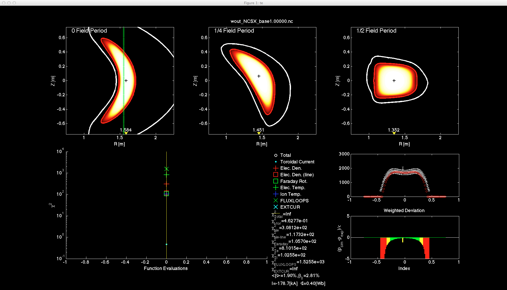



STELLOPT
========

The STELLOPT code is design to optimize 3D MHD equilibria to a set of
target physics parameters encompassing stellarator design and 3D
equilibrium reconstruction. It is currently interfaced to the
[VMEC](VMEC) 3D equilibrium solver.

[STELLOPT](https://github.com/PrincetonUniversity/STELLOPT) is currently hosted on the Princeton University's GitHub repository.

------------------------------------------------------------------------

Table of Contents
  * [Theory](#theory)
  * [Compilation](#compilation)
  * [Input Data Format](#input-data-format)
  * [Execution](#execution)
  * [Output Data Format](#output-data-format)
  * [Visualization](#visualization)
  * [Tutorials](#tutorials)
  
------------------------------------------------------------------------

### Theory

The STELLOPT code can be thought of
as a multi-dimensional non-linear curve fitting algorithm. The curve to
which a fit is sought is parameterized by a set of target parameters
which themselves may be MHD equilibrium quantities (beta, aspect ratio,
etc.) or non-linear functions of the equilibrium itself (stability,
particle transport, etc). The function used to fit these targets is the
MHD equilibrium itself. Here the input parameters to the equilibrium
serve as a set of coefficients parameterizing our non-linear fit
function. The code uses either a modified
[Levenberg-Marquardt algorithm](http://en.wikipedia.org/wiki/Levenberg%E2%80%93Marquardt_algorithm),
[genetic algorithm](http://en.wikipedia.org/wiki/Genetic_algorithm), or
[differential evolution](http://en.wikipedia.org/wiki/Differential_evolution)
to find a best fit set of equilibrium inputs to the set of desired
targets. The quality of fit is determined by the Chi-squared
metric
\$$ \chi_i^2=\sum \frac{\left(f_i^{target}-f_i^{equilbria}\right)^2 }{\sigma_i^2} .$$
The sigma here represents the tolerance of the target value. The goal of
the code is to minimize the total chi-squared value.

The user specifies which equilibrium input values to vary independently
of the targets. Additionally, profiles for Ne, Te, and Ti (as functions
of toroidal flux) have been added to STELLOPT. If utilized these
profiles are used to calculate the equilibrium total pressure before a
calculation is preformed. The code is capable of targeting a number of
different parameters by either directly evaluating the equilibrium or
calling subcodes once an equilibrium is found. The following list
outlines the currently available targets:

 | Target | Dimension | Description |
 |--------|--------|--------|
 | ASPECT RATIO | Single | Equilibrium Aspect Ratio |
 | BETA | Single | Equilibrium Total Plasma Beta |
 | CURTOR | Single | Equilibrium Total Toroidal Current |
 | PHIEDGE | Single | Equilibrium Total Enclosed Toroidal Flux |
 | R0 | Single | Equilibrium Radial Magnetic Axis Position |
 | RBTOR | Single | Equilibrium R-B_toroidal |
 | STORED ENERGY | Single | Equilibrium Stored Energy |
 | VOLUME | Single | Equilibrium Volume |
 | EXTCUR | Vector | Vacuum Field Currents |
 | LINE_NE | Vector | Array of line integrated electron density measurements |
 | FARADAY | Vector | Array of Faraday Rotation measurements |
 | PRESS | Vector | Array of pressure profile measurements (R,PHI,Z or S)|
 | NE | Vector | Array of electron density measurements (R,PHI, Z or S) |
 | TE | Vector | Array of electron temperature measurements (R, PHI, Z or S) |
 | TI | Vector | Array of ion temperature measurements (R, PHI, Z or S) |
 | LINE_TE | Vector | Array of line integrated electron temperature measurements |
 | LINE_TI | Vector | Array of line integrated ion temperature measurements |
 | IOTA | Vector | Array of rotational transform measurements (R, PHI, Z or S) |
 | BPROBE | Vector | Array of B-Field measurements calculated by [DIAGNO](DIAGNO) |
 | FLUXLOOP | Vector | Array of Flux Loop measurements calculated by [DIAGNO](DIAGNO) |
 | ROGOWSKI | Vector | Array of Rogowski Coil measurements calculated by [DIAGNO](DIAGNO) |
 | VESSEL | Matrix | Limiting points in space |
 | SEPARATRIX | Matrix | Desired edge points in space |
 | BALLOON | Vector | Array of radial locations for ballooning stability calculation by [COBRAVMEC](COBRAVMEC) |
 | KINK | Single | Equilibrium kink stability as calculated by TERPSICHORE |
 | BOOTSTRAP | Vector | Array of radial locations for bootstrap calculation by [BOOTSJ](BOOTSJ) |
 | NEO | Vector | Array of radial locations for Neoclassical transport calculation by [NEO](NEO)|
 | HELICITY | Vector | Array of radial locations for Helicity calculation |
 | JSTAR | Vector | Array of radial locations for particle confinement calculation |
 | ORBIT | Vector | Array of radial locations on which to calculate confinement [BEAMS3D](BEAMS3D) |
 | COIL_BNORM | Single | Calculation of residual coil normal field after calculation by [COILOPT++](COILOPT)|

------------------------------------------------------------------------

### Compilation

Compilation of the STELLOPT suite is discussed on the
[STELLOPT Compilation Page](STELLOPT Compilation)

------------------------------------------------------------------------

### Input Data Format

The STELLOPT code takes an input file which contains all the input
namelists necessary to run the equilibrium code, STELLOPT, and any
additional codes called by the optimizer. The STELLOPT code itself
requires an [OPTIMUM namelist](STELLOPT Input Namelist) which contains
the runtime parameters for the code, specifies which input variables to
vary, any additional profiles, and the target parameters to match.

------------------------------------------------------------------------

### Execution

The STELLOPT routine is designed to be run on a multi-processor machine
or cluster. In general, it should be executed via a call to mpirun (most
likely inside a PBS script). The call should take the form:

    mpirun -np $NPROCS /path-to/xstelloptv2 $runid > log.$runid

Here `$NPROCS` is the number of processors being requested and \$runid is
the suffix assigned to the input file. Upon execution STELLOPT will
create a working directory entitled `stellopt_$runid` where
`$runid` is the value passed to it from the command line. All work
and final output is preformed in this directory. Optional arguments
which control the code behavior are:

 | Argument | Default | Description |
 |--------|--------|--------|
 | -restart | NONE | Use wout_reset_file.nc in directory to restart VMEC run on first iteration. |
 | -noverb  | NONE | Suppress screen output. |
 | -log | NONE | Send screen output to log file (useful on systems where `>&` doesn't work). |
 | -autodomain XX | NONE | Automatically calculate bounds as percentage (-autodomain 0.2, produces a +/-20% bound) |
 | -tri FILE1 FILE2 | NONE | Use FILE1 and FILE2 to set Min and Max bounds respectively (used in hyperplane mapping mode) |
 | -xvec_file FILE1 | NONE | Use FILE1 to initialize population for Differential Evolution and Particle Swarm runs. |
 | -help | NONE | Print help message |

------------------------------------------------------------------------

### Output Data Format

The STELLOPT code will produce many files so it is suggested that each
run be kept in a separate directory. A stereotypical run looks something
like:

Once a run has completed the code will output a `stellopt.ext` file,
and a `input.ext_min` file. The `_min` file contains an
equilibrium input file corresponding to the best fit as found by
STELLOPT. The `stellopt.` file contains an iteration by iteration
analysis of the fit to the target parameters. The file begins with a
version string (VERSION 2.65). Each iteration is demarked by an
iteration line (ITER XXXX). Each target type is then noted by line
indicating a type, the number of target values, and the number of output
values (TYPE 3 1). Immediately following that line is a line of text
indicating the value in each column.

Additionally, many working files denoted by `_optXX` are produced by
STELLOPT. These files may be removed once a run has completed. If the
user has elected to keep minimum states as the code iterated, various
files produced by the equilibrium calculation, and other codes will be
kept with an iteration number appended to their name. In this way a step
by step analysis of the optimization may be evaluated. The optimization
routines may themselves create output files.

------------------------------------------------------------------------

### Visualization

The final output of the STELLOPT routine is a combination of STELLOPT
files, [VMEC](VMEC) files, and the output files of the physics modules
invoked durring the run.

------------------------------------------------------------------------

### Tutorials

[Compiling STELLOPT](STELLOPT Compilation)

[The STELLOPT OPTIMUM namelist](STELLOPT Input Namelist)

[Boundary Representations Explained](STELLOPT Fixed Boundary Optimization)

[STELLOPT Optimizer Comparison](STELLOPT Optimizer Comparison)

[Optimization of an NCSX-like configuration](Optimization of an NCSX-like configuration)

[Optimization of Iota using LMDIF](Optimization of Iota using LMDIF)

[STELLOPT Turbulent Transport](STELLOPT Turbulent Transport)

[STELLOPT Coil Optimization](STELLOPT Coil Optimization)

[STELLOPT Energetic Particle Optimization](STELLOPT Energetic Particles)

[STELLOPT Adding A New Code](STELLOPT Adding A New Code)
