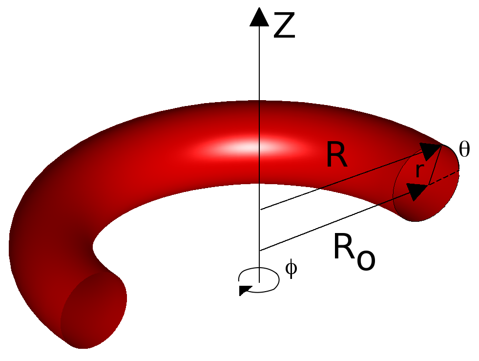

VMEC
====

The code uses a variational method to find a minimum in the total energy
of the system. The code assumes that quantities may be Fourier expanded
in terms of the poloidal and toroidal coordinates. This produces a
parabolic set of equations (with second-order spatial derivatives in the
radial coordinate, rho), which are converted to hyperbolic form through
a Richardson scheme. The VMEC code is able to rapidly solve for MHD
equilibrium configurations in magnetically confined fusion devices.

------------------------------------------------------------------------

## Theory


(*The toroidal angle used in VMEC is in the counter-clockwise direction)

The VMEC code seeks to solve a set
of MHD force balance equations in a toroidal domain:

\$$  \vec{F}=-\vec{j}\times\vec{B}+\vec{\nabla}p=0, $$

\$$    \vec{\nabla}\times\vec{B}=\mu_o\vec{j}, $$

\$$    \vec{\nabla}\cdot\vec{B}=0. $$

Combining these equations the total plasma potential energy can be
written

\$$ W=\int\left(\frac{\|\vec{B}\|^2}{2\mu_o}+\frac{p}{\gamma-1}\right)d^3x. $$

The scalar invariance of the potential energy allows it's computation
directly in flux coordinates. The relevant toroidal-cylindrical and flux
coordinates are shown in Figure 1.

The flux and mass of the system must be conserved. The conservation of
flux is achieved through a contravariant formulation of the magnetic
field

\$$  \vec{B}\cdot\vec{\nabla}p=0 $$

\$$  \vec{\nabla}\cdot\vec{B}=0 $$

\$$   \longrightarrow $$

\$$  \vec{B}  =  \vec{\nabla}\zeta\times\vec{\nabla}\chi+\vec{\nabla}\Phi\times\vec{\nabla}\theta^* $$

\$$   =  B^\theta \hat{e}_\theta + B^\zeta\hat{e}_\zeta $$

where $$ \theta^*=\theta+\lambda\left(\rho,\theta,\zeta\right)$$, and $$ \lambda $$
straightens the magnetic field lines. Adiabatic conservation of mass
flux may then be achieved through

\$$ p\left(\rho\right)=\frac{M\left(\rho\right)}{\left[\int\int d\theta d\zeta \| \sqrt{g} \|\right]^\gamma} \qquad \sqrt{g}=\frac{1}{\vec{\nabla}\rho\cdot\vec{\theta}\times\vec{\nabla}\zeta} $$

where M is our mass function and g is the metric for the flux
coordinates. This allows the total potential energy to be written as

\$$  W=\int\frac{\|\vec{B}\|^2}{2\mu_o}\|\sqrt{g}\|d\rho d\theta d\zeta + \int_0^1 \frac{M\left(\rho\right)}{\left(\gamma-1\right)\left[\int\int d\theta d\zeta \|\sqrt{g}\|\right]^{1-\gamma}}d\rho. $$

The magnitude of the magnetic field is defined as:

\$$  \|\vec{B}\|^2\equiv B^iB_i=\left(B^\theta\right)^2g_{\theta\theta}+2B^\theta B^\zeta g_{\theta\zeta}+\left(B^\zeta\right)^2g_{\zeta\zeta}. $$

The limits of the second integral indicate that we've normalized our
radial magnetic coordinate to the dimensions of our toroidal cross
section.

A variation in the potential energy is now preformed. The resulting
equation may be written

\$$  \frac{dW}{d\beta}=\int\left[-\left(\frac{\|\vec{B}\|}{2\mu_o}+p\right)\frac{\partial \sqrt{g}}{\partial\beta}+\frac{1}{\mu_o\sqrt{g}}\left(b_R\frac{\partial b_R}{\partial \beta}+R^2b_\phi\frac{\partial b_\phi}{\partial \beta}+b_Z\frac{\partial b_Z}{\partial \beta}+Rb^2_\phi\frac{\partial R}{\partial \beta}\right)\right]d^3\alpha, $$

where a variational parameter (Beta) has been used instead of the
canonical time (t). The toroidal-cylindrical domain considered here is
defined by x=(R,phi,Z). Utilizing the coordinate transformation between
the toroidal-cylindrical and magnetic coordinate domains we may then
rewrite the variation in potential energy:

\$$  \frac{dW}{d\beta}=-\int F_i\frac{\partial x_i}{\partial \beta}d^3\alpha -\int F_\lambda \frac{\partial \lambda}{\partial \beta}d^3\alpha -\int_{\rho=1}\|\sqrt{g}\|\frac{\partial \rho}{\partial x_i}\left(\frac{\|\vec{B}\|^2}{2\mu_o}+p\right)\frac{\partial x_i}{\partial \beta}d\theta d\zeta. $$

Here, the MHD force components are $$\left(F_1,F_2,F_3\right)=\left(F_R,F_\phi,F_Z\right)$$.

\$$  F_R=-\frac{\partial}{\partial \rho}\left[\|\sqrt{g}\|\frac{\partial\rho}{\partial R}\left(\frac{\|\vec{B}\|^2}{2\mu_o}+p\right)\right]-\frac{\partial}{\partial \theta}\left[\|\sqrt{g}\|\frac{\partial\theta}{\partial R}\left(\frac{\|\vec{B}\|^2}{2\mu_o}+p\right)\right] $$

\$$   -\frac{\partial}{\partial \zeta}\left[\|\sqrt{g}\|\frac{\partial\zeta}{\partial R}\left(\frac{\|\vec{B}\|^2}{2\mu_o}+p\right)\right]+\mu^{-1}_o\|\sqrt{g}\|\vec{\nabla}\cdot\left[\left(\vec{B}\cdot\vec{\nabla}R\right)\vec{B}\right] $$

\$$   +\frac{\sqrt{g}}{R}\left[\frac{\|\vec{B}\|^2}{2\mu_o}+p-\frac{R^2\left(\vec{B}\cdot\vec{\nabla}\phi\right)^2}{\mu_o}\right] $$

\$$  F_\phi=-\frac{\partial}{\partial \rho}\left[\|\sqrt{g}\|\frac{\partial\rho}{\partial \phi}\left(\frac{\|\vec{B}\|^2}{2\mu_o}+p\right)\right]-\frac{\partial}{\partial \theta}\left[\|\sqrt{g}\|\frac{\partial\theta}{\partial \phi}\left(\frac{\|\vec{B}\|^2}{2\mu_o}+p\right)\right] $$

\$$   -\frac{\partial}{\partial \zeta}\left[\|\sqrt{g}\|\frac{\partial\zeta}{\partial \phi}\left(\frac{\|\vec{B}\|^2}{2\mu_o}+p\right)\right]+\mu^{-1}_o\|\sqrt{g}\|\vec{\nabla}\cdot\left[\left(R^2\vec{B}\cdot\vec{\nabla}\phi\right)\vec{B}\right] $$

\$$  F_Z=-\frac{\partial}{\partial \rho}\left[\|\sqrt{g}\|\frac{\partial\rho}{\partial Z}\left(\frac{\|\vec{B}\|^2}{2\mu_o}+p\right)\right]-\frac{\partial}{\partial \theta}\left[\|\sqrt{g}\|\frac{\partial\theta}{\partial Z}\left(\frac{\|\vec{B}\|^2}{2\mu_o}+p\right)\right] $$

\$$   -\frac{\partial}{\partial \zeta}\left[\|\sqrt{g}\|\frac{\partial\zeta}{\partial Z}\left(\frac{\|\vec{B}\|^2}{2\mu_o}+p\right)\right]+\mu^{-1}_o\|\sqrt{g}\|\vec{\nabla}\cdot\left[\left(\vec{B}\cdot\vec{\nabla}Z\right)\vec{B}\right]. $$

This defines our system of equations. This system is subsequently
simplified through a spectral decomposition in the angle variables and
furthermore through the implementation of a steepest-descent method for
solving for the minimum in potential energy.

The inverse mapping ($$R,\lambda,Z$$ in terms of the flux coordinates
$$\rho,\theta,\zeta$$) can be expressed as:

\$$  R=R_o\left(\rho\right) + f_R \left(\rho,\theta,\zeta\right),$$

\$$  Z=Z_o\left(\rho\right) + f_Z \left(\rho,\theta,\zeta\right). $$

A Fourier expansion in terms of theta and zeta may be conducted giving

\$$  x_j=\sum_{m,n}X_j^{mn}\left(\rho\right)\exp\left[i\left(m\theta-n\zeta\right)\right] $$

where $$(x_1, x_2, x_3)=(R, \lambda, Z)$$. The variation of the total potential
energy then becomes

\$$  \frac{dW}{d\beta}=-\int\left(F_j^{mn}\right)^* \frac{\partial X_j^{mn}}{\partial \beta}dV, $$

\$$  F_j^{mn}=\frac{1}{\partial V / \partial \rho}\int\int F_j\exp\left[-i\left(m\theta-n\zeta\right)\right] d\theta d\zeta. $$

Having simplified the equation through a Fourier decomposition we now
see that the net Force in the system will be composed of second order
operators in rho. A minimum in potential energy is now sought.

The method of steepest descent is used to progress towards a minimum in
potential energy. This path is given by

\$$  \frac{\partial X_j^{mn}}{\partial \beta}=F_j^{mn}. $$

It is now assumed that the variational parameter beta can be taken to be
the canonical time t. This equation is parabolic in nature. A
second-order Richardson scheme may be applied to the derivative over the
variational parameter to reduce this equation to a hyperbolic form and
increase the rate of convergence. This equation then becomes

\$$  \frac{\partial^2 X_j^{mn}}{\partial \beta^2}+\frac{1}{\tau}\frac{\partial X_j^{mn}}{\partial \beta}=F_j^{mn} $$

where the optimum frequency is given by

\$$  \frac{1}{\tau_{op}}=-\frac{d}{d\beta}\left(\int \|F\|^2dV\right). $$

The spectral nature of the VMEC code coupled with the toroidal geometry
of magnetic fusion devices reduces the number of boundaries to two along
the rho dimension. The first is located at the origin (rho=0). Here
three general constraints on the behavior of the magnetic field at the
origin must be maintained. At the outer boundary (rho=1) two situations
may exist: a fixed boundary and a free boundary. The former case is
simply implemented through specification of the boundary Fourier
amplitudes ($$X_j^{mn}$$). In the latter case, energy principles must be
incorporated into the variational principle.

The magnetic field must be well behaved at the inner boundary. The
magnetic axis must not have a poloidal dependence (theta). This implies
that that all the Fourier coefficients ($$X_j^{mn}$$) must vanish at the
origin for m≠0. The net force in the system is a second order operator
in rho. This implies that at the origin, which has mirror symmetry, the
Fourier coefficients must also be second order in rho. In terms of the
Fourier coefficients ($$ {X_1^{0n}}' = {X_3^{0n}}'=0 $$, here the prime
indicates a derivative with respect to rho. The final constraint is on
the lambda coordinate. At the origin we require the poloidal derivative
of the toroidal coordinate to vanish. Again in the nomenclature of the
Fourier coefficients, it is written

\$$  \partial X_2^{0m}/\partial \theta=0. $$

It is also important to mention that the toroidal coordinate must be
periodic thus it's m=0,n=0 coefficient must vanish everywhere
($$X_2^{00}=0$$). This completes the boundary specification of the magnetic
field at the origin.

The boundary conditions for a fixed outer boundary (rho=1) are
implemented through specification of the Fourier coefficients. The shape
of the flux surface thus prescribes the radial $$X_1^{mn}$$ and vertical
$$X_3^{mn}$$ coordinate coefficients. The poloidal force components contain
no radial derivatives. This implies that no boundary specification is
required for $$X_2^{mn}$$.

The VMEC code treats the  'free' outer boundary condition through
inclusion of a 'vacuum' magnetic field. The MAKEGRID code is used to
produce an 'mgrid' file. This file contains the vacuum field on an R-Z
grid for a series of toroidal angles for a given coil set. The vacuum
field can be decomposed into two parts

\$$  \vec{B_V}=\vec{B_0}+\nabla\Phi. $$

Here the first part is attributed to the plasma currents and coil
configuration, the second part is a single valued potential. This
potential is required in order to satisfy the following condition

\$$  \vec{B_V} \cdot \hat{n} = 0, $$

the flux surface constraint. At the vacuum-plasma interface the total
pressure must be continuous and the normal component of the vacuum field
must vanish. This field is incorporated into the total potential energy
and a variation is conducted. This produces a descent equation for the
vacuum potential

\$$  \frac{\partial \nu}{\partial \beta}=F_\nu\equiv-\vec{\nabla}\cdot\vec{B_\nu}=\nabla^2\nu. $$

The free boundary condition requires the calculation of the initial
vacuum magnetic field from data involving the coil configuration. The
MAKEGRID code is used to produce an 'mgrid' file. This file contains
the vacuum field on an R-Z grid for a series of toroidal angles.

------------------------------------------------------------------------

## Compilation

VMEC is a component of the STELLOPT suite of codes. It is contained
within the 'stellopt.zip' file. Compilation of the STELLOPT suite is
discussed on the [STELLOPT Compilation Page](STELLOPT Compilation).

------------------------------------------------------------------------

## Input Data Format

The VMEC input file has the name 'input.name' where 'name' is a
descriptive name of the user's choosing. This input file is a Fortran
namelist file which specifies how the code is to be run. A full listing
of variable can be found in the
[input variable namelist page](VMEC Input Namelist (v8.47)). The input
file in general looks like:

```Fortran
&INDATA
LFREEB = F
MGRID_FILE = "none"
DELT = 0.9
NFP = 7
NCURR = 0
MPOL = 9
NTOR = 6
NZETA = 18
NITER = 10000
NSTEP = 200
NVACSKIP = 6
GAMMA = 0.000000E+00
PHIEDGE = 1.13E-01
CURTOR = 0.0
NS_ARRAY =     9      49
FTOL_ARRAY = 1.00e-6   1.e-11
AM =   1.e4    -1.e4    9*0.
AI =    6.90    0.0      0.0    3.90   0.0    0.0    6.90    0.0    0.0    6.90
0.0
AC =   11*0.
RAXIS =   2.88    0.04
ZAXIS =   0.00   -0.04
RBC(0,0) =   2.90     ZBS(0,0) =   0.00
RBC(0,1) =   1.00     ZBS(0,1) =   1.00
RBC(1,1) =  -0.21     ZBS(1,1) =   0.21
RBC(1,4) =  -0.01     ZBS(1,4) =   0.01
RBC(1,6) =  -0.01     ZBS(1,6) =  -0.01
/
```

The first line simply defines the Fortran namelist and the last line
ends it. The 'LFREEB' is a boolean value which specifies if the code
should be run in free boundary mode. If 'LFREEB' is set to 'T' then
the next variable 'MGRID\_FILE' must specify the name of an mgrid file
created by the xgrid package. This file contains information regarding
the fields created by the various field coils. If 'LFREEB' is set to
'F' then 'MGRID_FILE' is ignored and may be omitted. The 'DELT'
parameter determines the amount of blending from previous iterations
(value from 0.0 to 1.0). The 'NFP' variable specifies the number of
field periods in the toroidal direction (number of times the plasma
cross-section repeats itself). The 'NCURR' variable specifies that the
rotational transform (NCURR=0, iota) or the toroidal current (NCURR=1)
is specified at the boundary. The 'MPOL' variable specifies the
maximum poloidal mode number for the run. The 'NTOR' variable
specifies the minimum and maximum toroidal mode number for the run. The
'NZETA' variable specifies the number of planes on which the mgrid
file has calculated the magnetic field. The 'NITER' variable specifies
the maximum number of iterations for the VMEC code. Note that if this
number is exceeded VMEC will continue to run for double this number to
see if convergence can be met. The 'NSTEP' variable determines how
often the code should output diagnostics to the screen and 'threed1'
file. The 'NVACSKIP' variable is used for a free boundary run to
indicate how often to update the vacuum field solution. The 'GAMMA'
variable is used to set the adiabatic (compressional) index. Note that
for GAMMA=0.0 the code assumes it is being supplied a pressure not a
mass. The 'PHIEDGE' variable specifies the total enclosed toroidal
flux for a fixed boundary run. For a free boundary run, this variable
limits the radius of the plasma. The 'CURTOR' variable specifies the
scaling for the toroidal current in Amps.

The 'NS\_ARRAY' and 'FTOL\_ARRAY' specify the radial grid
refinement that the code uses. In general the code iterates on a given
radial grid. Once a specified tolerance is met, the code uses a more
refined grid and restarts it's iterative cycle for a new tolerance. The
'NS\_ARRAY' is an array of integers specifying the number of radial
grid points for each cycle of the code. The 'FTOL\_ARRAY' variable
specifies the tolerance for a given radial grid discretization. These
arrays should have the same number of elements. In this way the user
control the gird refinement of the code.

The input profiles (mass/pressure, rotational transform, and current)
for the code are described in terms of a 10th order polynomial in the
radial grid. The user must thus specify the 11 coefficients for the
polynomial in input file. The 'AM' array specifies the coefficients
for the mass (pressure) polynomial. The 'AI' array specifies the
coefficients for the rotational transform (iota) polynomial (used if
NCURR=0). The 'AC' array specifies the coefficients for the toroidal
current polynomial (used if NCURR=1). In order to change the
specification to a form other than a polynomial in the radial direction,
the source code for the profile specifications must be changed. The
'pcurr.f', 'piota.f', and 'pmass.f' files in the 'vsource'
directory specify these profile functions.

The code requires a guess for the initial magnetic axis. The position of
this axis is specified in the 'RAXIS' and 'ZAXIS' variables. The
axis is specified by a space curve in terms of Fourier coefficients in
the toroidal angle. The 'RAXIS' and 'ZAXIS' variables contain the
Fourier coefficients describing this space curve. This is only an
initial guess.

The boundary coefficients for the plasma are stored in the 'RBC',
'RBS', 'ZBC', and 'ZBS' variables. These are Fourier coefficients
describing the outer most flux surface over one field period. For a
fixed boundary run, these values prescribe the shape of the outer most
flux surface. For the free boundary run, they prescribe an initial
condition for the shape of the plasma. For up-down symmetric
(stellarator symmetric) plasmas, only the 'RBC' and 'ZBS'
coefficients need be specified. The variables names indicate if they
reference radial (R) or vertical (Z) coordinates. The second character
(B) specifies them as the boundary coefficients. The third letter
specifies sine (S) or cosine (C) transformations. NOTE: The definition
of the boundary also defines the sign of the poloidal and toroidal
angles. For example, the choice of negative ZBS(0,1) implies the field
will rotate in the clockwise direction when viewed in cylindrical
coordinates. A negative value of iota is generally a good indicator that
your boundary definition needs to be flipped.

It is worthwhile to note that the array indices in VMEC use toroidal
angle precedence so the first index of the arrays is over the toroidal
mode indices while the second is over the poloidal indices. Also
remember that the toroidal angle must be multiplied by the number of
field periods to plot the entire torus. This implies that 'NTOR'
actually corresponds to NTOR x NFP modes over the entire torus.

------------------------------------------------------------------------

## Execution

To run VMEC with a given input file simply pass the suffix of the file
to VMEC like so (input file named input.test):

    yourmachine:0005> ~/bin/xvmec2000 test >& log.test &

Here we've redirected screen output (trapping error messages) to
'log.test' and put the process in the background.

------------------------------------------------------------------------

## Output Data Format

The VMEC code outputs some runtime and diagnostic data to the screen
along with the creation of four files (jxbout, mercier, threed1, and
wout). The data output to the screen is also indicated (in greater
detail) in the threed1 file. It is suggested that the user redirect the
output of the run to a log file. The wout file is a text file containing
data from plotting of the final configuration. Details of reading the
'wout' file can be found in
[LIBSTELL/Sources//Modules/read_wout_mod.f90](https://github.com/PrincetonUniversity/STELLOPT/blob/master/LIBSTELL/Sources/Modules/read_wout_mod.f90).
If 'LDIAGNO' was set to true in the input namelist, a 'diagno_in'
file will be created. This file contains information regarding the outer
flux surface and currents for the DIAGNO routine (which calculate the
field at a point for magnetic reconstruction).

------------------------------------------------------------------------

## Visualization

The datafiles output by VMEC are text files which explain the quantities
they contain, the exception being the 'wout' file. This file contains
a reduced form of the Fourier coefficients for various quantities, along
with radial profiles of specific quantities. This file can be in text or
netCDF format. The user is encourage to examine the files in the
matlabVMEC package to better understand how to handle these quantities.
In general, VMEC stores the R and Z data in the variables 'rmnc' and
'zmns'. These variables are two dimensional. One dimension indexes the
radial surface the other is a vectorization over the poloidal and
toroidal modes. The 'xn' and 'xm' variables store the m and n
information for a given index. It is important to note that VMEC
calculates values over one field period, thus for a full torus one must
multiply the toroidal mode number (n) by the number of field periods for
a given machine. Strumberger provides an explanation of how to map the
VMEC contravariant vectors to cylindrical space. A few packages exist to
ease the user into plotting the VMEC data. A discussion of toroidal
coordinate systems can be found [Toroidal Coordinate](Toroidal Coordinates). A FORTRAN
library for manipulation of toroidal equilibria AJAX does exist and is
distributed as part of the LIBSTELL package.

MATLAB: A series of utilities for reading and plotting VMEC and 
STELLOPT data can be found at the matlabVMEC Github repo. 
(<https://github.com/lazersos/matlabVMEC>)

IDL: ECHIDNA, provides a GUI for execution and visualization of VMEC via
IDL.

Python: PySTEL is also available in the repository.

------------------------------------------------------------------------

## Tutorials

- [ Fixed Boundary Run for NCSX-like configuration.](VMEC Fixed Boundary Run)
- [ Free Boundary Run for NCSX-like configuration.](VMEC Free Boundary Run)
- [VMEC Input Namelist](Tutorial VMEC Input Namelist)
- [VMEC Advanced Profiles](VMEC Advanced Profiles)
- [VMEC PEST1 Coordinates](VMEC PEST1 Coordinates)
- [Toroidal Coordinate](Toroidal Coordinates)
- [VMEC Descent Algorithm](VMEC Descent)

------------------------------------------------------------------------

## References

-   [VMEC input variables on Doxygen](https://ornl-fusion.github.io/stellinstall/vmec_equilibrium_sec.html)
-   [Hirshman, S.P. and Whitson, J.C. \"Steepest-descent moment method for three-dimensional magnetohydrodynamic equilibria.\" Phys. Fluids 26, 3353 (1983)](https://doi.org/10.1063/1.864116)
-   [Hirshman, S.P. and Meier, H.K.  \"Optimized Fourier representations for three-dimensional magnetic surfaces.\" Phys. Fluids 28, 1387 (1985)](https://doi.org/10.1063/1.864972)
-   [Hirshman, S.P. and Lee D.K. \"Momcon: A spectral code for obtaining three-dimensional magnetohydrodynamic equilibria.\" Comp. Phys. Comm. 39, 161 (1986)](https://doi.org/10.1016/0010-4655(86)90127-X)
-   [Hirshman, S.P., van Rij, W.I., and Merkel P. \"Three-dimensional free boundary calculations using a spectral green's function method.\" Comp. Phys. Comm. 43, 143 (1986)](https://inis.iaea.org/search/search.aspx?orig_q=RN:18025214)
-   [ Hirshman, S.P. and Betancourt O. \"Preconditioned descent algorithm for rapid calculations of magnetohydrodynamic equilibria.\" J. Comp. Phys. 96, 99 (1991)](https://doi.org/10.1016/0021-9991(91)90267-O)
-   [E. Strumberger, S. Günter, P. Merkel, E. Schwarz, C. Tichmann and H.-P. Zehrfeld \"Numerical computation of magnetic fields of two- and three-dimensional equilibria with net toroidal current.\" Nuclear Fusion 42, 7 (2002)](http://dx.doi.org/10.1088/0029-5515/42/7/305)
-   [S.E. Attenberger, W. A. Houlberg and S.P Hirshman. \"Some practical considerations involving spectral representations of 3D plasma equilibria.\" J. Comp. Phys. 72, 435 (1987)](http://www.sciencedirect.com/science/article/pii/0021999187900921)
-   [S.A. Lazerson, J. Loizu, S.P. Hirshman, and S.R. Hudson \"Verification of the ideal magnetohydrodynamic response at rational surfaces in the VMEC code.\" Phys. Plasmas 23, 012507 (2016)](https://aip.scitation.org/doi/abs/10.1063/1.4939881)
