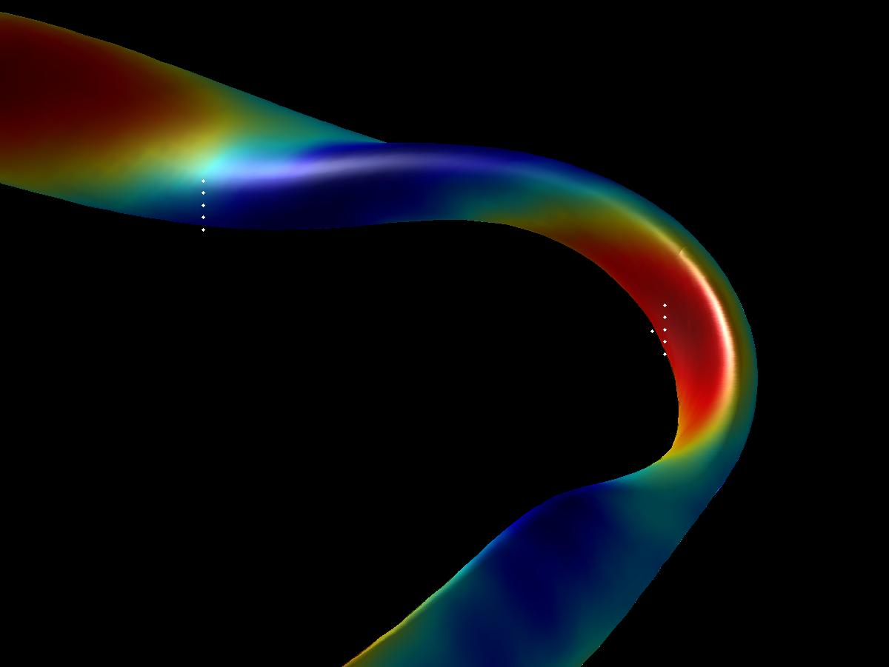
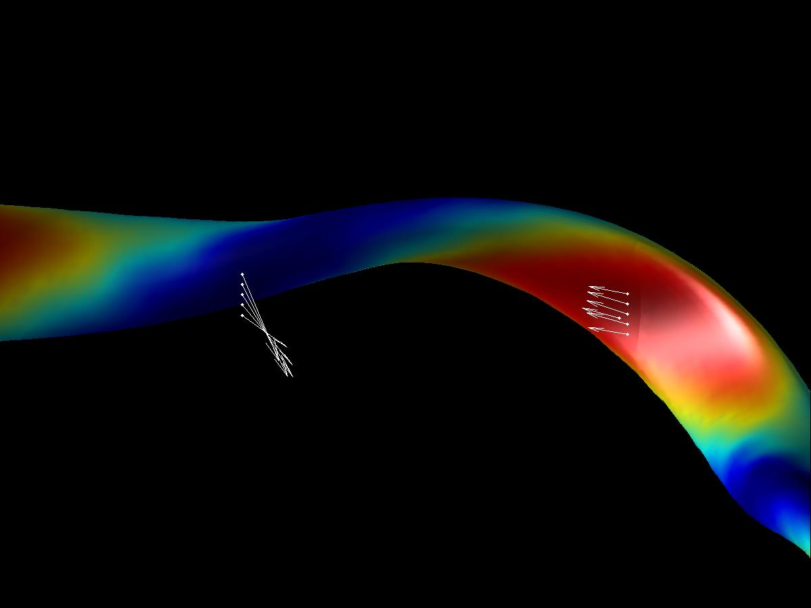

Tutorial: W7X VMEC Equilibria with EXTENDER
===========================================

This tutorial walks the user through running the EXTENDER code for a
VMEC equilibria on the W7X machine. In these runs two threads are
utilized by the EXTENDER code (-np 2). The output from a VMEC run, along
with tutorial files are provided here: The VMEC equilibrium output:
[wout\_std\_scp00\_beta1.nc](examples/wout_std_scp00_beta1.nc) B-Field
Test Points File: [b\_test](examples/b_test) Extender Control File:
[extender\_in](examples/extender_in)

------------------------------------------------------------------------

### Example 1: Calculating the fields at a point in space

In this example we run EXTENDER in order to calculate the plasma field
at a series of points external to the VMEC equilibria. First let\'s
examine where we will be evaluating the field with respect to the VMEC
equilibria. The b\_test points file looks like:

    # Sample points file
    # R    PHI     Z
     5.5   0.0    0.0
     5.6   0.0   -0.2
     5.6   0.0   -0.1
     5.6   0.0    0.0
     5.6   0.0    0.1
     5.6   0.0    0.2
     4.6   0.628   -0.2
     4.6   0.628   -0.1
     4.6   0.628    0.0
     4.6   0.628    0.1
     4.6   0.628    0.2

Here is a depiction of these points in space:
 The control file looks like:

    nr 200   # number of radial grid points
    nz 200   # number of vertical grid points
    nphi 72  # number of toroidal cut planes
    rmin 4.5 # optional param., can be computed autom. from boundary
    rmax 6.5 # optional parameter
    zmax 1.0 # optional parameter

The code is executed using the mpirun command. Here we\'ve selected to
use 2 processors (-np 2). We will be running the code using a VMEC
Nyquist file (netCDF 8.47), with our control file, using 360 poloidal
grid points on the surface, 72 toroidal grid points on the surface, test
as our output suffix, and we wish to find our plasma field.

    > mpirun -np 2 ~/bin/EXTENDER_P -vmec_nyquist wout_std_scp00_beta1.nc -i extender_in -NU 360 -NV 72 -s test -points b_test -plasmafield
    persistent objects table created
    reading VMEC file wout_std_scp00_beta1.nc ...
    reading VmecNetcdfNyquist
    persistent objects table created
    reading VMEC file wout_std_scp00_beta1.nc ...
    reading VmecNetcdfNyquist
    entering Vmec::post_read()
    entering Vmec::post_read()
    Vmec::post_read completed
    VMEC file wout_std_scp00_beta1.nc read successfully
    reading command file
    orientation = 1
    generating current sheet
    Vmec::post_read completed
    VMEC file wout_std_scp00_beta1.nc read successfully
    reading command file
    orientation = 1
    generating current sheet
    commencing computation
    pe 0 arrived at barrier
    commencing computation
    pe 0 arrived at barrier
    >

This creates a b\_test.out file which contains the magnetic field (H)
information regarding the points in the b\_test points file. Our output
looks like:

    #  i      r       phi       z       H_r       H_phi       H_z       |H|    inside
           0  5.50000000e+00  0.00000000e+00  0.00000000e+00  2.33323875e+00  1.33290897e+03 -1.66599741e+02  1.34328227e+03 0
           1  5.60000000e+00  0.00000000e+00 -2.00000000e-01 -1.77868044e+01  1.36686179e+03 -2.92511781e+02  1.39792369e+03 0
           2  5.60000000e+00  0.00000000e+00 -1.00000000e-01 -1.28263563e+01  1.42632806e+03 -1.67522929e+02  1.43618947e+03 0
           3  5.60000000e+00  0.00000000e+00  0.00000000e+00  1.91169944e+01  1.44658408e+03 -1.30659449e+02  1.45259865e+03 0
           4  5.60000000e+00  0.00000000e+00  1.00000000e-01  1.28263564e+01  1.42632806e+03 -1.67522929e+02  1.43618947e+03 0
           5  5.60000000e+00  0.00000000e+00  2.00000000e-01  1.77868044e+01  1.36686179e+03 -2.92511781e+02  1.39792369e+03 0
           6  4.60000000e+00  6.28000000e-01 -2.00000000e-01  1.47611615e+03 -1.09833561e+03 -1.79915159e+03  2.57336481e+03 0
           7  4.60000000e+00  6.28000000e-01 -1.00000000e-01  8.65399072e+02 -1.29202194e+03 -2.30594544e+03  2.78129837e+03 0
           8  4.60000000e+00  6.28000000e-01  0.00000000e+00  1.15886107e+01 -1.36780443e+03 -2.50911447e+03  2.85774013e+03 0
           9  4.60000000e+00  6.28000000e-01  1.00000000e-01 -8.54243992e+02 -1.29462806e+03 -2.30999002e+03  2.78241775e+03 0
          10  4.60000000e+00  6.28000000e-01  2.00000000e-01 -1.46828715e+03 -1.10232529e+03 -1.80566541e+03  2.57515354e+03 0

Plotting the vector field we see: 

------------------------------------------------------------------------

### Example 2: Calculating Fields on a Grid
