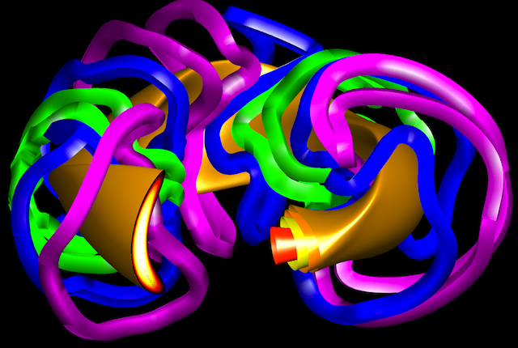

VMECwiki
========

The wiki is designed to provide user documentation for various
equilibrium magnetic confinement fusion codes. It is the goal of this
wiki to forward the development of fusion science by bridging the gap
between \'scientific\' and \'engineering\' approaches to software. This
is achieved through coherent documentation of codes with regards to
their purpose, usage, and capabilities. Each page contains relevant
information regarding the theory behind each code, input formats,
execution, output formats, visualization, and tutorials. Members
encouraged to participate in discussions (tab at the top of each page)
and to contribute to the pages themselves. The wiki is not a repository
for codes. It is suggested that authors upload their codes through
external sites designed to handle such capabilities. Pages are
maintained by organizers and members are encouraged to make commentary
and provide content through the discussions on each page.

[STELLOPT Compilation](STELLOPT Compilation)

[BEAMS3D](BEAMS3D)

[BNORM](BNORM)

[BOOTSJ](BOOTSJ)

[BOOZ\_XFORM](BOOZ_XFORM)

[COBRAVMEC](COBRAVMEC)

[COILOPT](COILOPT)

[DESCUR](DESCUR)

[DIAGNO](DIAGNO)

[EXTENDER](EXTENDER)

[FIELDLINES](FIELDLINES)

[MAKEGRID](MAKEGRID)

[NEO](NEO)

[NESCOIL](NESCOIL)

[NMORPH](NMORPH)

[PIES](PIES)

[SPEC](https://princetonuniversity.github.io/SPEC/)

[SFINCS](SFINCS)

[STELLOPT](STELLOPT)

[TERPSICHORE](TERPSICHORE)

[TORLINES](TORLINES)

[VMEC](VMEC)

[VMEC2PIES](VMEC2PIES)
