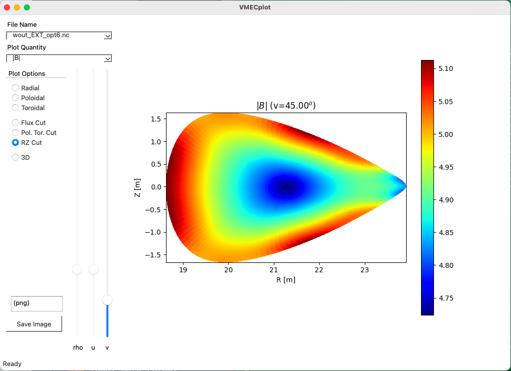



pySTEL
======

A Python class and utilites for interacting with the STELLOPT family
of codes.

------------------------------------------------------------------------

### Theory

The pySTEL software contains classes for reading the inputs and outputs
of the various software from STELLOPT. Additionally, it contains
utility routines and GUIs for working with the inputs and outputs. The
software makes use the of the [Python ctypes](https://docs.python.org/3/library/ctypes.html) foreign function interface.
This allows calls directly to compiled code of LIBSTELL. Two dimensional
visualization is provided by [matplotlib](https://matplotlib.org/) while the 3D visualization
is perforemd with [VTK](https://vtk.org/) package. [QT5](https://www.qt.io/) provides the 
framework for the Graphical user iterface tools.

 * Utilities (call with `--help` for more information)
   * VMECplot - A GUI for reading and plotting VMEC equilibrium `wout` files.
   * STELLOPT - A GUI for plotting STELLOPT stellarator optimization output files. It includes panes for read/writing the VMEC `INDATA` and `OPTIMUM` namelists.
   * beams3d_util.py - A command line utility for plotting [BEAMS3D](BEAMS3D) data.
   * bootsj_util.py - A command line utility for plotting [BOOTSJ](BOOTSJ) data.
   * boozer_util.py - A command line utility for plotting [BOOZ_XFORM](BOOZ_XFORM) data.
   * coil_util.py - A command line utility for manipulation and plotting of coils files.
   * fieldlines_util.py - A command line utility for ploting [FIELDLINES](FIELDLINES) data.
   * focus_util.py - A command line utility for working with the [FOCUS](https://github.com/PrincetonUniversity/FOCUS) code. *FOCUS is not part of STELLOPT.*
   * gist_util.py - A command line utility for working with [GIST](https://www.ipp.mpg.de/3444998/pax_gyrokin_turbulenzsimul) files.
   * nescoil_util.py - A command line utility for working with [NESCOIL](NESCOIL) files.
   * make_mesh.py - A command line utility for 2D and 3D meshing using [gmsh]()
   * vmec_util.py - A command line utility for working with [VMEC](VMEC) files.
   * wall_util.py - A command line utility for working with wall data.
 * Helper utilities
   * vmec2beams3d.py - A command line utility for generating [BEAMS3D](BEAMS3D) inputs from [VMEC](VMEC) outputs.
   * vmec2focus.py - A command line utility for generating [FOCUS](https://github.com/PrincetonUniversity/FOCUS) inputs from [VMEC](VMEC) outputs.
   * stellopt_renorm.py - Computes renormalized sigma values from a [STELLOPT](STELLOPT) run.
 * Classes (found in the `libstell` subdirectory)
   * beams3d.py - Class for [BEAMS3D](BEAMS3D) inputs/outputs
   * bnorm.py - Class for [BNORM](BNORM) inputs/outputs
   * bootsj.py - Class for [BOOTSJ](BOOTSJ) inputs/outputs
   * coils.py - Class for coils files.
   * collisions.py - Class for plasma collisional operators.
   * diagno.py - Class for [DIAGNO](DIAGNO) inputs/outputs
   * dkes.py - Class for [DKES](DKES) inputs/outputs
   * fieldlines.py - Class for [FIELDLINES](FIELDLINES) inputs/outputs
   * focus.py - Class for [FOCUS](https://github.com/PrincetonUniversity/FOCUS) inputs/outputs
   * fusion.py - Class for plasma fusion cross sections.
   * gist.py - Class for dealing with GIST data, generating GIST data, and calculating some turbulent transport proxies.
   * libstell.py - Main class for interfacing with `LIBSTELL`.
   * nescoil.py - Class for [NESCOIL](NESCOIL) inputs/outputs
   * penta.py - Class for [PENTA](PENTA) inputs/outputs
   * plot3D.py - Class for 3D plotting which wrappers [VTK](https://vtk.org/) calls.
   * popcon.py - Class for generating 0D POPCON plots.
   * stellopt.py - Class for [STELLOPT](STELLOPT) inputs/outputs
   * thrift.py - Class for [THRIFT](THRIFT) inputs/outputs
   * vmec.py - Class for [VMEC](VMEC) inputs/outputs
   * wall.py - Class for dealing with wall files.

------------------------------------------------------------------------

### Compilation

To compile pySTEL, from the main directory issue the command

    make pystel

This builds LIBSTELL according to the instructions found on [STELLOPT Compilation Page](STELLOPT Compilation) and then installs the Python components using [pip](https://www.pypi.org) and [setuptools](https://setuptools.pypa.io).

Please check that after building the install location is on your path.

------------------------------------------------------------------------

### Execution

Command line help text is provided for each code via the `--help` command line option.  Please reference the help text for options to run each piece of software.

------------------------------------------------------------------------

### Calling libraries from Python

After installation the user can call the tools using the classes. For example:

    import numpy as np
    from libstell.vmec import VMEC
    from libstell.plot3D import PLOT3D
    vmec_data = VMEC()
    vmec_data.read_wout('wout_test.nc')
    plt3d = PLOT3D()
    theta = np.linspace([0],[2*np.pi],256)
    phi   = np.linspace([0],[2*np.pi],360)
    r = vmec_data.cfunct(theta,phi,vmec_data.rmnc,vmec_data.xm,vmec_data.xn)
    z = vmec_data.sfunct(theta,phi,vmec_data.zmns,vmec_data.xm,vmec_data.xn)
    b = vmec_data.cfunct(theta,phi,vmec_data.bmnc,vmec_data.xm_nyq,vmec_data.xn_nyq)
    vmec_data.isotoro(r,z,phi,[127],vals=b,plot3D=plt3d)
    rmax = np.max(r)*5
    plt3d.colorbar(title='|B| [T]')
    phi = np.deg2rad(0)
    alpha = np.deg2rad(15)
    beta = np.deg2rad(15)
    plt3d.setCamera(pos=[rmax*np.cos(phi),rmax*np.sin(phi),rmax*np.sin(alpha)],focus=[0,0,0],camup=[0,np.sin(beta),np.cos(beta)])
    plt3d.render()
    plt3d.saveImage('example.png')

Here we read VMEC data, plot it using VTK, and save the plot to a file. It should be noted that VTK saves the last state of the window so one may reposition the 3D plot as they like. When the window is closed the file is then saved.

------------------------------------------------------------------------

### Tutorials

See above
